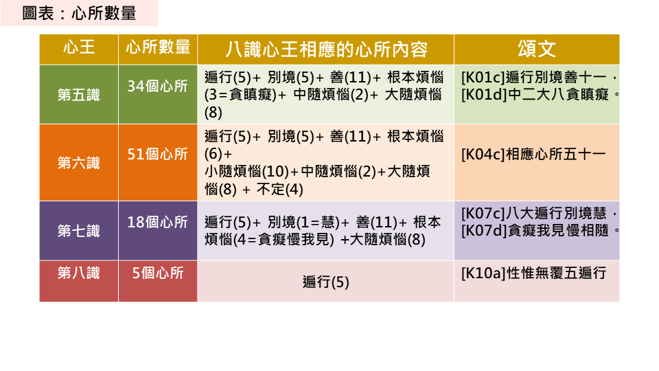
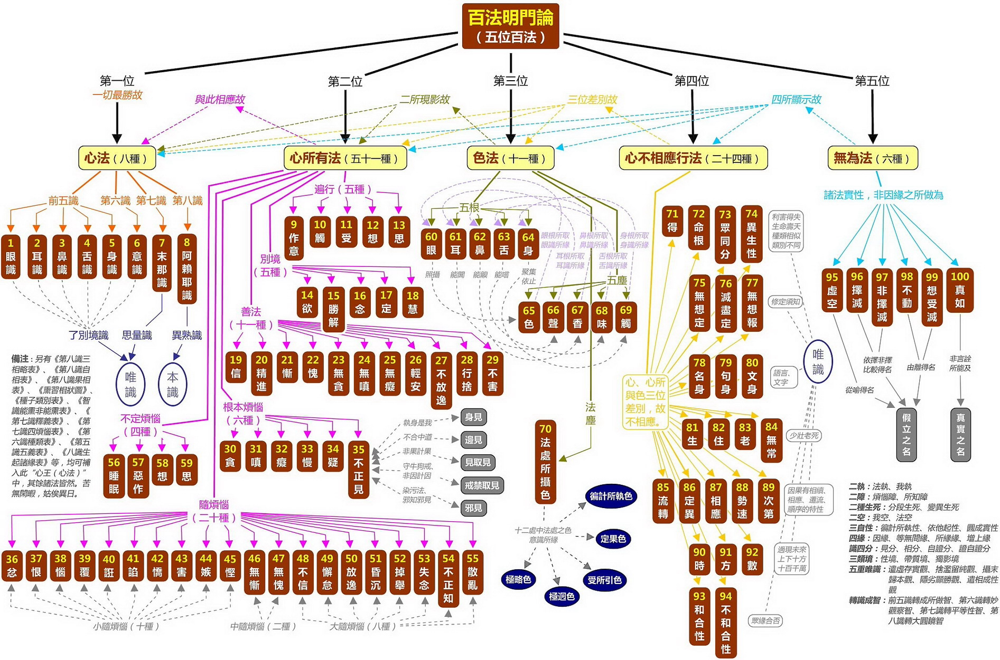
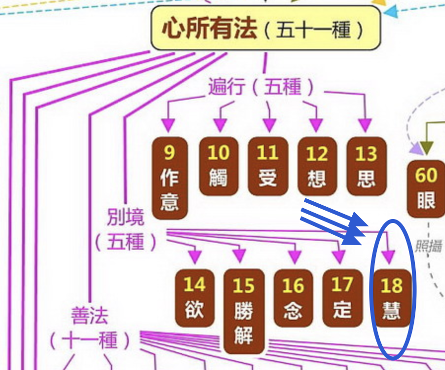

转识成智是唯识学中修行的关键和目标，它既然是唯识学的核心概念，就应该用唯识学的理论来解释，才是最合适的。

有人用如来藏解释，但这并不合适，因为唯识和如来藏是两个不同的体系，虽然有共同的部分，但区别也还是很大的。

唯识学又像是数学，它的理论是有完整的顺序的，像小学数学，中学数学，高中数学，大学数学一样的。 所以，这导致一个问题，不容易通俗化解释，就算是有一个通俗化解释，都很难准确和完整。 不信你去尝试下解释，微积分的通俗化解释是什么？ 离开了高中数学的基础，几乎无法解释。

用唯识来解释转识成智也离不开它的基础，它的基础就是百法。这里先卖一个关子。先澄清一个误解，转识成智后，并非没有识了。识依然存在的，即佛陀也有八识，一个不少，一个也不多。识的了别功能也都是在的。所以佛陀也是能吃、能喝、能说话的。很多人误以为，转识成智后，就没有识了。这是一个非常普遍的误解。

## 转识成智是什么意思呢？ 

转识成智是什么意思？ 首先要知道识有八个，即八识，转成的智有四个，所以，转识成智，这句话展开来说，其实是转八识成四智。那么八识和四智的对照关系如何呢？

* 前五识，即眼识、耳识、鼻识、舌识、身识，转成 —— 成所作智。
* 第六识，意识，转成 —— 妙观察智。
* 第七识，末那识，转成 —— 平等性智。
* 第八识，阿赖耶识，转成 —— 大圆镜智。

前面已经说了，转识成智后，依然有识。并不是说转识成智后，就没有识了。那么这个转识到底是什么意思呢？这里就需要用到百法来解释。百法的重点之一，就是识和心所的对应关系。

## 转识成智的内涵

在凡夫阶段，八识和心所的对照关系如下。

别忘记了百法是基础：

访问这里可以点击每个方框查看它们的定义：https://yuqianyi1001.github.io/100/

上面是凡夫的状态，那么成佛后的心所，是如何变化的呢？参考下图：

| 心王 | 心所数量  | 心所 |
|--|------|------|
| 成佛后的八识 | 21个  | 遍行（5）+ 别境（5）+ 善（11） |

如表所示，非常简单，八识全部都只有21个心所相应了。没有任何心王会再和烦恼心所相应，所以排除掉6个根本烦恼和20个随烦恼了，以大乘佛教对佛陀的描述来说（主要指报身），并不认为佛会有无记的情况（如睡觉等），所以4个不定心所也没有了。（其他部派佛教以释迦牟尼佛为主，即人间的佛陀，认为佛会有无记的情况，这就另说了，不展开了。）

这21个心所中，别境心所中的“慧”心所能力特别强，特别殊胜。为了突显这个特点，因此就以慧心所来代称“识”本身了。这才是转识成智的真正意思。慧心所的位置见图：

## 总结

总结来说，转识成智其实是八识对应的心所发生了改变，没有了染污的心所，即没有烦恼和不定心所；只有善心所，此时遍行，别境和善心所全部都是善心所了。

而其中别境中的“慧心所”的功能尤为殊胜，因此，以“慧心所”来代称八识 —— 就是转识成智的真正内涵了。

用一个通俗的比喻来说，比如王某某获得了博士学位，为了尊重他的学识，大家都称呼他为王博士。但是，他的本名依然是王某某，这点并没有发生变化。

以上，希望可以帮助大家理解下转识成智。

阿弥陀佛。

愚千一

