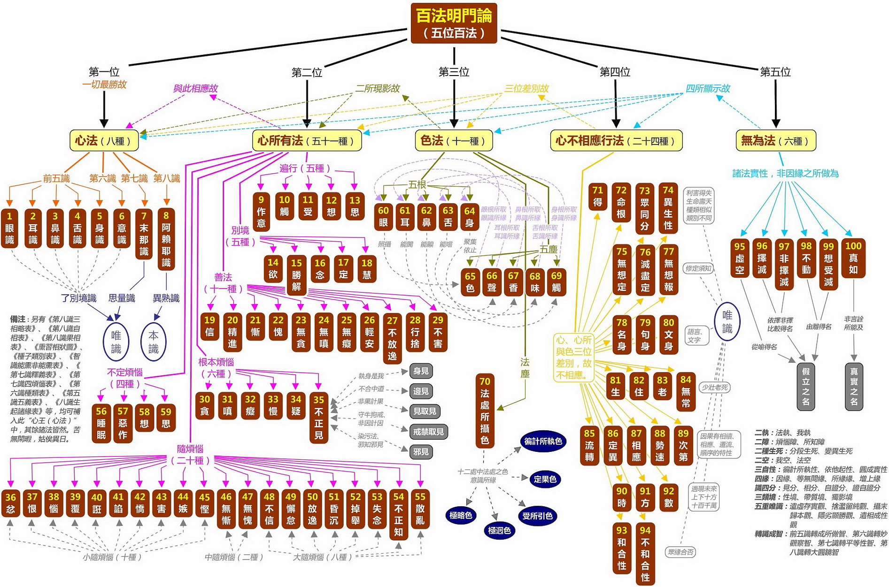

轉識成智是唯識學中修行的關鍵和目標，它既然是唯識學的核心概念，就應該用唯識學的理論來解釋，才是最合適的。

有人用如來藏解釋，但這並不合適，因為唯識和如來藏是兩個不同的體系，雖然有共同的部分，但區別也還是很大的。

唯識學又像是數學，它的理論是有完整的順序的，像小學數學，中學數學，高中數學，大學數學一樣的。 所以，這導致一個問題，不容易通俗化解釋，就算是有一個通俗化解釋，都很難準確和完整。 不信你去嘗試下解釋，微積分的通俗化解釋是什麼？ 離開了高中數學的基礎，幾乎無法解釋。

用唯識來解釋轉識成智也離不開它的基礎，它的基礎就是百法。這裡先賣一個關子。先澄清一個誤解，轉識成智後，並非沒有識了。識依然存在的，即佛陀也有八識，一個不少，一個也不多。識的了別功能也都是在的。所以佛陀也是能吃、能喝、能說話的。很多人誤以為，轉識成智後，就沒有識了。這是一個非常普遍的誤解。

## 轉識成智是什麼意思呢？ 

轉識成智是什麼意思？ 首先要知道識有八個，即八識，轉成的智有四個，所以，轉識成智，這句話展開來說，其實是轉八識成四智。那麼八識和四智的對照關係如何呢？

* 前五識，即眼識、耳識、鼻識、舌識、身識，轉成 —— 成所作智。
* 第六識，意識，轉成 —— 妙觀察智。
* 第七識，末那識，轉成 —— 平等性智。
* 第八識，阿賴耶識，轉成 —— 大圓鏡智。

前面已經說了，轉識成智後，依然有識。並不是說轉識成智後，就沒有識了。那麼這個轉識到底是什麼意思呢？這裡就需要用到百法來解釋。百法的重點之一，就是識和心所的對應關係。

## 轉識成智的內涵

在凡夫階段，八識和心所的對照關係如下。

別忘記了百法是基礎：

訪問這裡可以點擊每個方框查看它們的定義：https://yuqianyi1001.github.io/100/

上面是凡夫的狀態，那麼成佛後的心所，是如何變化的呢？參考下圖：

| 心王 | 心所數量  | 心所 |
|--|------|------|
| 成佛後的八識 | 21個  | 遍行（5）+ 別境（5）+ 善（11） |

如表所示，非常簡單，八識全部都只有21個心所相應了。沒有任何心王會再和煩惱心所相應，所以排除掉6個根本煩惱和20個隨煩惱了，以大乘佛教對佛陀的描述來說（主要指報身），並不認為佛會有無記的情況（如睡覺等），所以4個不定心所也沒有了。（其他部派佛教以釋迦牟尼佛為主，即人間的佛陀，認為佛會有無記的情況，這就另說了，不展開了。）

這21個心所中，別境心所中的“慧”心所能力特別強，特別殊勝。為了突顯這個特點，因此就以慧心所來代稱“識”本身了。這才是轉識成智的真正意思。慧心所的位置見圖：

## 總結

總結來說，轉識成智其實是八識對應的心所發生了改變，沒有了染汙的心所，即沒有煩惱和不定心所；只有善心所，此時遍行，別境和善心所全部都是善心所了。

而其中別境中的“慧心所”的功能尤為殊勝，因此，以“慧心所”來代稱八識 —— 就是轉識成智的真正內涵了。

用一個通俗的比喻來說，比如王某某獲得了博士學位，為了尊重他的學識，大家都稱呼他為王博士。但是，他的本名依然是王某某，這點並沒有發生變化。

以上，希望可以幫助大家理解下轉識成智。

阿彌陀佛。

愚千一

