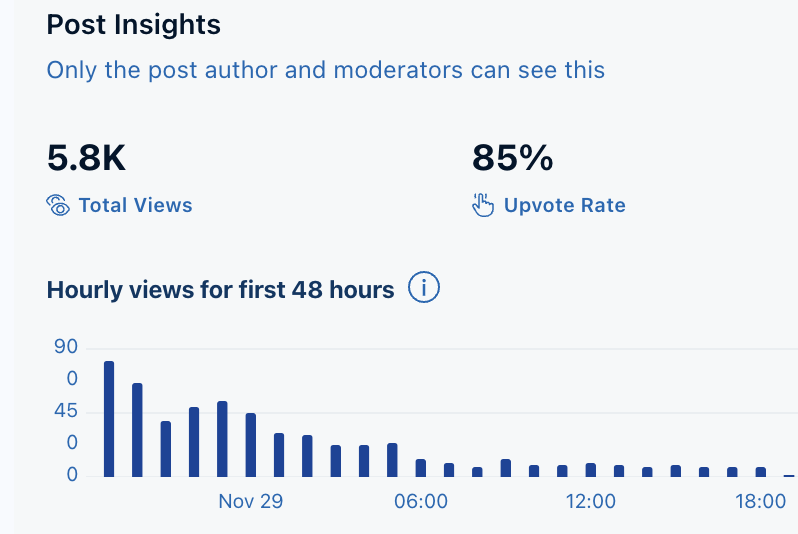

这些内容是我发在国外知名论坛（Reddit）佛教版块里面的一个活动，活动的类型叫做AMA，全称是Ask Me Anything，中文就是“随便问”的意思。
我也是第一次发AMA贴，没经验，后来才知道它会有一个大概4小时的Live时间，之后自动结束了（有经验的朋友还请指正下），讨论不多，但是查看人数还是不少。微信公众号完全不允许发链接了，有兴趣的朋友自行搜索下吧。

但是这里可以：
https://www.reddit.com/r/Buddhism/comments/1h237q9/ama_a_whole_picture_of_all_buddhism_dharma/

英文原文如下：

## My Background

I began my journey into Buddhism about 10 years ago, primarily through Chinese sources. My learning process can be divided into three distinct phases:

* Phase 1: Self-Learning I started by reading popular sutras, stories, and biographies to get a foundational understanding.

* Phase 2: Group Study I joined two study groups and explored parts of The Great Treatise on the Stages of the Path to Enlightenment (菩提道次第广论, Bodhipathapradīpa-prakaraṇa-mālikā) as well as a Pure Land class from Tibetan Buddhism.

* Phase 3: Advanced Study During the COVID-19 Pandemic During the pandemic, I delved into The Jiaoguan Gangzong (教观纲宗) of the Tiantai School. This study opened up a new dimension for me. To quote a teacher: "Before this study, most people know fragments of Buddhist teachings but struggle to see them as a structured system. After completing this study, if you truly grasp the essence of the book, you'll gain an understanding of the entire Dharma." I wholeheartedly agree with this perspective. 

After studying The Jiaoguan Gangzong, I revisited teachings from various Buddhist schools and found myself able to comprehend them in a more holistic way.

While I wouldn’t claim to have achieved a master-level understanding, simply being able to grasp the teachings without lingering confusion has brought immense joy—a true dharma joy. This sense of fulfillment is one of the most rewarding aspects of my Buddhist practice.

## What I have studied(or revised) by Systems

Theravāda Buddhism - Primarily focuses on the Āgamas（阿含经） and the Abhidharma-kośa（俱舍论）.
Mahāyāna Buddhism's
Prajñāpāramitā Philosophy - Mainly centers on the series of Prajñāpāramitā scriptures, including the Heart Sutra (Prajñāpāramitā Hṛdaya), the Diamond Sutra (Vajracchedikā Prajñāpāramitā), and the Mahāprajñāpāramitā-śāstra（大智度论）.
Yogācāra Philosophy - Primarily focuses on the Cheng Weishi Lun (Vijñaptimātratā-siddhi 成唯识论) and the Yogācārabhūmi Śāstra（瑜伽师地论）.
Tathāgatagarbha Philosophy - Mainly centers on the Ratnagotravibhāga（宝性论）, the Laṅkāvatāra Sūtra（入楞伽经）, and the Avataṃsaka Sūtra（华严经）.

## What I have studied(or revised) by Schools

Pure Land School - Focuses on the three Pure Land Sutras" and various treatises, such as The Essentials of the Amitabha Sutra (弥陀要解), The History of Chinese Pure Land Thought (中国净土教思想史), Master Yinguang's 600 Questions (印光大师600问), and Tibetan texts like The Aspiration for Sukhāvatī (极乐愿文).
Chan (Zen) School - Emphasizes kōans, stories, and Chan classics, such as The Platform Sutra of the Sixth Patriarch (坛经), the Laṅkāvatāra Sūtra (入楞伽经), and The History of Chinese Chan Buddhism (中国禅宗史).
Tiantai School - Centers on The Jiaoguan Gangzong (教观纲宗) and The Lotus Sutra (法华经).
Huayan School - Focuses on The Avataṃsaka Sūtra (华严经) and Master Shengyan's A Commentary on the Heart of Huayan Thought (华严心诠).
Yogācāra School - same as in system of Yogācāra philosophy.

Besides the systematic philosophies, I have also read many books on the history of Buddhism.

In summary, I have significantly expanded upon The Jiaoguan Gangzong (教观纲宗), adapting it to align better with modern educational systems and teaching methods. I no longer strictly adhere to the classifications found within The Jiaoguan Gangzong itself.

## Starting to Share My Insights and Perspectives

When I felt that I had gained a substantial understanding of many Buddhist scriptures and philosophical concepts, I began writing articles to share my insights, methods, and lessons from past missteps. My hope is to help those who are interested in learning Buddhism.

I have published over 130 articles on my WeChat public account in the name of 愚千一, all written in Chinese. My English is not very fluent, and I’m still learning the proper English translations for many Buddhist terms (improving as I go). I’ve also kept a backup of my articles on GitHub (yuqianyi1001.github.io -- if you can read Chinese, include my WeChat QR code too if you like read in WeChat).

I think I could also try sharing some of my insights and methods here, with the hope of helping more people.

**Disclaimer 1**: I use AI tools to help me translate and refine certain terms and sentences, but the main content is entirely my own work.

**Disclaimer 2**: I am not a professional scholar, so I am unable to answer in-depth academic questions. My most appropriate role is a mix of half scholar and half Buddhist practitioner. I take Great Master Zhiyi, Master Xuanzang, and modern figures such as Master Yinshun and Master Shengyan as my role models.

**Disclaimer 3**: Of course, I still have many unknown, unfamiliar things. If so, we could try to dive into it together.

阿弥陀佛

愚千一

