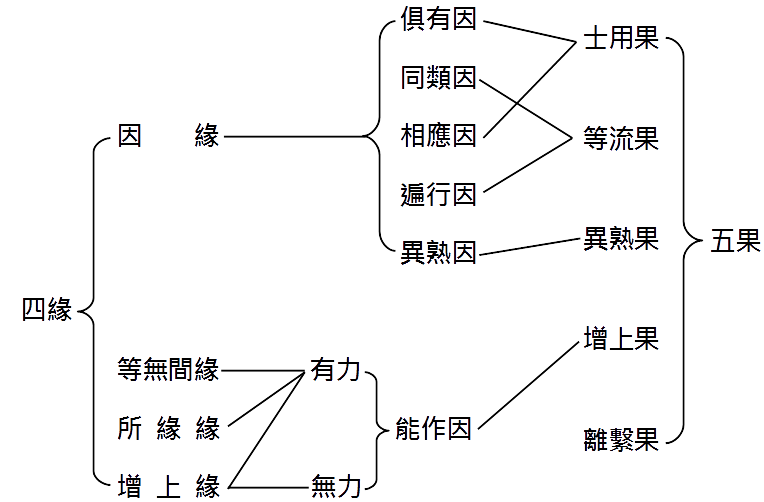
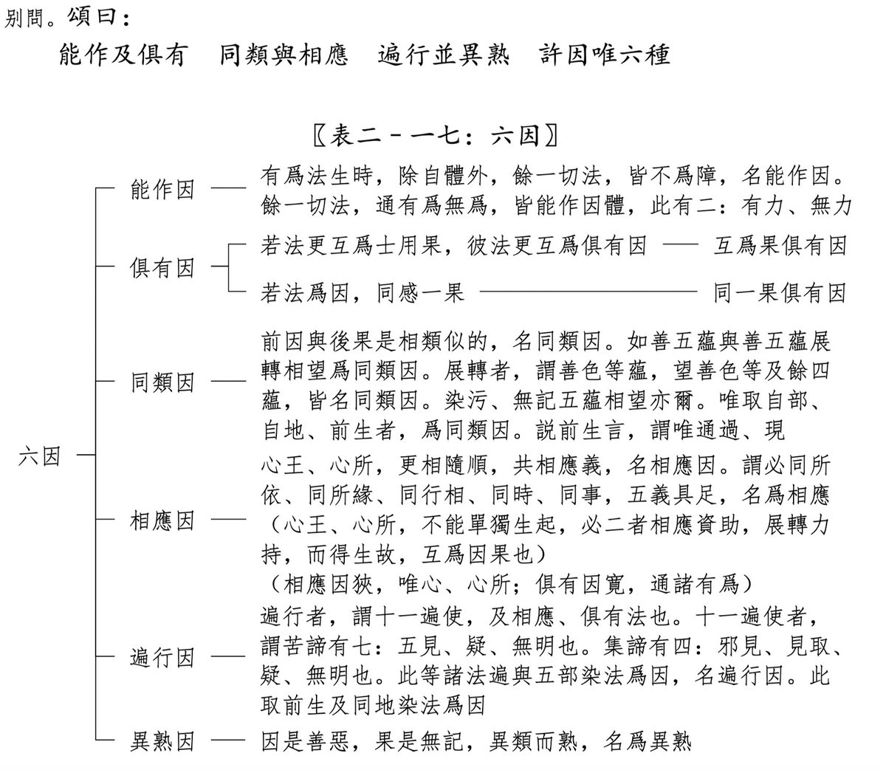

先看几个小红书上的例子，有些的点赞、收藏和评论数还挺高的：

“你介入了谁的因果，你将会背负谁的厄运”

“不要介入他人因果防止被借运”

“你要做的，是放下助人情结，尊重他人命运。”

“介入别人的因果， 是会要你命的！”

“介入因果 就会倒霉”

## 不要主动干涉他人的生活

先进行正面解读。有一种观点认为，不要去 “干涉” 他人，特别是不要在不恰当的时机与场合，主动介入他人事务。因为在这种情形下，介入行为不一定能带来帮助，反而可能引发其他 “后果”，甚至给自己招来麻烦。

这原本是极为普遍且正常的社会现象，的确值得留意。然而，要是非得给这种现象冠以 “因果” 之名，那便是对 “因果” 的误会与曲解了。这实际上是将 “因果” 的范畴狭隘化了。

## 狭义的因果

狭义的因果指的是，由于做了某件事，从而引发了相应的结果。

比如你努力学习，所以考试取得了好成绩。 
比如你努力工作，所以获得了晋升。 
比如你好好经营生意，所以财源滚滚。 
……

这些都是较易理解的 “因果” 关系，但并非因果关系的全貌。所以，我将其称作 “狭义” 的因果观。不过，若深入剖析便会发现，一个结果的产生往往是由众多因素共同促成的，并非单一原因所致。

举例来说，尽管你努力工作了，但倘若公司经营状况不佳，最终你可能会被裁员，甚至公司可能倒闭。如此一来，别说晋升了，就连工作都难以保住。所以，在努力工作与晋升之间，存在一个大前提，即公司要稳定运营。这个道理不难理解。

再比如，你努力工作了，却未能获得晋升，因为晋升存在名额限制。又或者，你得到了晋升，然而同样努力的同事却未能如愿。这种情况在大公司中颇为常见，尤其是在大环境不景气的时候。

仔细分析不难发现，因果关系极为复杂，不能简单、片面地去理解，否则就容易陷入认知误区，甚至变得怨天尤人。

进一步而言，我们更应深入了解 “广义的因果”。那么，什么是广义的因果观呢？那就是 “六因四缘五果”。

## 广义的因果

依据 “六因四缘五果” 的理论，六因分别为：能作因、俱有因、同类因、相应因、遍行因、异熟因。其中，能作因的涵盖范围最为广泛。为何能作因的范围最广呢？能作因的定义为：一切不妨碍其发生的事物，都属于这一范畴。其又可细分为 “有力能作因” 和 “无力能作因”。

有力能作因，指的是对某事物的发生具备推动力量。比如上述 “狭义的因果” 中的 “因” 皆属此类，因为这类事物对结果的产生起到了促进作用。举例来讲，一颗种子发芽生长，离不开种子、空气、水和土壤。那么，种子、空气、水和土壤，都是它的 “有力能作因”。

无力能作因，即对某事物的发生既没有助力，也不构成阻碍。例如，同样是一颗种子发芽，远在北极的北极熊与它有什么关系呢？答案是毫无关系！不要谈玄说妙，讲述那些无法证实的事情。它们之间就是毫不相干。然而，在广义的因果观中，这只北极熊就属于 “能作因”，而且是 “无力能作因”。

所以，“无力能作因” 的范围极其宽泛，“有力能作因” 的范围则相对较小。以我们当下的认知水平，列举 “有力能作因” 相对容易，但数量必然有限。知识储备较少的人，列举的数量会少一些；知识丰富的人，能列举得更多，但同样是有限的。而 “无力能作因” 的范围，却极为广阔，这一点任何人都不难理解。

## 全面的因果观 —— 六因四缘五果

能作因是六因四缘五果中六因之一，此外还有五因，以及四缘和五果。它们的关系图如下。

其中，关于“六因”的部分如下。

这是《俱舍论颂疏讲记》中的截图，是最准确的定义和最权威的阐释。日后若有机会，再为大家详细讲解。感兴趣的朋友，也可直接找来《俱舍论颂疏讲记》研读。

阿弥陀佛。

愚千一

