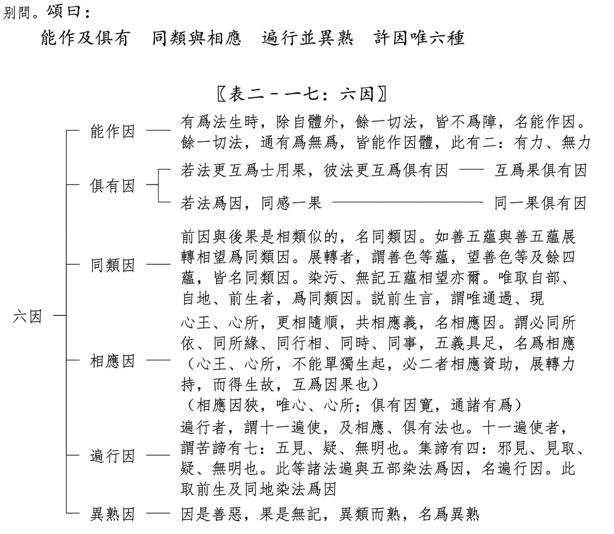

先看幾個小紅書上的例子，有些的點贊、收藏和評論數還挺高的：

“你介入了誰的因果，你將會揹負誰的厄運”

“不要介入他人因果防止被借運”

“你要做的，是放下助人情結，尊重他人命運。”

“介入別人的因果， 是會要你命的！”

“介入因果 就會倒黴”

## 不要主動干涉他人的生活

先進行正面解讀。有一種觀點認爲，不要去 “干涉” 他人，特別是不要在不恰當的時機與場合，主動介入他人事務。因爲在這種情形下，介入行爲不一定能帶來幫助，反而可能引發其他 “後果”，甚至給自己招來麻煩。

這原本是極爲普遍且正常的社會現象，的確值得留意。然而，要是非得給這種現象冠以 “因果” 之名，那便是對 “因果” 的誤會與曲解了。這實際上是將 “因果” 的範疇狹隘化了。

## 狹義的因果

狹義的因果指的是，由於做了某件事，從而引發了相應的結果。

比如你努力學習，所以考試取得了好成績。 
比如你努力工作，所以獲得了晉升。 
比如你好好經營生意，所以財源滾滾。 
……

這些都是較易理解的 “因果” 關係，但並非因果關係的全貌。所以，我將其稱作 “狹義” 的因果觀。不過，若深入剖析便會發現，一個結果的產生往往是由衆多因素共同促成的，並非單一原因所致。

舉例來說，儘管你努力工作了，但倘若公司經營狀況不佳，最終你可能會被裁員，甚至公司可能倒閉。如此一來，別說晉升了，就連工作都難以保住。所以，在努力工作與晉升之間，存在一個大前提，即公司要穩定運營。這個道理不難理解。

再比如，你努力工作了，卻未能獲得晉升，因爲晉升存在名額限制。又或者，你得到了晉升，然而同樣努力的同事卻未能如願。這種情況在大公司中頗爲常見，尤其是在大環境不景氣的時候。

仔細分析不難發現，因果關係極爲複雜，不能簡單、片面地去理解，否則就容易陷入認知誤區，甚至變得怨天尤人。

進一步而言，我們更應深入瞭解 “廣義的因果”。那麼，什麼是廣義的因果觀呢？那就是 “六因四緣五果”。

## 廣義的因果

依據 “六因四緣五果” 的理論，六因分別爲：能作因、俱有因、同類因、相應因、遍行因、異熟因。其中，能作因的涵蓋範圍最爲廣泛。爲何能作因的範圍最廣呢？能作因的定義爲：一切不妨礙其發生的事物，都屬於這一範疇。其又可細分爲 “有力能作因” 和 “無力能作因”。

有力能作因，指的是對某事物的發生具備推動力量。比如上述 “狹義的因果” 中的 “因” 皆屬此類，因爲這類事物對結果的產生起到了促進作用。舉例來講，一顆種子發芽生長，離不開種子、空氣、水和土壤。那麼，種子、空氣、水和土壤，都是它的 “有力能作因”。

無力能作因，即對某事物的發生既沒有助力，也不構成阻礙。例如，同樣是一顆種子發芽，遠在北極的北極熊與它有什麼關係呢？答案是毫無關係！不要談玄說妙，講述那些無法證實的事情。它們之間就是毫不相干。然而，在廣義的因果觀中，這隻北極熊就屬於 “能作因”，而且是 “無力能作因”。

所以，“無力能作因” 的範圍極其寬泛，“有力能作因” 的範圍則相對較小。以我們當下的認知水平，列舉 “有力能作因” 相對容易，但數量必然有限。知識儲備較少的人，列舉的數量會少一些；知識豐富的人，能列舉得更多，但同樣是有限的。而 “無力能作因” 的範圍，卻極爲廣闊，這一點任何人都不難理解。

## 全面的因果觀 —— 六因四緣五果

能作因是六因四緣五果中六因之一，此外還有五因，以及四緣和五果。它們的關係圖如下。

其中，關於“六因”的部分如下。

這是《俱舍論頌疏講記》中的截圖，是最準確的定義和最權威的闡釋。日後若有機會，再爲大家詳細講解。感興趣的朋友，也可直接找來《俱舍論頌疏講記》研讀。

阿彌陀佛。

愚千一

