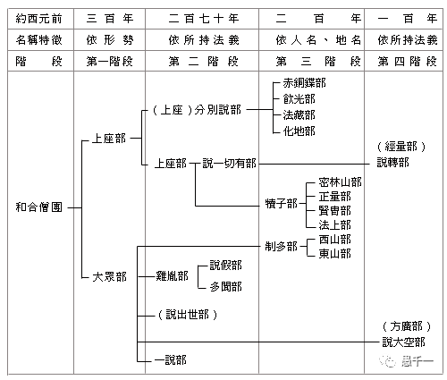

入群的人多了，共读的人少。群里已经有90多人了。共读打卡的，不到10人。所以，我想再来介绍下《阿含经》的殊胜之处。

尤其是对比南传和藏传之后，就会更加凸显汉传佛教中《阿含经》的特殊性了。

备注，不要误会，不是说汉传各方面都比南传和藏传更好。而只是在《阿含经》所代表的部派佛教经典方面。汉传佛教有其独特之处。在其他方面，南传和藏传当然各具特色。但不是这篇文章的重点，就不再展开了。

## 阿含经是最原汁原味的佛教圣典

阿含经是我们可以接触到的，最原汁原味的佛教圣典。最能反映佛陀的教法，最为原始，也是最无争议的经典。

佛教史中，部派佛教时期，又是距离佛陀最近的时期。再早的时候，要么还没有结集经典，要么靠口诵，而没有文字记载。而流传下来最早的佛经，只有阿含系列（或对应的经典）。

部派佛教时期的经典，成体系的，只有四阿含和巴利三藏。而藏传经典，对应的经典，少到可以忽略不计。

## 南传上座部的尼柯耶

南传的经藏，是指巴利三藏。而不是指读《阿含经》的南传学派。

南传的全称其实是：上座部分别说系赤铜鍱部大寺派。

了解过佛教史的人都知道，在部派佛教时期，佛教分裂成多达18个（其他说法有更多）的部派佛教。而现在的南传上座部佛教，仅仅是部派佛教中的一支。

圖片來源佛光教科書，佛教史，星雲大師 (masterhsingyun.org) 

而后来的大寺派，是在赤铜鍱部内部再次分化出来的。参考下图：

图片来源，原始佛教会，https://www.arahant.org/hou-qi-bu-pai-chu-qi-da-sheng 

总结来说，现在南传上座部的巴利三藏，只是众多的18个部派佛教中的一支。巴利三藏中的经藏（为五部尼迦耶：《长部》、《中部》、《相应部》、《增支部》和《小部》。），根据《漢譯南傳大藏經》进行统计，共有115卷。分别是：
1. N0004 長部經典（14卷）
2. N0005 中部經典（4卷）
3. N0006 相應部經典（11卷）
4. N00O7 增支部經典（3卷）
5. N0008-23 小部 N26-47（83卷）

## 汉传中的《阿含经》

汉传中的《阿含经》，通常称之为《四阿含》，总共：183卷。包括：
1. 《长阿含经》22卷
2. 《中阿含经》60卷
3. 《杂阿含经》50卷
4. 《增一阿含经》51卷

另有《别译杂阿含经》20卷，內容和四阿含有重複，故不計入統計。

实际上《四阿含》还更多一些，因为汉传三藏有很多遗失的经典。而相对而言，巴利三藏中遗失的则少一些。原因是，巴利三藏有背诵的传统。即把巴利三藏全部背诵下来，这样一代一代传下去。而大乘佛教（阿含经和大乘经）的三藏数目过于庞大，基本上，没人可以全部背诵下来。这就导致了，遗失的可能性更大。

仅以现存的三藏来说。为何汉传佛教中的四阿含会比巴利三藏中的经藏多68卷呢？

原因很简单，巴利三藏是从部派佛教时期的一支而来。而四阿含是从多个部派佛教传承而来，例如：说一切有部、法藏部、大众部、饮光部等。（綜合了各種說法。）

## 藏传中只有散落的部分

那麼藏傳中的《甘珠爾》中，又有多少和《四阿含》可以對應的呢？

這個問題很難找到直接的資料，經過和ChatGPT，Deepseek，Gemini多輪資訊，這是總結：
1. 藏傳《甘珠爾》中並沒有系統、完整地收錄相當於巴利四部或五部尼柯耶的經典。
2. 只有少量經文（多是片段或節錄），可以和巴利尼柯耶找到平行或對應段落。
3. 數量遠遠低於漢傳四阿含與巴利三藏的對應度，無法像漢譯阿含那樣可集中對讀。

有學者分析和對比過。《甘珠爾》沒有完整的阿含經，幾十部零散的譯本。大概在50-60經（單位不是卷）。如果按照《杂阿含经》中卷和经的比例关系，50卷，包含1362经，平均一卷包含27經，那麼50-60經，也許只相當於2-3卷了。如果參照《長阿含經》中卷和經的比例（22卷/30經），那麼則有40卷了。兩者再取一個平均值，那也只有20卷左右了。

以藏传经藏中的全部经藏来说，阿含经对应的比例，低到可以忽略不计了。之前和藏传的佛友聊过这个问题，他说，藏传主要通过学习《俱舍论》来学习部派佛教了。

**为何藏传佛教中相应经典如此稀少？**

因为藏传佛教开始的时候，印度佛教已经进入到了佛教大乘晚期，早期经典，早已遗失殆尽了。或被忽视不计了。如果对比下密教和部派佛教，无论是从形式还是理论，说是两个宗教也完全没问题的。

## 總結

漢傳佛教中的四阿含有183卷之多，对比南传巴利三藏中的经藏115卷，多了68卷。比起藏传对应的四阿含或巴利经藏，多了160多卷，甚至多了180卷。

所以四阿含是汉传佛教中的至宝，比起巴利三藏是单一分支的经典，四阿含是多个部派留存下来的合集。以藏传佛教为代表的是大乘后期佛教思想（密教）。阿含经是我们可以接触到的，最原汁原味的佛教圣典。最能反映佛陀的教法，最为原始，也是最无争议的经典。

这么殊胜，这么独特的四阿含，你还有不想读一读吗？

阿弥陀佛。

愚千一

