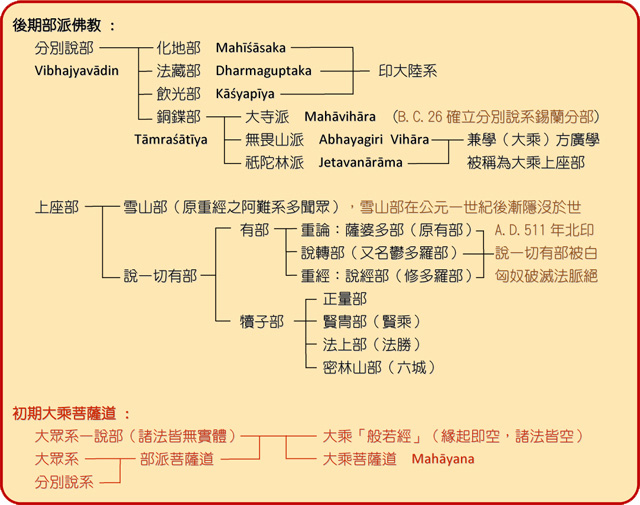

## 共讀打卡不到10人

入群的人多了，共讀的人卻少。群裡已經有90多人，但共讀打卡的不到10人。因此，我想再次介紹《阿含經》的殊勝之處。

尤其是對比南傳和藏傳之後，漢傳佛教中《阿含經》的特殊性更加凸顯。

需要說明的是，這裡並不是說漢傳各方面都比南傳和藏傳更好，而只是在《阿含經》所代表的部派佛教經典方面，漢傳佛教有其獨特之處。在其他方面，南傳和藏傳當然各具特色，但這並非本文的重點，故不再展開。

## 阿含經是最原汁原味的佛教聖典

阿含經是我們可以接觸到的，最原汁原味的佛教聖典。它最能反映佛陀的教法，最為原始，也是最無爭議的經典。

在佛教史中，部派佛教時期是距離佛陀最近的時期。再早的時候，要麼還沒有結集經典，要麼靠口誦，而沒有文字記載。而流傳下來最早的佛經，只有阿含系列（或對應的經典）。

部派佛教時期的經典，成體系的，只有四阿含和巴利三藏。而藏傳經典，對應的經典，少到可以忽略不計。

## 南傳上座部的尼柯耶

南傳的經藏，指的是巴利三藏，而不是指讀《阿含經》的南傳學派。

南傳的全稱其實是：上座部分別說系赤銅鍱部大寺派。

瞭解過佛教史的人都知道，在部派佛教時期，佛教分裂成多達18個（其他說法有更多）的部派佛教。而現在的南傳上座部佛教，僅僅是部派佛教中的一支。

圖片來源：佛光教科書，佛教史，星雲大師 (masterhsingyun.org)

而後來的大寺派，是在赤銅鍱部內部再次分化出來的。參考下圖：

圖片來源：原始佛教會，https://www.arahant.org/hou-qi-bu-pai-chu-qi-da-sheng

總結來說，現在南傳上座部的巴利三藏，只是眾多18個部派佛教中的一支。巴利三藏中的經藏（為五部尼迦耶：《長部》、《中部》、《相應部》、《增支部》和《小部》），根據《漢譯南傳大藏經》進行統計，共有115卷。分別是：
1. N0004 長部經典（14卷）
2. N0005 中部經典（4卷）
3. N0006 相應部經典（11卷）
4. N00O7 增支部經典（3卷）
5. N0008-23 小部 N26-47（83卷）

## 漢傳中的《阿含經》

漢傳中的《阿含經》，通常稱之為《四阿含》，總共183卷。包括：
1. 《長阿含經》22卷
2. 《中阿含經》60卷
3. 《雜阿含經》50卷
4. 《增一阿含經》51卷

另有《別譯雜阿含經》20卷，內容和四阿含有重複，故不計入統計。

實際上《四阿含》還更多一些，因為漢傳三藏有很多遺失的經典。而相對而言，巴利三藏中遺失的則少一些。原因是，巴利三藏有背誦的傳統，即把巴利三藏全部背誦下來，這樣一代一代傳下去。而大乘佛教（阿含經和大乘經）的三藏數目過於龐大，基本上沒人可以全部背誦下來，這就導致了遺失的可能性更大。

僅以現存的三藏來說，為何漢傳佛教中的四阿含會比巴利三藏中的經藏多68卷呢？

原因很簡單，巴利三藏是從部派佛教時期的一支而來，而四阿含是從多個部派佛教傳承而來，例如：說一切有部、法藏部、大眾部、飲光部等。（綜合了各種說法。）

## 漢譯五部尼柯耶和四阿含的對比

## 藏傳中只有散落的部分

那麼藏傳中的《甘珠爾》中，又有多少和《四阿含》可以對應的呢？

這個問題很難找到直接的資料，經過和ChatGPT、Deepseek、Gemini多輪資訊，總結如下：
1. 藏傳《甘珠爾》中並沒有系統、完整地收錄相當於巴利四部或五部尼柯耶的經典。
2. 只有少量經文（多是片段或節錄），可以和巴利尼柯耶找到平行或對應段落。
3. 數量遠遠低於漢傳四阿含與巴利三藏的對應度，無法像漢譯阿含那樣可集中對讀。

有學者分析和對比過，《甘珠爾》中只有幾十部零散的譯本，大概在50-60經（單位不是卷）。如果按照《雜阿含經》中卷和經的比例關係，50捲包含1362經，平均一卷包含27經，那麼50-60經，也許只相當於2-3捲了。如果參照《長阿含經》中卷和經的比例（22卷/30經），那麼則有40捲了。兩者再取一個平均值，那也只有20卷左右了。

以藏傳經藏中的全部經藏來說，阿含經對應的比例，低到可以忽略不計了。之前和藏傳的佛友聊過這個問題，他說，藏傳主要通過學習《俱舍論》來學習部派佛教了。

**為何藏傳佛教中相應經典如此稀少？**

因為藏傳佛教開始的時候，印度佛教已經進入到了佛教大乘晚期，早期經典早已遺失殆盡，或被忽視不計了。如果對比下密教和部派佛教，無論是從形式還是理論，說是兩個宗教也完全沒問題。

## 總結

漢傳佛教中的四阿含有183卷之多，對比南傳巴利三藏中的經藏115卷，多了68卷。比起藏傳對應的四阿含或巴利經藏，多了160多卷，甚至多了180卷。

所以，四阿含是漢傳佛教中的至寶，比起巴利三藏是單一部派分支的經典，四阿含是多個部派留存下來的合集。而藏傳佛教主要是大乘後期的佛教思想（密教），和阿含意趣相差懸殊。

阿含經是我們可以接觸到的，最原汁原味的佛教聖典。最能反映佛陀的教法，最為原始，也是最無爭議的經典。

這麼殊勝，這麼獨特的四阿含，你還有不想讀一讀嗎？

阿彌陀佛。

愚千一

