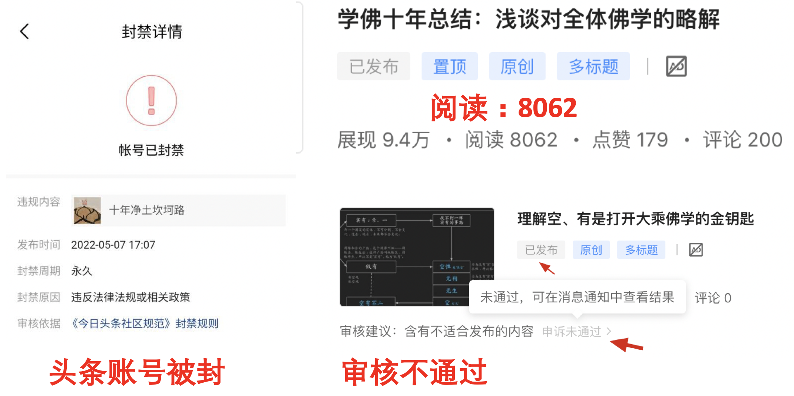
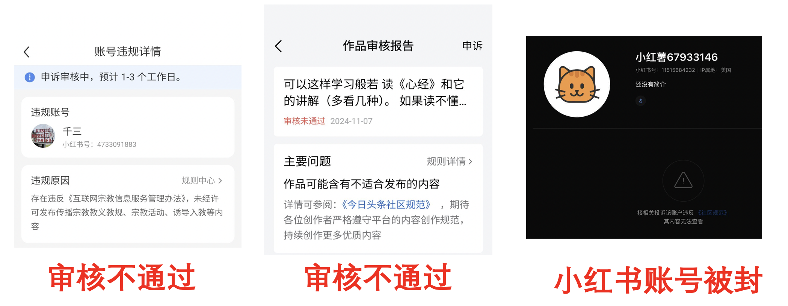
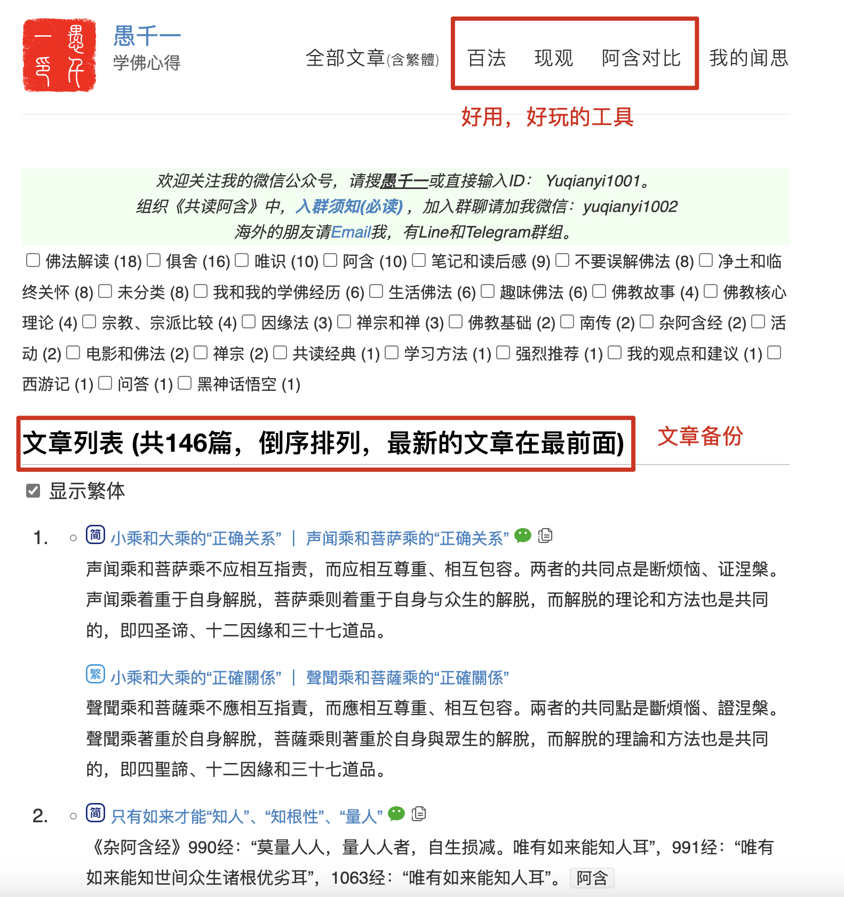

## 被封、被限制的总记录

1. 2022-05：头条账号被封  
2. 2024-01：微信群被封（一个新建的群而已，对话不超过10句，也被封了）  
3. 2025-01：小红书上建群，共读经典，一日后，群被解释
4. 2025-01：小红书账号被封  
5. 发表文章或帖子，审核不通过的记录，数不清了，包括平台：头条，小红书，豆瓣，百家号，简书……  
6. 发表了，但是别人看不到：小红书  
7. 可能被限流，无平台推荐流量：小红书，公众号，微博  

## 第一次被封号 - 头条

最早开始写文章，是在头条上发表的。有几篇总结性质的文章，正好是我个人学佛十年经历和心得的分享。

也许是因为这些文章信息量较大，每篇的阅读数都过万。其次，我在评论区积极互动，哪怕有人骂我，我也感谢他们的阅读和留言。当然，也可能是平台照顾新作者，主动给了一些流量。

写了几篇后，突然就很难再发文章了，因为审核一直通不过。无论怎么改都不行，而平台也不会告诉你具体的问题出在哪。甚至，我还把一篇长文拆成一节一节地发，想看看究竟是哪段通不过，最终还是没用。

就在我一筹莫展的时候，账号被封了。

## 平台的无常

第一次被封之后，才有了这个公众号。基于之前被封的经历，我觉得公众号也未必能长久，所以就去找一个更可靠的备份。这样就有了我的个人小站 [https://yuqianyi1001.github.io/](https://yuqianyi1001.github.io/)，里面有所有文章的备份。后来，我还陆续加了一些单网页应用，比如《可交互的百法大图》《阿含对比阅读》《现观大纲》等，后续会增加更多有趣的小应用，也欢迎收藏和分享。

**封禁的权力在平台**

相同的文章，相同的内容，发在头条就不行，但发在公众号却可以。这是为什么？是不同平台遵守了不同的法律法规吗？

不仅头条不行，大部分平台也不行，比如百度的百家号、豆瓣、简书等，知乎也不太行了。

当然，微博还能发，但是几乎没有任何留言和评论，也许是被限流了，也可能是没人感兴趣。后来，我也懒得在微博更新了。

**可能被限流**

目前这个公众号已经存在3年了，至今还没被封。但是，有可能被限流（平台不会主动推荐，基本要靠读者分享传播），因为推荐流量少得可怜。我也只是猜测，没有十足证据。同样的内容，按理说阅读量不该差那么多。

之前提到，头条上每篇文章很容易在一两周内过万阅读，因为新号会有系统推荐流量。而在公众号上，同样的那几篇文章，3年来总阅读量也只有几百，少得可怜。

每年年底，公众号都会出年度总结。2024年，所有的阅读量加起来也才3万5左右，还不如头条上当初的几篇文章，这差距实在明显。所以我猜不仅仅是推荐机制的原因。

## 第二次被封号 - 小红书

第二次被封的是小红书账号。我在公众号上会积极解释误解、澄清正见，一开始在小红书也是如此希望的。

但很快我发现行不通：许多内容虽然能发出去，但别人看不到，实际上被平台隐藏了。只有我自己能看到，别人根本看不到。

我是怎么发现的呢？起初只是好奇怎么阅读量一直是1、2个，那不就是我自己吗？为什么没有别人？于是我注册了一个小号去查看大号空间，却看不到新帖子，这就是系统隐藏了。

头条至少审核不通过会直接告诉你，而小红书则好像发布成功了，其实别人看不到，被平台悄悄隐藏。这种感觉有点恶心，碰到几次后我就放弃了。

过了一段时间，到了2024年，我发现小红书上的宗教贴多了起来，于是又试着发了几条，居然都能发表出去。当时还挺惊讶，也许是审核规则变了。

那段时间，我对常乐我净的外道思想、本体论下的本佛思想、梵我合一等泛神论思想感到厌烦，就在小红书上发表了一些“暴论”，批判这类说法。有些“暴论”后来我也专门写文章展开陈述（以后有机会再继续写）。这些“暴论”虽然有一些批评声音，但并没有特别“严重”。

直到有一天，我提到了《楞严经》。在发表“暴论”之前，我考虑到《楞严经》的广大信众，所以说得已经很委婉，最后一句是：“如果学过阿毗达摩，就读不下去楞严了。” 这话已经很客气了，但还是引来了不少批评。倒不是我觉得会有很多人同意，毕竟读过阿毗达摩的人太少，他们关心的根本不是阿毗达摩是什么，也不关心为什么读完阿毗达摩就读不下去楞严，只是听不得对“楞严”的不利评价，好像祖坟被刨了一样。

随后，账号就被封了。平台说是被投诉，所以封号。

## 封号之后

有人说，如果因为害怕禁言、害怕被封就不敢说话，那不就等于自己先把自己封禁了吗？——我很同意。要么让我说话，要么让我闭嘴。（当然，这里仅限于佛学方面。）

所以账号被封，我一点也不觉得可惜，甚至诧异来得有点晚。之前已经发表了不少“暴论”，批评的力度比批评楞严更大，比如：

* “开悟才是副产品”，后来还写了文章详述，参考 [《开悟，只是修行中的“副作用”而已》](https://mp.weixin.qq.com/s/8vutlnqb1W0HRc86JZMlIA)  
* “成佛都是副产品”  
* “不守戒律，只是佛教的外伤。佛教走向末法，什么才是佛教的内伤呢？—— 那就是外道思想混入佛教，并成为主流思想。”  
* “汉传佛教，成也禅宗，败也禅宗”  

再看这句话：

* “如果学过阿毗达摩，就读不下去楞严了”

其实最后这句反而是最温和的。

小红书上批评佛教的帖子很多，不过大多是教外人士，并不了解佛教，批评得也很低级。但这些帖子能存在，就给人一种错觉，好像佛教可以随便被批评。其实“楞严”争议由来已久，本来也没什么，但有人受不了就去投诉，平台就封号了。由此可见，批评佛教或许行，批评楞严却是万万不行。

## 且行且珍惜

能读到这里，相信都是和我有缘的读者。请珍惜这个号还存在的时光吧。我并不知道哪天会被封，但如果那一天真的来了，请记得它曾经存在过。

除了公众号，还有一个群，目前在共读《阿含》。也请大家珍重、珍惜。

阿弥陀佛

愚千一
