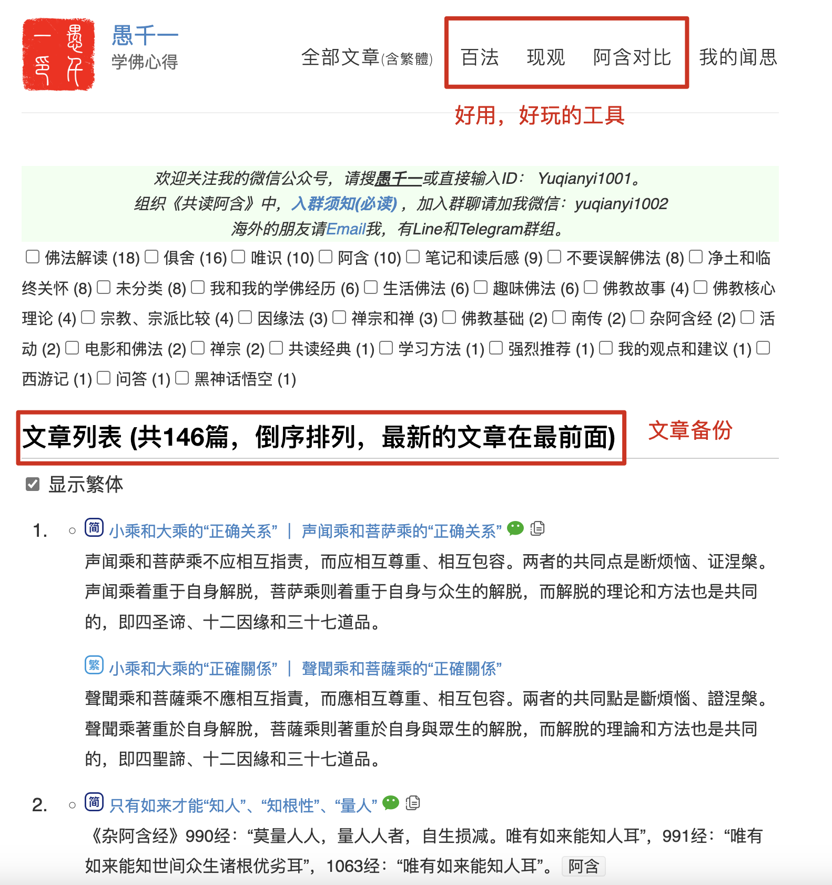

## 被封、被限制的總記錄

1. 2022-05：頭條賬號被封
2. 2024-01：微信群被封（一個新建的群而已，對話不超過10句，也被封了）
3. 2025-01：小紅書賬號被封
4. 發表文章或帖子，審核不通過的記錄，數不清了，包括平臺：頭條，小紅書，豆瓣，百家號，簡書……
5. 發表了，但是別人看不到：小紅書
6. 可能被限流，無平臺推薦流量：小紅書，公眾號，微博

## 第一次被封號 - 頭條

最早開始寫文章，是發表在頭條上的。有幾篇文章是總結性質的，正好是我個人學佛十年經歷和心得的總結和分享。

也許是總結的文章信息量大的緣故，每篇的閱讀數都過萬了。其次，是因為我在評論區積極互動。哪怕罵我的人，我也感謝他們的閱讀和留言。當然，也可能是平臺照顧新人的緣故，會主動給一些流量。

幾篇之後，突然就很難再發文章了，因為審核不通過。無論怎麼修改，都無法通過。平臺也不會告訴你具體是哪裡有問題。甚至，我把一篇大的文章拆成一節一節地發表，看看到底是哪一段審核不過，最終還是不行。

就在我一籌莫展的時候，賬號被封了。

**封禁的權力在平臺**

相同的文章，相同的內容，發在頭條就不行，而發在公眾號就可以。這是為什麼呢？是不同的平臺遵守了不同的法律法規嗎？

不僅頭條不行，大部分平臺都不行，比如百度的百家號、豆瓣、簡書，這幾個都不行。知乎也不太行了。

當然，微博還是可以的，但是幾乎沒有任何留言和評論。所以，也許是被限流了，也許就是微博上沒人感興趣了。微博也不如小紅書了。後來，微博上我也懶得更新了。

**可能被限流**

目前的公眾號已經存在了3年，至今還沒有被封。但是，有可能被限流（平臺不會主動推薦，完全靠讀者的分享進行傳播）。因為推薦的流量少得可憐。我也只是猜測，並沒有十足的證據。同樣的內容，按道理來說，流量也應該差不多的。或者，不該差這麼多。

之前提到，頭條上每篇閱讀量很容易在一兩週內過萬。因為是新號，所以這些流量都是系統推薦的。而在公眾號上，相同的那幾篇文章，3年來都只有幾百的閱讀量，少得可憐。

每年年底，公眾號都會有年度總結。2024年，所有的閱讀量加起來也僅僅有3萬5左右，還不如頭條上的幾篇文章而已。這就是差距吧。所以，我推測不僅僅是平臺推薦的區別了。

## 第二次被封號 - 小紅書

第二次被封是小紅書的賬號。我在公眾號上，是比較正向的，是在積極解釋誤解，澄清正見的。而在小紅書上，一開始我也是希望如此的。

但是很快，我發現行不通。很多發佈的內容，雖然可以發佈出去，但是別人看不到，實際上是被平臺隱藏起來了。只有我自己可以看到，任何人都看不到。

我是怎麼發現的呢？一開始我只是好奇，怎麼一點閱讀量都沒有，只有1、2個閱讀，那不就是我自己嘛？怎麼沒有別人呢？於是，就註冊了一個小號，去看大號的空間，是看不到新貼子的。這就是系統隱藏了。

頭條是審核不通過，還不會欺騙你。

小紅書是好像發佈成功了，但其實別人看不到，只有你自己看到，被平臺隱藏了。這種感覺有點噁心。被噁心多了，我就放棄了。

過了一段時間，查不到到了2024年的時候，我發現小紅書上的宗教貼有多了起來，於是，我也嘗試了幾條，居然都發表出去了。當時，我還有點驚訝，怎麼又可以發了呢。也許是審核發生了變化吧。

那段時間，我對於常樂我淨的外道思想，本體論下的本佛思想，梵我合一，等泛神論思想感到厭煩，於是就在小紅書上發表了一些“暴論”，批判了這類的說法。有些“暴論”，後來我都有些文章展開陳述我的觀點。（以後有機會我會繼續陳述那些的“暴論”。）這些“暴論”雖然引起了一些批評，但是並沒有特別“嚴重”。

直到有一天，我提到了《楞嚴經》，在發表“暴論”之前，我已經考慮到了《楞嚴經》的廣大信眾，所以委婉了很多，最後我說：“如果學過阿毗達摩，就讀不下去楞嚴了” —— 這句話，已經十分委婉了吧？但是，並沒有減少多少批評的聲音，批評倒是無妨，我本來也沒有覺得有幾個人會同意，畢竟讀過阿毗達摩的人，太少太少了。所以，他們關心的根本不是阿毗達摩是什麼，為什麼讀完阿毗達摩就讀不下去楞嚴了，他們只是聽不得“楞嚴”的不好，那種不好，就跟祖墳被刨掉了差不多。

之後，賬號就被封了。平臺說是被投訴，所以封號。

## 封號之後

有人說，如果害怕禁言，害怕被封而不敢說話了，那不相當於自己封禁自己了嘛？！—— 我十分同意。要麼讓我說話，要麼讓我閉嘴。（當然，僅僅限於佛學上嘍。）

所以，賬號被封。我一點都不覺得可惜，還詫異這次封禁來得有點晚了，因為，之前已經發表了不少“暴論”，所批評的力度，都比批評楞嚴要大得多了。比如說：

* “開悟才是副產品”，這條後來有寫文章詳細說明，參考 [《開悟，只是修行中的“副作用”而已》](https://mp.weixin.qq.com/s/8vutlnqb1W0HRc86JZMlIA)
* “成佛都是副產品”
* “不守戒律，只是佛教的外傷，佛教走向末法，什麼才是佛教的內傷呢？ —— 那就是外道思想混入了佛教，且變成了主流思想。”
* “漢傳佛教，成也禪宗，敗也禪宗”

再把這句話放一起看：

* “如果學過阿毗達摩，就讀不下去楞嚴了” 

是不是最下面這句是其中最溫和的呢？

其實，小紅書上批評佛教非常多，當然，大多批評一看都是教外人士，一點都不懂佛教的那種，所以，批評的點都很低級。但是，這類批評的帖子，可以存在於平臺上，就會給人錯覺，好像佛教是可以被批評的一樣。“楞嚴”爭議由來已久，其實，本來也沒什麼，但是，就是有人受不了。於是，投訴了。平臺就封號了。由此看來，批評佛教是被允許的，但是批評楞嚴卻是萬萬不行的。

## 平臺的無常

第一次被封后，才有了這個公眾號。基於之前被封的經歷，也許公眾號也不能長久存在，所以，就開始找一個更加可靠的備份。這樣就有了我的個人小站，https://yuqianyi1001.github.io/ ，裡面有所有文章的備份。後來，除了文章的備份之外，還發現可以包括一些單網頁應用，非常有趣，比如：《可交互的百法大圖》《阿含對比閱讀》《現觀大綱》，後續還會增加更多，更有趣小應用。也歡迎惠存和分享。

## 請珍惜

能讀到這裡，相信都是和我有緣的讀者了，那麼，還請珍惜這個號存在的時光吧。我並不知道，那一天會在什麼時候到來。但是，如果它來了，請記得它曾經存在過。

除了號，還有一個群。目前在共讀阿含。也請珍惜，珍重。

阿彌陀佛

愚千一
