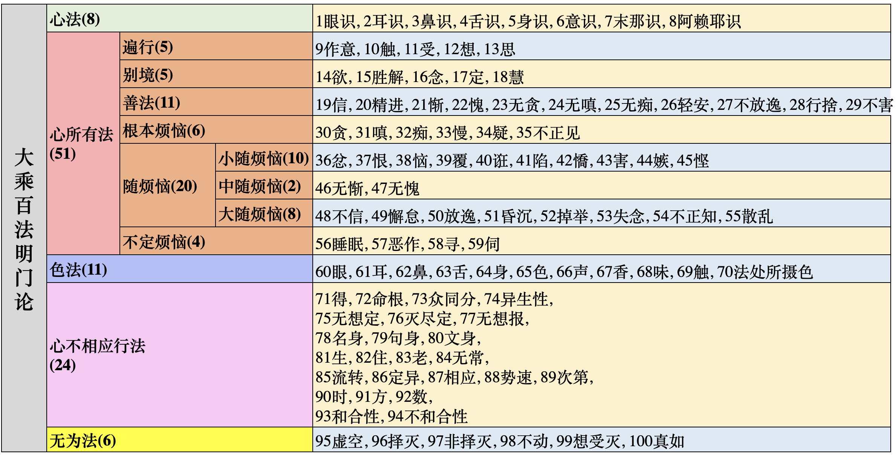

# 大乘百法明门论

**天亲菩萨造**
**唐三藏法师玄奘奉诏译**

如世尊言。一切法无我。
何等一切法。云何为无我。
一切法者。略有五种。
一者心法。二者心所有法。三者色法。四者心不相应行法。五者无为法。
一切最胜故。与此相应故。二所现影故。三分位差别故。四所显示故。
如是次第。

第一心法略有八种。一眼识。二耳识。三鼻识。四舌识。五身识。六意识。七末那识。八阿赖耶识。

第二心所有法。略有五十一种。分为六位。
一遍行有五。二别境有五。三善有十一。四烦恼有六。五随烦恼有二十。六不定有四。
一遍行五者。一作意。二触。三受。四想。五思。
二别境五者。一欲。二胜解。三念。四定。五慧。
三善十一者。一信。二精进。三惭。四愧。五无贪。六无嗔。七无痴。八轻安。九不放逸。十行舍。十一不害。
四烦恼六者。一贪。二嗔。三慢。四无明。五疑。六不正见。
五随烦恼二十者。一忿。二恨。三恼。四覆。五诳。六谄。七㤭。八害。九嫉。十悭。十一无惭。十二无愧。十三不信。十四懈怠。十五放逸。十六惛沈。十七掉举。十八失念。十九不正知。二十散乱。
六不定四者。一睡眠。二恶作。三寻。四伺。

第三色法。略有十一种。一眼。二耳。三鼻。四舌。五身。六色。七声。八香。九味。十触。十一法处所摄色。

第四心不相应行法。略有二十四种。一得。二命根。三众同分。四异生性。五无想定。六灭尽定。七无想报。八名身。九句身。十文身。十一生。十二老。十三住。十四无常。十五流转。十六定异。十七相应。十八势速。十九次第。二十方。二十一时。二十二数。二十三和合性。二十四不和合性。

第五无为法者。略有六种。一虚空无为。二择灭无为。三非择灭无为。四不动灭无为。五想受灭无为。六真如无为。

言无我者。略有二种。一补特伽罗无我。二法无我。　

# 百法原文表格

以下是百法原文，排版成表格的样子。仅仅省略了一些重复的连接句：“一遍行五者”，“二别境五者”，“三善十一者”，“四烦恼六者”，“五随烦恼二十者”，“六不定四者”。

# 百法表格

简略版，且序号是从1，100。

# 百法大图

# 百法大图可交互版

https://yuqianyi1001.github.io/100/

以及每个序号都可以点击，显示解释的交互版。（有部分国内的朋友告诉我，这个网站无法打开了。那就只能先科学上网了。）

阿弥陀佛

愚千一
