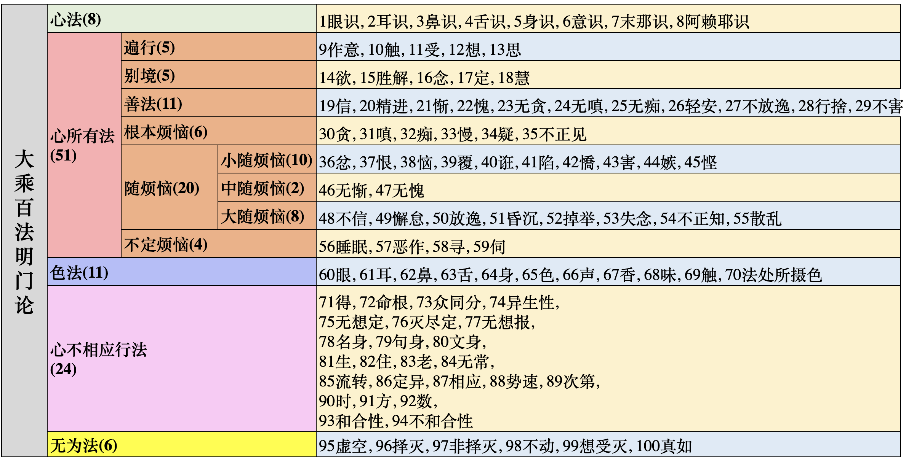
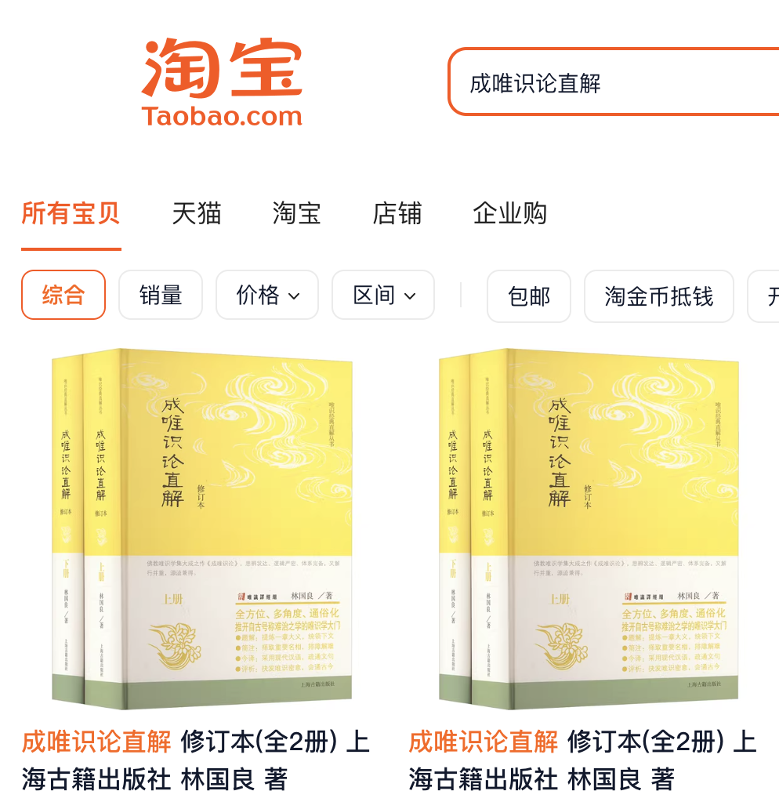

## 百法表格

简略版，且序号是从1到100。

## 介绍“《大乘百法明门论》直解”

这篇文章，是根据林国良教授的《成唯识论直解》中的《大乘百法明门论》直解（简称《百法直解》），摘录和整理的。

注意，这里的摘录和整理无法替代原文，建议朋友们还是尽量阅读下原文。这本书在各大网店都可以购买，例如：万能的淘宝。

## 《大乘百法明门论》直解

<!-- 用这个工具制作表格 https://www.tablesgenerator.com/html_tables# -->

阿弥陀佛。

愚千一

