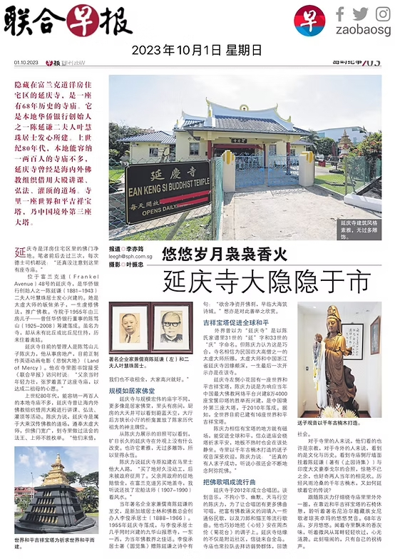
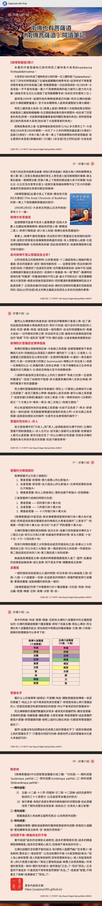

#  新加坡延庆寺

新加坡延庆寺是一座位于新加坡富兰克道（Frankel Avenue）洋房区内的寺庙，到2023年已有68年历史。它是由华侨银行创始人之一陈延谦的二夫人叶慧珠居士发心，并由儿子陈笃山于1955年建成。

虽然名为“寺”，但从未有僧侣住持，更像是一座清净的“居家佛堂”。

延庆寺内有一座“世界和平吉祥宝塔”, 是为响应当年中国最大佛教网络平台建8万4000座宝塔的善举而兴建, 是中国境外第三座大塔, 于2010年落成。据悉, 全世界目前已建有16座世界和平吉祥宝塔。另外，寺里以千年古楠木打造的送子观音深受信众喜欢。

下图是联合早报对新加坡延庆寺的完整报道。（字迹略小，请放大阅读。）

# 《延庆文坛》

《延庆文坛》是延庆寺主编的一本佛教刊物。根据我在寺院官网上看到的记录来看，一年出四期，正好对应四季。正是这本2025年春季刊（编号2025-01）收录了我的文章  —— [《南传也有菩萨道 \|〈南传菩萨道〉阅读笔记 \| 南北传菩萨道的简略对比》](https://mp.weixin.qq.com/s/fwgHuMw9PTOZsy7OEDzDyA) 收录在乙巳年春季刊 SPRING EDITION 2025-01。

# 后记

小时候上学的时候，经常读别人的作文佳作，其中有一句印象深刻，那就是优秀的作文，会被铅字印刷出来。这还是互联网发达之前的世界，被铅字印刷出来，都是指新闻，杂志，书籍等，那都是相当有分量的肯定了。虽然，互联网时代，自媒体横行，铅字印刷的分量似乎也有所下降，但是能够被收录，依然是一件很值得鼓励的事情吧。因此，也算是一个小小的纪念了。

阿弥陀佛，千一合十

