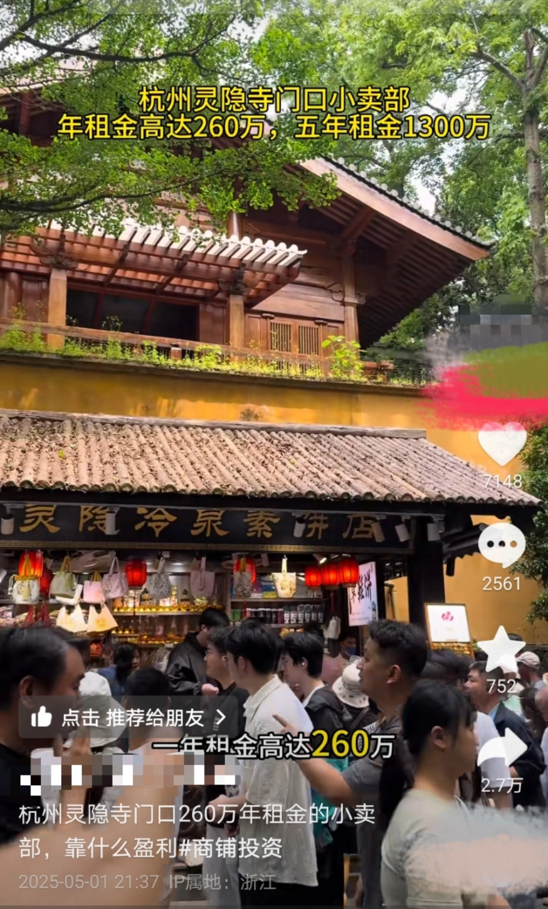
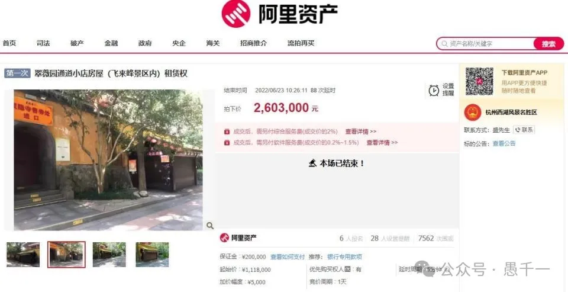
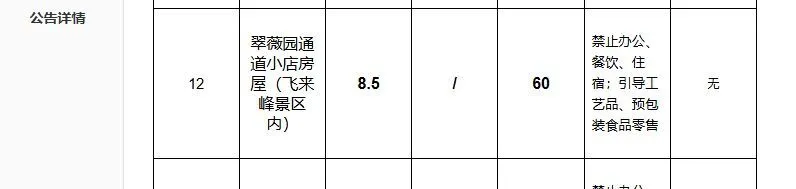

# 灵隐寺天价小卖部，和佛教有什么关系？别再让佛教背锅了！

## 事件回顾：灵隐寺景区现“天价”小卖部

杭州灵隐寺景区入口处的“灵隐冷泉素饼店”小卖部（仅8.5平方米）。五一假期，一位博主发布视频称该小卖部一瓶普通矿泉水卖8元、年租金高达260万元，在网上引发热议。不少网友调侃：“游客烧香拜佛先被宰一刀，佛祖看了可能都叹气”。灵隐寺因此一度被推上舆论风口。

## 租金调查：年租金260万，公开竞拍所得

随着讨论发酵，小卖部背后的经营数据被媒体曝光：其**年租金高达260.3万元**，是通过公开竞价取得的。杭州西湖风景名胜区管委会工作人员5月4日证实，**2022年该店铺租赁权公开招标**，成交年租金达**二百多万元**。拍卖平台信息显示，该8.5㎡店铺起拍价111.8万元，经过88次竞价延时，最终以260.3万元成交。

如此高昂的租金意味着什么？粗略计算，**日均租金约7123元**。再加上装修、水电、人力等支出，网友估算该店每日经营成本**至少上万元**。难怪有人感叹：“怪不得景区的物品比市场价高出好几倍”，“店铺租金贵，最后都是游客埋单”。可见，高租金直接推高了商品售价，游客埋单的其实是景区**稀缺商业资源**的溢价。

值得一提的是，这并非孤例。**西湖景区其他热门点位**也拍出过惊人高价。例如，2023年西湖白堤一处仅4.5㎡的售卖亭最终以**284万元/年**租金成交。可见在游客密集的著名景区，“寸土寸金”导致商铺租金畸高，这更像是旅游市场驱动的结果，并非某座寺院独有的问题。

## 商铺归属：景区经营公司持有，寺院并未参与

很多人看到“灵隐寺”字样，直觉会责怪寺院敛财，认为**寺庙靠高价商品牟利**。但事实恰恰相反：上述小卖部的**产权和经营权并不属于灵隐寺**等佛教寺院。正如西湖风景名胜区管委会所述，该铺位由景区方面公开招租，租金收益归属景区管理方。换言之，这间店只是**景区资产**的一部分，由景区管理机构或其下属企业对外招租经营。

灵隐寺景区隶属杭州市西湖风景名胜区管委会，后者是政府派出机构，负责西湖及周边景区的统一管理和开发。根据杭州市政府官网信息，管委会下设有**国有独资的景区资产经营公司**，专门负责景区内商业项目的运营管理。因此，灵隐寺景区内商铺的租金收益实际归于国有资产，并不归寺院或僧侣个人。

事实上，灵隐寺等宗教场所**管理权与商业经营权是相分离**的。寺院僧众的职责在于宗教法务和文物古迹维护，并不直接参与景区商业运作。景区内售票处、商店、小吃摊等由景区管理方或承租商家运营。高价售卖矿泉水的**并非出家人**，而是以高价拿下铺位经营权的商家。

## 不应让佛教替“天价”背锅

透过上述事实可以看到，灵隐寺“天价小卖部”反映的是景区商业行为，与佛教宗教活动无关。类似灵隐寺这样的名刹，由政府主导旅游开发，寺院专注宗教事务，高昂物价更多是**市场逐利**的结果。以少林寺为例，少林景区早年实行门票收入**政府与寺院分成**，寺院仅得其中三成；且这笔收入主要用于古寺维修和僧众生活，曾因地方拖欠票款而影响寺院运转。由此可见，寺庙在景区商业收益中所占比例很小，更像被动参与者，而非操盘者。

正因为管理权和经营权分离，我们不应把景区高物价的账算到佛教头上。当游客因景区商品定价过高而不满时，应该理性看待**背后的市场供求与管理责任**——质疑可以指向景区经营方的定价策略和监管问题，但不该迁怒寺庙或出家人。总而言之，**寺院并非景区逐利的主体**，不要让佛教无辜“背锅”。景区经营管理方理应承担其定价策略的后果并改进问题，同时各方也应维护宗教场所的清誉。

## 尊重宗教和文化

佛教虽然从印度传来，但早已实现了中国化，且是传统文化中的重要组成部分。禅宗，净土宗，天台宗等都是汉传佛教的特色。尊重宗教，尊重文化，还以清净，这是有关部门需要审视的话题。物质世界的丰富不代表精神世界也丰富，有时反而会凸显精神世界的缺失。如何让人们在丰富的物质生活中，也能够达到精神层面的满足，是有关部门所应该重视的。仅仅以此作为呼吁吧。毕竟这是个复杂的、社会问题，不会容易轻易改变的。

阿弥陀佛。

愚千一

