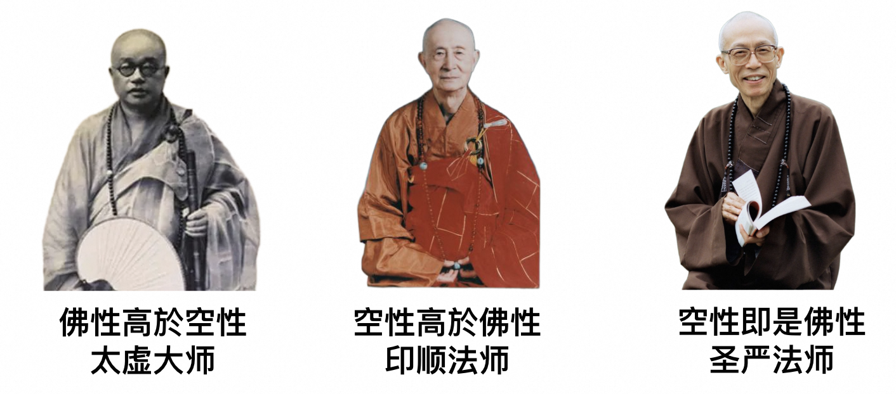
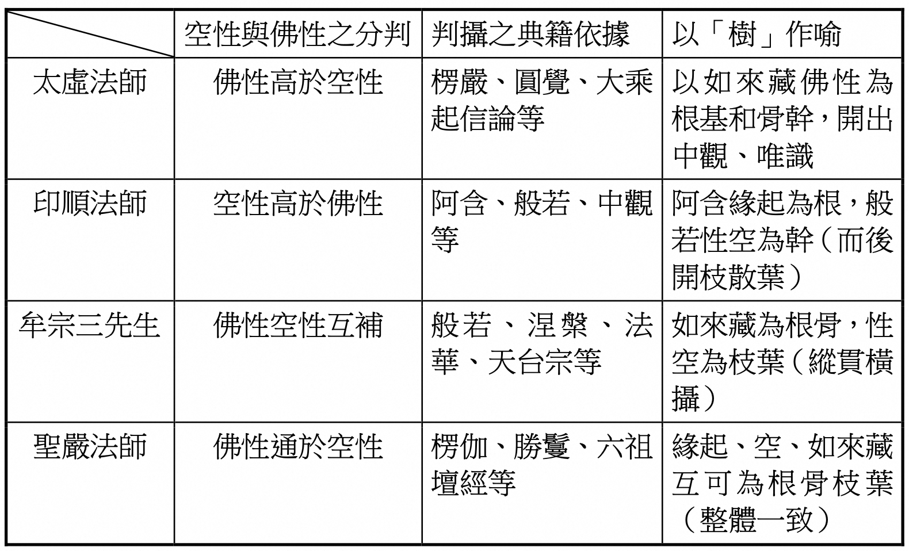

# 圣严法师的佛学思想是般若空性（以般若空性为究竟法），把如来藏当做方便法，接引法

## 佛性与空性

要说明这个问题，那是相当的不容易。

幸好，有林建德教授已经做了整理，论文是《試論聖嚴法師對「空性」與「佛性」之詮解與貫通》，收录在《法鼓佛学学报第21期》。我就直接引用下他的论文精华吧，如下：

首先他介绍了太虚大师和印顺大师的观点。

太虚大师是汉传传统佛教的代表。汉传佛教除了唯识宗、三论宗以外的其他宗派（如禅宗，净土宗，天台宗，华严宗等）通通都是如来藏系为主流思想的。而了解和学习过唯识宗和三论宗的人，非常非常少。

因此，太虚大师的佛学观点 —— 佛性高于空性 —— 也是传统如来藏系的观点。如来藏即佛性。如来藏等于佛性。佛性和如来藏这两个词是相当的，在佛教内基本上是没有分歧的。所以，后文中，我会混用这两个词，但是他们都可以相互替换的。

印顺法师是近代宗教家，兼具学者风格的代表。也是三论宗或般若宗的代表。或者也可以包括中观宗的代表。藏传佛教中，有不少是中观系的。

为什么大师们会有不同的观点呢？为什么圣严法师要去融合两者呢？我们先要从佛性和空性的基本定义开始。

## 什么是佛性？

**佛**：代表了最圆满的智慧和慈悲，或者说是最圆满的觉悟。无论是智慧、觉悟、慈悲 —— 都是正面的、积极的描述，而且都是有作用的，自度度人，自利利人的。

**佛性**，用两种解释：
* 代表了成佛的可能性，潜力，但是还要经历修行，才能具备完整的佛的智慧和慈悲。这个说法是最稳妥的，最不容易产生误解的。
* 是每个人的“本来面目”，“佛性本有”，每个人，每个有情都已经具有完整的佛性（智慧和慈悲），而只是因为客尘烦恼而无法把佛性完全展露出来。这个说法，相对前者，容易引起误会。这里先不展开了。

## 什么是空性？

也有两种理解：
**虚空**：虚空是最佳的比喻，但虚空本身不是真实存在的，虚空也是没有作用的，虚空只是不障碍一切事物、一切现象的发生。

**毕竟空**：一切的现象都有成、住、坏、空是个阶段，而空是最后的阶段，也是最后的结局 —— 即般若讲的“毕竟空”，所以用这个“空”来理解也是可以的。

**空性**：这就是**缘起性空**的“空”了，因缘有，自性空。因为一切的现象（人、事、物）都是因缘和合才产生的，所以一切的现象都有成、住、坏、空是个阶段。一切现象有，但是自性空，自性空的意思是，这些现象都没有一个实体。

**实体**：实体的定义是，如果存在一个永恒的，不变的“东西”，那么这个“东西”就是它的实体。而且这个“东西”是要在任何条件下都要保持固定不变。现代物理学特别可以佐证这点。

## 为什么如来藏系认为“佛性高于空性”？

很简单，因为如来藏系的传统观点，都是认为人人本具佛性，而且，这里的佛性是倾向于第二个佛性的意思，即人人本具圆满的佛陀的智慧和慈悲。

强调佛性的时候，往往是看重他们的作用的，即智慧的作用和慈悲的作用。这也包括了佛陀不可思议的广大神通。

从重视“佛”的智慧和慈悲作用的角度来说，有作用的佛性，比一个没有作用的佛性更加积极，更加启发人，更加鼓舞人。因此，如来藏系的人，通常都是坚持这个观点的 —— “佛性高于空性”。

这其实是汉传佛教的主流思想（没有之一）。以及藏传佛教中的主流思想之一。

## 为什么般若或中观会认为“空性高于佛性”呢？

理由也很简单。因为般若系的核心思想是 —— 缘起性空。以般若系来说，缘起性空是最究竟，最了义的，也是最高的教理。

而成佛，是从一个凡夫，历经三大无比久远的劫数，慢慢修行，最后才能成佛。所以，成佛也是因缘法，“佛”也是自性空的，并没有一个“佛”的实体存在。成佛后，佛也会涅槃的，然后“毕竟空”。

（补充：这个涅槃后面是什么呢？在声闻经或般若经中，把“灭度后是有是无”的问题归为无记问题，即无意义的问题，佛陀不予回答，经文也不回答。意思是，先修行成佛更为紧迫。）

以上，从般若系的核心理论出发，空性是一个更加准确、更加全面、更加普适的描述。相对来说，佛性就只是方便法，只是描述了成佛的一个角度而已了。所以，般若系的观点是“空性高于佛性”。

## 为什么圣严法师要调和两者？

### 圣严法师是以“缘起性空”为佛学中心思想

“聖嚴法師曾表達其「中心思想」，明確表示「緣起性空」是 他的思想中心”。林建德教授在论文是如此总结的。

不仅林建德教授如此总结。圣严法师的《法鼓全集》中的经典诠释系列，我全部读过，有些甚至不只是一遍。我也完全赞同林教授的观点。以下，略举一些例子。

>《聖嚴法師學思歷程》：
>
>「我在慧學方面，是從印度佛教的原始聖典《阿含經》入手，對於《阿含經》中所說「此生故彼生，此滅故彼滅」的緣起緣滅的道理，印象非常深刻，故當我解釋或說明佛法根本義理的時候，一定會從這個立足點上出發又回到這個立足點來。**就是我現在所弘傳的禪學，若以中國禪宗祖師們留下的文獻來看，是屬於如來藏系統的思想，可是我把佛法回歸到緣起性空的原點，不論在修行方法的指導和修行理念的疏通，我都會指出最基本的立場，那便是所謂三法印：「無常、無我、寂靜。」如果偏離三法印的原則，那就很容易跟外道的常見和斷見混淆不清了。**」
>
> 法鼓全集2020紀念版（第6輯第15冊，頁178）。取自：https://ddc.shengyen.org/?doc=06-15-012

而一些执着于如来藏系的人，对于三法印是在降级使用的，认为三法印只是现象层面的，而在佛性上，尤其是常、乐、我、净的佛性上，三法印是不适用的。

阿弥陀佛。

愚千一

