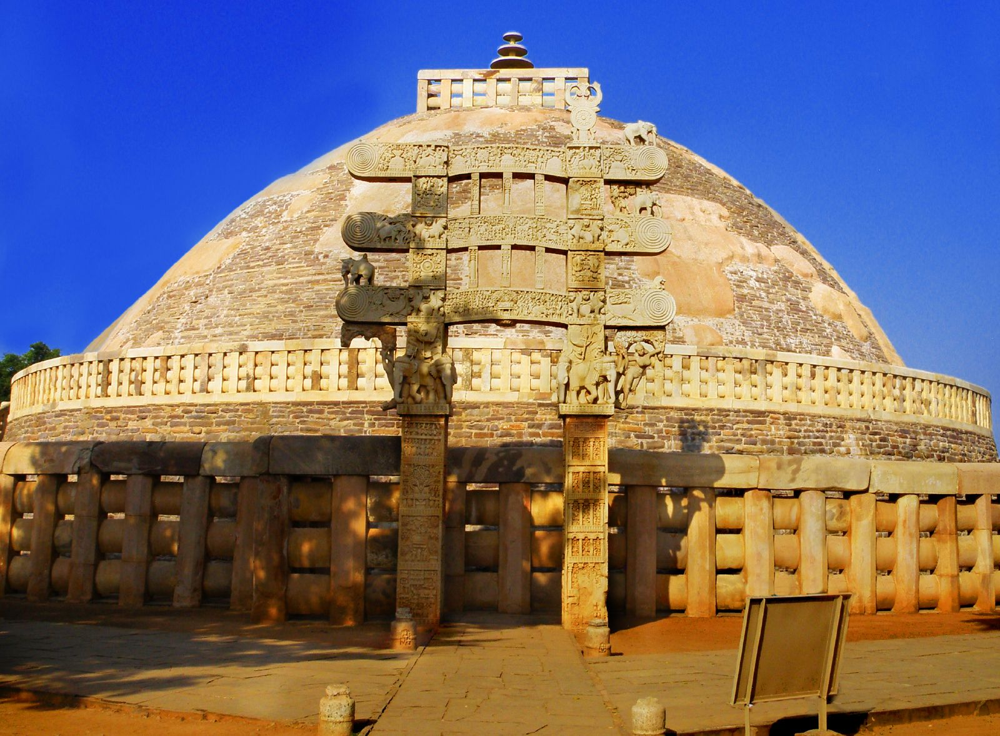

# 舍利弗结集的佛法大纲｜《长阿含经》卷8，众集经

按照佛教史的大多数说法，佛经的第一次结集，是在佛去世后，由大迦叶尊者组织结集的。由阿含尊者诵出佛经（法），由优波离尊者诵出律（律），合称**正法律**。

然而，实际的情况是，结集早在佛世的时候，就开始了。《长阿含经》卷8中的众集经，就记载了这样一件事情。

> 如是我闻：
> 一时，佛于末罗游行，与千二百五十比丘俱，渐至波婆城阇头庵婆园。
> 尔时，世尊以十五日月满时，于露地坐，诸比丘僧前后围绕。世尊于夜多说法已，告舍利弗言：「今者四方诸比丘集，皆共精勤，捐除睡眠，吾患背痛，欲暂止息，汝今可为诸比丘说法。」

世尊说了很多佛法后，告诉舍利弗说，他有背痛，需要休息一下。请舍利弗尊者为比丘们继续说法。注意，**在阿含经中的世尊，是非常朴素的、人间化的佛陀**，和人一样，也会生病的，经中有多次记载了背痛。

> 对曰：「唯然！当如圣教。」

舍利弗痛快地答应了世尊。

> 尔时，世尊即四牒僧伽梨，偃右脇如师子，累足而卧。

然后，世尊就躺下了休息，以狮子卧的姿态躺着。大概是右边侧躺，右手在下，左手在上，右脚在下，左脚在上，左脚放在右脚上。双脚略微弯曲。

> 时，舍利弗告诸比丘：「今此波婆城有尼干子命终未久，其后弟子分为二部，常共诤讼相求长短，迭相骂詈，各相是非：『我知此法，汝不知此；汝在邪见，我在正法。言语错乱，无有前后。』自称己言，以为真正。『我所言胜，汝所言负，我今能为谈论之主，汝有所问，可来问我。』

舍利弗说，尼干子死后不久，他的弟子们就相互争论，相互谩骂。彼此争论，自己才是正法，别人是非法。当时的印度除了佛教外，还有其他宗教，就说佛经中经常提到的六师外道。尼干子就是其中之一。

（备注，以佛教史来说，佛教的根本分裂也不可避免地发生了，不过是在佛灭度后的100-几百年之间，分成了上座部和大众部，后来又继续分裂成了20个左右的部派。）

> 「诸比丘！时，国人民奉尼干者，厌患此辈鬪讼之声，皆由其法不真正故；法不真正无由出要，譬如朽塔不可复圬，此非三耶三佛所说。

舍利弗先说了，外道尼干子说的不是正法，不是正等正觉的佛所说的。三耶三佛，更常见的名词是三藐三佛陀（正等正觉者）。

> 诸比丘！唯我释迦无上尊法，最为真正可得出要，譬如新塔易可严饰，此是三耶三佛之所说也。诸比丘！我等今者，宜集法、律，以防诤讼，使梵行久立，多所饶益，天、人获安。

舍利弗继续说，只有佛说的法，才是正法，才能出离生死。为了让佛法久住，应该结集佛法（也就是佛经的意思）。然后舍利弗就开始归纳、整理、并诵出佛法了。

他是以怎样的形式来归纳，整理佛法呢？从数字一、二、三开始，直到十。有兴趣的朋友可以直接参考原文，后来，我再用现代的方法再次整理下，方便大家参考。也可以说，这是舍利弗尊者归纳和整理的佛法大纲。

有兴趣的朋友建议去查佛学词典，深入学习。

## 舍利弗的佛法大纲

### 如来说一正法

1. 如来说一正法，一切众生皆仰食存。

一切众生都依赖“食”才能生存。而“食”有四种（段食、触食、思食、识食），众生至少要依赖一种才能生存。欲界的人，四种食都有。色界没有段食。而无色界的天人，就只有识食了。

2. 如来所说复有一法，一切众生皆由行往。

一切众生都依赖“行”（业力）才有生生死死的意思。

### 如来说二正法

1. 如来说二正法：一名，二色。
2. 复有二法：一痴，二爱。
3. 复有二法：有见、无见。
4. 复有二法：一无惭，二无愧。
5. 复有二法：一有惭，二有愧。
6. 复有二法：一尽智，二无生智。
7. 复有二法，二因二缘生于欲爱：一者净妙色，二者不思惟。
8. 复有二法，二因二缘生于瞋恚：一者怨憎，二者不思惟。
9. 复有二法，二因二缘生于邪见：一者从他闻，二者邪思惟。
10. 复有二法，二因二缘生于正见：一者从他闻，二者正思惟。
11. 复有二法，二因二缘：一者学解脱，二者无学解脱。
12. 复有二法，二因二缘：一者有为界，二者无为界。

### 如来说三正法

1. 如来说三正法，谓三不善根：一者贪欲，二者瞋恚，三者愚痴。
2. 复有三法，谓三善根：一者不贪，二者不恚，三者不痴。
3. 复有三法，谓三不善行：一者不善身行，二者不善口行，三者不善意行。
4. 复有三法，谓三不善行：身不善行、口不善行、意不善行。
5. 复有三法，谓三恶行：身恶行、口恶行、意恶行。
6. 复有三法，谓三善行：身善行、口善行、意善行。
7. 复有三法，谓三不善想：欲想、瞋想、害想。
8. 复有三法，谓三善想：无欲想、无瞋想、无害想。
9. 复有三法，谓三不善思：欲思、恚思、害思。
10. 复有三法，谓三善思：无欲思、无恚思、无害思。
11. 复有三法，谓三福业：施业、平等业、思惟业。
12. 复有三法，谓三受：乐受、苦受、不苦不乐受。
13. 复有三法，谓三爱：欲爱、有爱、无有爱。
14. 复有三法，谓三有漏：欲漏、有漏、无明漏。
15. 复有三法，谓三火：欲火、恚火、愚痴火。
16. 复有三法，谓三求：欲求、有求、梵行求。
17. 复有三法，谓三增盛：我增盛、世增盛、法增盛。
18. 复有三法，谓三界：欲界、恚界、害界。
19. 复有三法，谓三界：出离界、无恚界、无害界。
20. 复有三法，谓三界：色界、无色界、尽界。
21. 复有三法，谓三聚：戒聚、定聚、慧聚。
22. 复有三法，谓三戒：增盛戒、增盛意、增盛慧。
23. 复有三法，谓三三昧：空三昧、无愿三昧、无相三昧。
24. 复有三法，谓三相：止息相、精勤相、舍相。
25. 复有三法，谓三明：自识宿命智明、天眼智明、漏尽智明。
26. 复有三法，谓三变化：一者神足变化，二者知他心随意说法，三者教诫。
27. 复有三法，谓三欲生本：一者由现欲生人天，二者由化欲生化自在天，三者由他化欲生他化自在天。
28. 复有三法，谓三乐生：一者众生自然成办，生欢乐心，如梵光音天初始生时。二者有众生以念为乐，自唱善哉，如光音天。三者得止息乐，如遍净天。
29. 复有三法，谓三苦：行苦、苦苦、变易苦。
30. 复有三法，谓三根：未知欲知根、知根、知已根。
31. 复有三法，谓三堂：贤圣堂、天堂、梵堂。
32. 复有三法，谓三发：见发、闻发、疑发。
33. 复有三法，谓三论：过去有如此事，有如是论；未来有如此事，有如是论；现在有如此事，有如是论。
34. 复有三法，谓三聚：正定聚、邪定聚、不定聚。
35. 复有三法，谓三忧：身忧、口忧、意忧。
36. 复有三法，谓三长老：年耆长老、法长老、作长老。
37. 复有三法，谓三眼：肉眼、天眼、慧眼。

### 如来说四正法

1. 如来说四正法，谓口四恶行：一者妄语，二者两舌，三者恶口，四者绮语。
2. 复有四法，谓口四善行：一者实语，二者软语，三者不绮语，四者不两舌。
3. 复有四法，谓四不圣语：不见言见，不闻言闻，不觉言觉，不知言知。
4. 复有四法，谓四圣语：见则言见，闻则言闻，觉则言觉，知则言知。
5. 复有四法，谓四种食：抟食、触食、念食、识食。
6. 复有四法，谓四受：有现作苦行后受苦报；有现作苦行后受乐报；有现作乐行后受苦报；有现作乐行后受乐报。
7. 复有四法，谓四受：欲受、我受、戒受、见受。
8. 复有四法，谓四缚：贪欲身缚、瞋恚身缚、戒盗身缚、我见身缚。
9. 复有四法，谓四刺：欲刺、恚刺、见刺、慢刺。
10. 复有四法，谓四生：卵生、胎生、湿生、化生。
11. 复有四法，谓**四念处**；于是，比丘内身身观，精勤不懈，忆念不忘，舍世贪忧；外身身观，精勤不懈，忆念不忘，舍世贪忧；内外身身观，精勤不懈，忆念不忘，舍世贪忧。受、意、法观，亦复如是。
12. 复有四法，谓**四意断**；于是，比丘未起恶法，方便使不起；已起恶法，方便使灭；未起善法，方便使起；已起善法，方便思惟，使其增广。*（备注，即四正勤，四正断）*
13. 复有四法，谓**四神足**；于是，比丘思惟欲定灭行成就；精进定、意定、思惟定，亦复如是。
14. 复有四法，谓四禅；于是，比丘除欲、恶不善法，有觉、有观，离生喜、乐，入于初禅。灭有觉、观，内信、一心，无觉、无观，定生喜、乐，入第二禅。离喜修舍、念、进，自知身乐，诸圣所求，忆念、舍、乐，入第三禅。离苦、乐行，先灭忧、喜、不苦不乐、舍、念、清净，入第四禅。
15. 复有四法，谓四梵堂：一慈、二悲、三喜、四舍。
16. 复有四法，谓四无色定；于是，比丘越一切色想，先尽瞋恚想，不念异想，思惟无量空处，舍空处已入识处，舍识处已入不用处，舍不用处已入有想无想处。
17. 复有四法，谓四法足：不贪法足、不瞋法足、正念法足、正定法足。
18. 复有四法，谓四贤圣族；于是，比丘衣服知足，得好不喜，遇恶不忧，不染不着，知所禁忌，知出要路，于此法中精勤不懈，成办其事，无阙无减，亦能教人成办此事，是为第一知足住贤圣族。从本至今，未常恼乱；诸天、魔、梵、沙门、婆罗门、天及世间人，无能毁骂；饭食、床卧具、病瘦医药，皆悉知足，亦复如是。
19. 复有四法，谓四摄法：惠施、爱语、利人、等利。
20. 复有四法，谓四须陀洹支：比丘于佛得无坏信，于法、于僧、于戒得无坏信。
21. 复有四法，谓四受证：见色受证、身受灭证、念宿命证、知漏尽证。
22. 复有四法，谓四道：苦迟得、苦速得、乐迟得、乐速得。
23. 复有四法，谓**四圣谛**：苦圣谛、苦集圣谛、苦灭圣谛、苦出要圣谛。
24. 复有四法，谓**四沙门果**：须陀洹果、斯陀含果、阿那含果、阿罗汉果。
25. 复有四法，谓四处：实处、施处、智处、止息处。
26. 复有四法，谓四智：法智、未知智、等智、知他人心智。
27. 复有四法，谓四辩才：法辩、义辩、词辩、应辩。
28. 复有四法，谓四识住处：色识住、缘色、住色，与爱俱增长，受、想、行识中亦如是住。
29. 复有四法，谓四扼：欲扼、有扼、见扼、无明扼。
30. 复有四法，谓四无扼：无欲扼、无有扼、无见扼、无无明扼。
31. 复有四法，谓四净：戒净、心净、见净、度疑净。
32. 复有四法，谓四知：可受知受、可行知行、可乐知乐、可舍知舍。
33. 复有四法，谓四威仪：可行知行、可住知住、可坐知坐、可卧知卧。
34. 复有四法，谓四思惟：少思惟、广思惟、无量思惟、无所有思惟。
35. 复有四法，谓四记论：决定记论，分别记论、诘问记论、止住记论。
36. 复有四法，谓佛四不护法；如来身行清净，无有阙漏，可自防护；口行清净、意行清净、命行清净，亦复如是。

### 如来说五正法

1. 如来说五正法，谓五入：眼色、耳声、鼻香、舌味、身触。
2. 复有五法，谓五受阴：色受阴，受、想、行、识受阴。
3. 复有五法，谓**五盖**：贪欲盖、瞋恚盖、睡眠盖、掉戏盖、疑盖。
4. 复有五法，谓五下结：身见结、戒盗结、疑结、贪欲结、瞋恚结。
5. 复有五法，谓五上结：色爱、无色爱、无明、慢、掉。
6. 复有五法，谓**五根**：信根、精进根、念根、定根、慧根。
7. 复有五法，谓**五力**：信力、精进力、念力、定力、慧力。
8. 复有五法，谓灭尽枝：一者比丘信佛、如来、至真、等正觉，十号具足。二者比丘无病，身常安隐。三者质直无有谀谄，能如是者，如来则示涅槃径路。四者自专其心，使不错乱，昔所讽诵，忆持不忘。五者善于观察法之起灭，以贤圣行，尽于苦本。
9. 复有五法，谓五发：非时发、虚发、非义发、虚言发、无慈发。
10. 复有五法，谓五善发：时发、实发、义发、和言发、慈心发。
11. 复有五法，谓五憎嫉：住处憎嫉、檀越憎嫉、利养憎嫉、色憎嫉、法憎嫉。
12. 复有五法，谓五趣解脱：一者身不净想，二者食不净想，三者一切行无常想，四者一切世间不可乐想，五者死想。
13. 复有五法，谓五出要界：一者比丘于欲不乐、不动，亦不亲近，但念出要，乐于远离，亲近不怠，其心调柔，出要离欲，彼所因欲起诸漏缠，亦尽舍灭而得解脱，是为欲出要。瞋恚出要、嫉妬出要、色出要、身见出要，亦复如是。
14. 复有五法，谓五喜解脱入。若比丘精勤不懈，乐闲静处，专念一心，未解得解，未尽得尽，未安得安。何谓五？于是，比丘闻如来说法，或闻梵行者说，或闻师长说法，思惟观察，分别法义，心得欢喜，得欢喜已，得法爱，得法爱已，身心安隐，身心安隐已，则得禅定，得禅定已，得实知见，是为初解脱入。于是，比丘闻法喜已，受持讽诵，亦复欢喜，为他人说，亦复欢喜，思惟分别，亦复欢喜，于法得定，亦复如是。
15. 复有五法，谓五人：中般涅槃、生般涅槃、无行般涅槃、有行般涅槃、上流阿迦尼咤。

### 如来说六正法

1. 如来说六正法，谓**内六入**：眼入、耳入、鼻入、舌入、身入、意入。
2. 复有六法，谓**外六入**：色入、声入、香入、味入、触入、法入。
3. 复有六法，谓六识身：眼识身，耳、鼻、舌、身、意识身。
4. 复有六法，谓六触身：眼触身，耳、鼻、舌、身、意触身。
5. 复有六法，谓六受身：眼受身，耳、鼻、舌、身、意受身。
6. 复有六法，谓六想身：色想、声想、香想、味想、触想、法想。
7. 复有六法，谓六思身：色思、声思、香思、味思、触思、法思。
8. 复有六法，谓六爱身：色爱身，声、香、味、触、法爱身。
9. 复有六法，谓六诤本：若比丘好瞋不舍，不敬如来，亦不敬法，亦不敬众，于戒穿漏，染污不净；好于众中多生诤讼，人所憎恶，娆乱净众，天、人不安。诸比丘！汝等当自内观，设有瞋恨，如彼娆乱者，当集和合众，广设方便，拔此诤本；汝等又当专念自观，若结恨已灭，当更方便，遮止其心，勿复使起。诸比丘！佷戾不谛、悭恡嫉妬、巧伪虚妄、自因己见、谬受不舍、迷于邪见、与边见俱，亦复如是。
10. 复有六法，谓六界：地界、火界、水界、风界、空界、识界。
11. 复有六法，谓六察行：眼察色，耳声、鼻香、舌味、身触、意察法。
12. 复有六法，谓六出要界。若比丘作是言：『我修慈心，更生瞋恚。』余比丘语言：『汝勿作此言，勿谤如来，如来不作是说：欲使修慈解脱，更生瞋恚想，无有是处。佛言：除瞋恚已，然后得慈。』若比丘言：『我行悲解脱，生憎嫉心；行喜解脱，生忧恼心；行舍解脱，生憎爱心；行无我行，生狐疑心；行无想行，生众乱想。』亦复如是。
13. 复有六法，谓六无上：见无上、闻无上、利养无上、戒无上、恭敬无上、忆念无上。
14. 复有六法，谓六思念：佛念、法念、僧念、戒念、施念、天念。*(备注：即六随念)*

### 如来说七正法

1. 如来说七正法，谓七非法：无信、无慙、无愧、少闻、懈怠、多忘、无智。
2. 复有七法，谓七正法：有信、有惭、有愧、多闻、精进、总持、多智。
3. 复有七法，谓七识住：
   1. 或有众生，若干种身，若干种想，天及人是，是初识住；
   2. 或有众生，若干种身而一想者，梵光音天最初生时是，是二识住；
   3. 或有众生，一身若干种想，光音天是，是三识住；
   4. 或有众生，一身一想，遍净天是，是四识住；
   5. 或有众生，空处住、识处住、不用处住。*（备注，是五、六、七识住）*
4. 复有七法，谓七勤法：一者比丘勤于戒行，二者勤灭贪欲，三者勤破邪见，四者勤于多闻，五者勤于精进，六者勤于正念，七者勤于禅定。
5. 复有七法，谓七想：不净想、食不净想、一切世间不可乐想，无想、无常想、无常苦想、苦无我想。
6. 复有七法，谓七三昧具：正见、正思、正语、正业、正命、正方便、正念。
7. 复有七法，谓**七觉意**：念觉意、法觉意、精进觉意、喜觉意、猗觉意、定觉意、护觉意。

### 如来说八正法

1. 如来说八正法，谓**世八法**：利、衰、毁、誉、称、讥、苦、乐。
2. 复有八法，谓八解脱：色观色，一解脱；内无色想观外色，二解脱；净解脱，三解脱；度色想灭瞋恚想住空处解脱，四解脱；度空处住识处，五解脱；度识处住不用处，六解脱；度不用处住有想无想处，七解脱；度有想无想处住想知灭，八解脱。
3. 复有八法，谓**八圣道**：正见、正志、正语、正业、正命、正方便、正念、正定。
4. 复有八法，谓八人：须陀洹向、须陀洹、斯陀含向、斯陀含、阿那含向、阿那含、阿罗汉向、阿罗汉。

### 如来说九正法

1. 如来说九正法，所谓九众生居：
   1. 或有众生，若干种身，若干种想，天及人是，是初众生居；
   2. 复有众生，若干种身而一想者，梵光音天最初生时是，是二众生居；
   3. 复有众生，一身若干种想，光音天是，是三众生居；
   4. 复有众生，一身一想，遍净天是，是四众生居；
   5. 复有众生，无想无所觉知，无想天是，是五众生居；
   6. 复有众生，空处住，是六众生居；
   7. 复有众生，识处住，是七众生居；
   8. 复有众生，不用处住，是八众生居；
   9. 复有众生，住有想无想处，是九众生居。

（备注，即三界九地中的九地。）

### 如来说十正法

1. 如来说十正法，所谓十无学法，无学正见、正思、正语、正业、正命、正念、正方便、正定、正智、正解脱。

（备注，即阿罗汉的八正道，加上最后两个正智、正解脱。有学只有八圣道。）

## 小结

以佛学来说，这些概念至少要记住和理解60%以上，才算及格了。对于想要实践**深入经藏，智慧如海**的人来说，把这些概念都了解得差不多以后，读佛经就非常容易了。

阿弥陀佛。

愚千一

