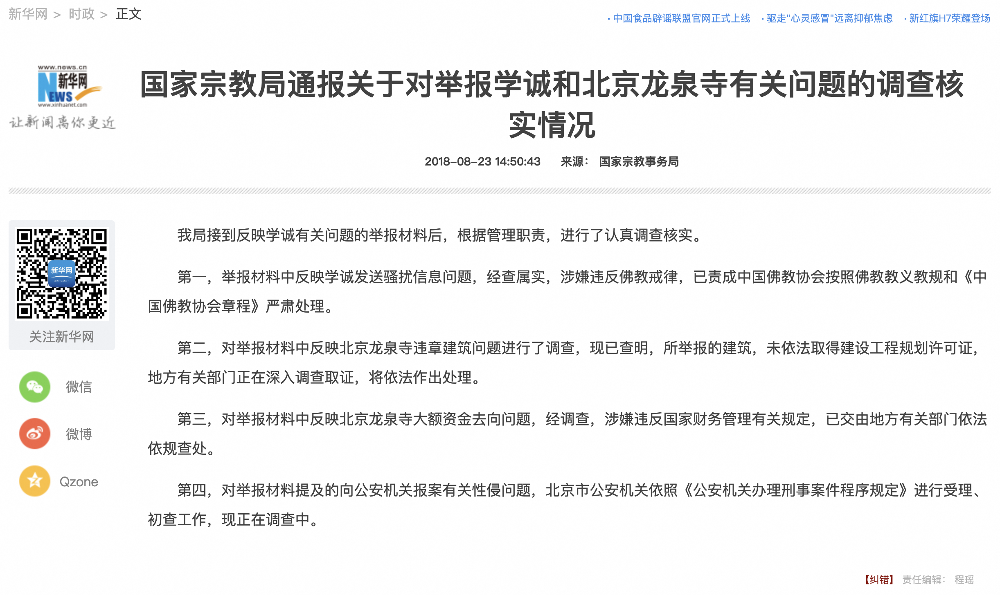

# 舊文新感系列文章

以前零散的寫過一些文章，但沒有收集起來，也不容易找到。而現在，既然已經重新開始寫，並在堅持寫文章了以後，也想把以前的文章收集起來。所以，就起了一個主題，叫做“舊文新感”。文章是舊的，是以前發表過的。而新感的意思是，如果我有新的感想的話，也會補充在後面。

下面這篇文章，是發表在某乎上的，發佈於 2022-02-13 10:19，編輯於 2022-02-16 13:58。所以，文章標題中的“三年後”，是指當時的時間了。算到現在的2025年，那都快7年了。7年過去了，“結局”也沒有發生變化。國內的很多事情都是這樣，不了了之了。

鏈接：https://zhuanlan.zhihu.com/p/467067181

相對原文，略有改動。

## 三年後，對學誠事件的反思

2018年8月份，第一次聽到了學誠被舉報的事情，據說有一個95頁的PDF舉報材料（後附鏈接），舉報人則是當時兩位龍泉寺的督監。

作為2012年在龍泉寺的皈依賢字輩弟子，作為一個多次參加，又多次中斷（備註1）過龍泉寺組織的學佛小組的佛子，對於這樣的舉報本能的反應是“不相信”，和平常被教育後的高大的形象落差太大了，一時間難以接受，雖然在外還能平靜地勸大家不要急於下結論，事情可能還會反轉。雖然當時的自己相信被誣告的成分大，但是內心的悲痛依然難以忘懷，好幾次獨處時，無法控制情緒，失聲大哭。不僅哭泣自己的學佛遭遇，更加悲痛的是眾多佛子們，尤其是初入佛教的人，更加難以接受和自我療愈，甚至還可能走向另一個學佛的極端。

（注1:因為對“觀功念恩”的實踐以及“廣論”的學習方式不相應的問題，學習都沒有完成，中斷了。只是對其詮釋的方式和做法不認可，並不否定廣論本身和觀功念恩本身。）

再加上佛教裡面有些高僧大德也曾經遭受過誣陷，入獄，最後都得以平反，反而增加了他們的傳奇和偉大，所以自事件發生之後，一直本著“等子彈再飛一會兒”的心態來看。時間不僅是撫育心理創傷的重要方法，也是歷史事件能夠得以反轉的充分條件。

直至昨天，一個佛學交流群裡面大家提及一些佛教著名人士的桃色事件時，無一例外地再次提及學誠事件，每次提及時，我也會因此再去搜索一下，看看是否有什麼最新的跟蹤報道，內心也期盼著“反轉”早日到來。然而也正式這樣的機緣，打算仔細看看之前的材料，3年多了，子彈也飛了一會兒了，自己的心理建設也完備了不少，於是終於仔細地看了多篇相關的材料。

其中印象最深的是《鳳凰嶺驚夢 - 學誠往事》，賢二寫的，裡面報道的經歷也正是自己的想法。當事件出現後，所以學誠身邊的大弟子們，都在盡一切的努力在證偽，無論從情感上，還是從護教的角度，他們都有最大的動機去證偽 —— 最後他們都失敗了，他們都承認了這些短信就是學誠本人親自發的事實。而宗教局的調查結論也是在第一時間核實了（後附鏈接）。

95頁的舉報材料都是冷冰冰的材料，裡面的短信對話看起來也像小黃文，然而這篇《鳳凰嶺驚夢》，則是學誠最親近的大弟子的角度，內部處理此事的第一人，其內心的過程也是從“不相信”，努力證偽，並且有機會接觸到所有的當事人，學誠和受害者們，所以這篇文章的可信度和衝擊力對我而言，遠遠大於95頁的舉報材料。

相同地，我的認知也進行了“反轉”，從之前的“不相信”和“誣告”變成了“這就是事實”。文中也提到了學誠依然還會公開講法，甚至還有實際掌控海外的道場，再加上週圍的佛友們也的確有在繼續“不相信”和繼續跟隨他。這是我寫這篇文章最大的動機，我們最害怕的是什麼？最不原因相信的是什麼？不就是害怕沒有誣告，沒有栽贓，這件事情從頭到尾就是事實嘛。如果不是事實，就會認為自己依舊在“護教”，依舊在堅持“正法”，如果終究有一天，會驚醒地認識到事實，那個時候的傷害恐怕會更大啊。

因此特別地提出以下建議，供您參考：

1. 極其強烈地推薦您閱讀《鳳凰嶺驚夢》，這篇文章是學誠身邊大弟子的第一視角，並接觸到了幾乎所有的當事人，包括學誠本人的表現和應對。
2. 我記得在學誠或龍泉寺在微博裡面說過，對於學佛而言，最重要的就是隨學一個公認的，正規的道場。換句話說，當一個道場出現了輿論危機的時候，最好不要再隨學這個道場了。事件的中心人物即是學誠，那麼當他出現了輿論危機的時候，我們是不是該遵循其建議，遠離他了呢。
3. “兩權相害取其輕” —— 假設您還是認為是誣告，他是高僧，那請您可以放心，高僧的境界有沒有護持都不會對他本人有任何影響，否則他就不是高僧。所以遠離他並不會對他造成實質性的傷害，最大的傷害是，降低了他的對外影響力，延緩了他的弘法。 但是，但是，萬一事件是真實的呢，那麼他就確確實實地傷害了他人，而且是像我們一樣最普通的初學佛者，這可不是簡單的打罵，而是最嚴重的身體傷害和精神傷害 —— 性侵。那我們又該以怎樣的心態去對待這些親如手足的師兄們呢。所以，兩權相害取其輕啊，不要再去維護他，甚至可能成為他的幫兇啊。
4. 學佛人應有的態度 —— 這個才是真正的靈魂拷問 —— 我們是否有能力去接受這件事情不是誣告而是事實？如果已經產生了懷疑，就請繼續深挖下去，尤其是拿《鳳凰嶺驚夢》的描述去對照一下自己的經歷，這樣便很容易發現端倪。
5. 請多多關注受害者，隨學者。信仰是座大山，正信時可以給予我們最大的鼓勵和希望，當這座大山倒塌時，危害也最大，所以請以內心深處的良知，關心他們，幫助他們。他們不是“高僧”，他們才是我們最需要關心和保護的人 。

最後，請大家不要喪失了對佛法的希望，無論什麼團隊都有可能發生類似的個案，除此之外，還有很多的正規，公認的道場值得我們隨學，還有很多的善知識值得我們學習。歷史上曾經有過比這大無數倍的危機，最終善良都將戰勝邪惡，光明戰勝黑暗，佛法將會永遠在人間，幫助人們找到生命的真諦。

## 2022-02-17的補充

主要的因素還是因為自己是在龍泉寺皈依的，龍泉寺也是自己學佛路上的起點，認識的很多師兄也都是龍泉寺的，雖然因為所學不同，早已不再隨他們的教法，但是師兄們還是會有聯繫的，而且還是住在附近的師兄，聯繫更多了。

最開始知道龍泉寺出事的時候，也是傾向於是誣告，事後3年，讀到了鳳凰嶺驚夢以後，傾向於是事實了。這個轉變令我自己感到了後怕，也看到了在龍泉寺體系裡面學習了很多年的出家法師和居士們在認清事情的真相後的痛苦⋯⋯因此我在努力想要讓跟我比較親近的師兄們認清“真相”，以免以後反轉的痛苦⋯⋯，另一方面，我也從世間的角度考慮了很多，比如“正，邪”，“善，惡”等等⋯⋯

後面的這兩點導致自己的情緒起伏較大。終於在讀到驚夢一文後的第三天，我請教了一位老師。我之前也因為龍泉寺的事情請教過一次。所以這次也算是第二次了。老師的回答從不直接談論事件本身，而是談論“我的內在（內觀）”⋯⋯，正是如此，我才覺得找到一個更好的方式：

1. 作為學習過佛法多年的人來說，首先應該關注的是修行層面的“覺和迷”，即自己內心的真正狀態，理觀和事觀。即第一義諦，勝義諦，我空法空觀。
2. 其次和其他師兄的重點也應該是把重心放到“覺和迷”上。如果不是放在了“覺和迷”上，就自然而然地會放到了其他的，如“正和邪”“善和惡”了，然後開始產生了強烈的對立，再產生了強烈的情緒和煩惱。
3. 其他的事情或者說和不修行佛法的人來說，就應該隨順世間法的法律和道德即可，多強調風險，提醒大家注意防範。然後根據自己的世間法的能力，依法行事了。 如果沒有能力，就先提高自己的修行。

對於“迷”的現象千變萬化，在“迷”的現象裡面，用“迷”的心態，是永遠也解脫不了的…… 自己解脫不了，更幫助不了他人解脫。最後祝您，心安平安，自由自在。

2022-02-17 補充（完）

95頁的PDF舉報材料： 
https://web.archive.org/web/20180802045151/https://bbs.pku.edu.cn/attach/ad/7b/ad7ba6d0590260a5/%E4%B8%BE%E6%8A%A5%E4%BF%A1.pdf

鳳凰嶺驚夢：學誠往事 （1-58）賢二 著： 
https://news.ifeng.com/c/88hHT8EfyiD

國家宗教局通報關於對舉報學誠和北京龍泉寺有關問題的調查核實情況：
http://www.xinhuanet.com/politics/2018-08/23/c_1123315427.htm

## 新的感想

從這裡，我看到了“宗教”可怕的一面。

正如我看過很多“邪教”的報道一樣，無論權威機構多麼努力地澄清真相，或已經做出了判斷，也總會有執迷不悟的人存在，還在拼命地維護他們。甚至詐騙也是如此，無論旁人怎麼勸，也總會有人持續上當受騙，甚至還流連忘返，期待“幻想”發生 —— 這何嘗不是一種悲哀呢。

這就是現實吧，所以，我還是很鼓勵大家提高自己的知見，提高自己的判斷力，能夠遠離邪教，邪師，也遠離各類詐騙。

阿彌陀佛。

愚千一

