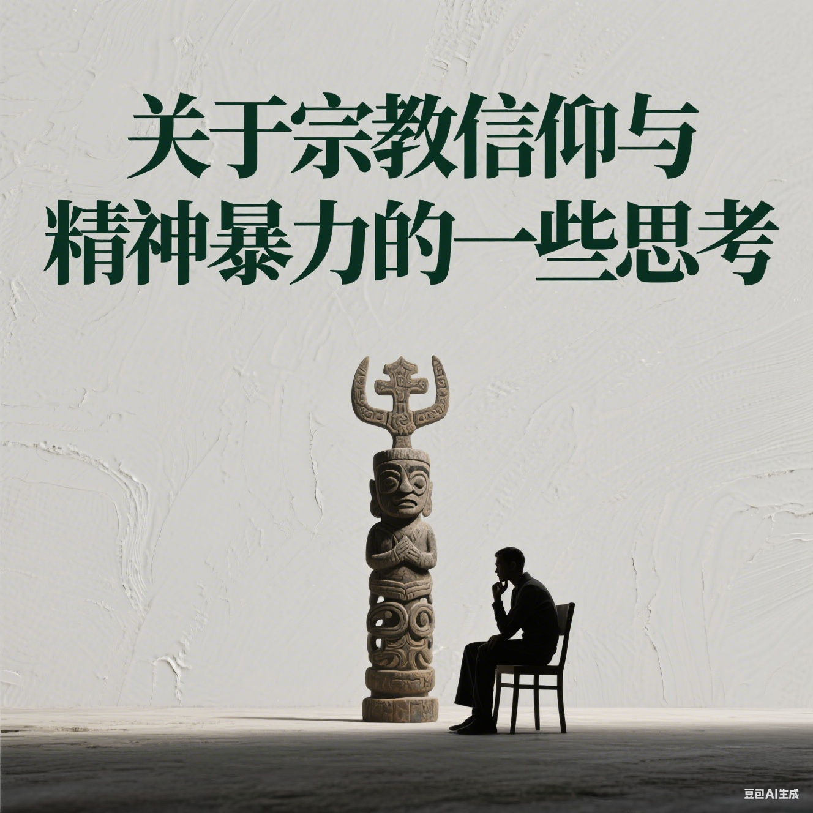

今天这里分享下圆善师兄的文章，她发表自己的朋友圈，我看到后，在征得她同意的情况下，发表在这里了。欢迎朋友们主动投稿，请参考： 征集原创文章
 https://mp.weixin.qq.com/s/spSRNf_0_Jw61z3Bo-fAlQ

# 关于宗教信仰与精神暴力的一些思考

今天看到一个BBC的纪录片，讲的是精神控制。于是想到了这个题目，想到这个题目的同时，想到了柴静的《陌生人》。

《陌生人》讲述了伊斯兰教如何被一些极端分子利用，成为教唆别人进行恐怖袭击的工具。这部片子给了我无数的震撼，其中最大的，是用一个非宗教人士的眼光来看宗教人士。我自己是一个宗教人士，旁观者是如何看待我的呢？看了《陌生人》，我感到自己对宗教的稍许狂热胜过理智，是如何让旁人感到不适的。“独立思考”是《陌生人》反复强调的一个问题，学中观的时候，我们都有过一个结论——一个凡夫人不可能拥有真正的独立思考，我们的思维、感受、情绪完全受制于业力，连五根所感受的外境都是假的，哪里有独立思考的自由？于是对佛陀的教言、上师的教言更加深信不疑。这是一个好现象，然而，万法皆空，在学习了5年中观之后，仍然是一个挂在嘴边的词汇，我的“深信不疑”，到底有几分是真的？
“独立思考”是一些人非常缺乏的一种能力，这就是为什么他们在面对宗教的时候，尤其容易显得狂热，热得快、凉得也快。某些教育体系一直致力于压制每个人的独立思考能力，因为对于某种意识形态来说，独立思考是危险的。

缺乏独立思考虽然是一种悲哀，然而很多人不愿意独立思考，因为独立思考是要负责任的！你需要对自己的思维，以及由此产生的行为和结果负责任，这比“别人怎么说我就怎么做”要困难得多。就像一个小孩，如果他的决定都不是自己做的，得到的东西也不是自己争取来的、失去的东西也不是自己主动放弃的，长此以往，他就不必对自己的人生负责了！事情搞砸了都可以怪别人，获得了成就也不会感到自信和满足，因为这一切都是别人安排的。
很多成年人，由于缺乏独立思考，也会显得贪婪而又怯懦，得到一点成就或赞许就心生傲慢、沾沾自喜，因为这背后隐藏着深深的“不配得感”；做错了事就相互推诿、怨天尤人，因为他们对责任感到恐惧和无力。

相比独立思考，“别人怎么说我就怎么做”要容易得多，然而，“上师怎么说我就怎么做——依教奉行”为什么又那么难呢？独立思考和依教奉行是否相悖？

“独立思考”是什么？佛陀说：“诸位比丘和智者，就像黄金通过十六次锤炼以后，方能显出它真正的本来面目一样，对于我所说的语言，你们也应该反复观察，千万不要因为是佛陀所说而欣然接受，一定要经过详细的思维观察，找出本来的甚深意义以后，再去接受它（引自《三戒要解》）。”我们的闻思修行，是在用佛陀的教言“奴役”自己？还是“解放”自己？二者的差距，就是独立思考。

当然，独立思考的结果，是对分别念的全盘否定，以至最终分别念的寂灭。然而在这之前，在闻思修的过程当中，如果缺乏了独立思考，无论对法、对人都会变得盲目，从而落入一种“精神暴力”。

对法缺乏独立思考，就容易拿着佛语“暴力”他人，“佛教警察”令人讨厌又害怕；或者将佛法断章取义，成为与他人争讼的因。

对人，如果缺乏独立思考，就容易“被暴力”。

莲师说：“不察上师如饮毒，不察弟子如跳崖。”

我们对上师有着强烈的信任、感激、爱、向往。“承事上师：要有赴汤蹈火、在所不辞的精神……如是依靠法性力，自会获得上师的意传加持。”这是前行里的教言。如果我们缺乏独立思考，将同样的热情和信任，不小心放到了一个凡夫人身上，若这个人的菩提心并不足够，会是一种怎样的结局？

上师讲过如何观察善知识，最好是圣者，如果不是圣者，一定要具足菩提心。我们已经有了一位具相的善知识，如果你有视师如佛的信心，这位善知识就是一位功德等佛恩德胜佛的善知识。有了这么一位善知识，佛教就是解脱之路、自利利他的真实之道。然而，我们还是经常有意无意地，将信心放在自己能实实在在接触到的人身上，比如有些大德、出家人、甚至是师兄。

当然这些人当中，即便不是具足菩提心的善知识，也能为我们答疑解惑、安慰鼓励。那么，我们应该将多少信心放在他们身上呢？

曾听一位师兄说：信心要省着用。当时很疑惑，信心不是无穷无尽的一种力量吗？后来发现，作为还在轮回中流转的我们来说，对佛法、对上师的信心还是一种分别念，一种暂时的热情，它来自往昔善业的成熟，而这些善业仍然是有漏的。

也就是说，如果我们投入太多的“信心”在一个不具相的善知识身上，我们的信心是会被消耗的。这个消耗的过程，很可能伴随着精神暴力，因为这种信心给了对方评判、奖赏、打压、标签化我们的权利，并且都是以宗教之名。久而久之，你的信心会越来越捆绑在这个人身上，对上师、对佛陀的信心却不一定会随之增长，这个不具相的善知识就像一堵挡在你和上师之间的厚厚的墙。

还有一些完全相反的人，无论他的个性鲜明或是平淡、犀利或是柔和，在我们与上师连接的这个问题上，他们的存在感是很低的，什么意思呢？他们好似一双无形的手，在我们一步步靠近上师的过程中，他们退到一旁，用这双手引领我往上师那里去。长期接触下来，你对这个人的“信心”只是淡淡的君子之交，然而和上师的距离却是越来越近。我想，这是由他们对上师纯净的信心所至，他们由此得到了上师的加持，并在交往的过程中，自然而然、毫不费力地就将上师的加持带到了你的身边。

如果发现自己对谁生了信心，产生向往、崇拜等等，甚至超过了对上师的感情，就要万分谨慎，要用独立思考来鉴别，这样的信心来自狂热还是生于智慧？如此才能避免“暴力”和“被暴力”。

通过你的独立思考、反复锤炼出来的信心，才是真挚的，这样的信心才具有真正的加持。
