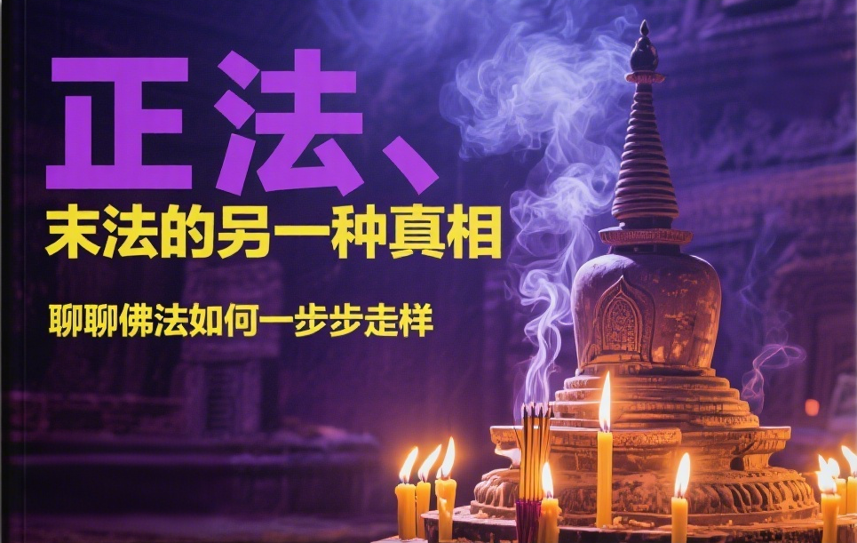

# 正法、像法、末法的另一種真相｜聊聊佛法如何一步步走樣

聊起佛教，很多人都會提到“末法時代”這個詞，臉上多半帶著一種無奈和悲觀。傳統的說法，大家也基本都熟悉：佛陀滅度後，佛法會經歷三個時期，正法、像法、末法。

這三個時期的劃分，傳統觀點主要有兩個標準：
1.  **修行與證果**：正法時期，大家根器好，聽法就能證果；像法時期，根器差了點，修行的人多，但證果的少了；到了末法時期，根器最差，能修行就不錯了，談證果更是鳳毛麟角。
2.  **戒律**：正法時期，大家持戒精嚴；像法時期，開始鬆懈；末法時期，戒律更是有名無實。

對於第二點，戒律的問題，我完全同意。看看現在各種亂象就知道，戒律的廢弛是顯而易見的。但是，對於第一點，我認為只說對了一半。把所有問題都歸結為“現代人根器不行”，這是一種很省事的解釋，但可能忽略了更根本的問題。

我有一個不同的看法，或者說是對傳統觀點的一個補充：**從正法到末法，最核心的變化，是佛法本身被不斷地“稀釋”和“扭曲”了。**

打個比方，這就好比是牛奶：
* **正法時代**，是百分之百的純牛奶，營養豐富，喝了就能強身健體。
* **像法時代**，牛奶裡開始摻水，還加了各種味道不錯的添加劑。看起來還是牛奶，喝起來也還行，但營養價值已經打了折扣。
* **末法時代**，更像是一桶汙水裡，象徵性地點了幾滴牛奶。你指著這桶水說這是“牛奶”，恐怕沒人會信。

所以，問題的關鍵，不僅僅是喝牛奶的人體質變差了，更是我們現在喝到的，到底還是不是那杯純牛奶？

## 什麼是純牛奶？—— 佛法的核心

那麼，什麼是佛法的“純牛奶”？什麼是那個未經稀釋和扭曲的“正法”？

很簡單，就是佛陀教法的根本——**四聖諦、十二因緣、八正道**。

這不是我個人發明，這是佛陀在最早的經典《阿含經》裡，反反覆覆、苦口婆心宣講的核心。這套理論，是一個完整的、邏輯自洽的系統：
* **四聖諦（苦、集、滅、道）**：指出了問題的本質（苦），分析了問題的原因（集），描繪了問題解決後的狀態（滅），並給出瞭解決問題的具體方法（道）。它是一個總綱。
* **十二因緣**：詳細解釋了“集諦”和“滅諦”，揭示了生命流轉和還滅的深層規律，是緣起法的具體展開。
* **八正道**：則是“道諦”的實踐手冊，從思想到言行，提供了八個可操作的修行準則。

這套體系，就是佛法的骨架和心臟。它直麵人生問題，提供解決方案，有理論有實踐，邏輯清晰，層次分明。這就是正法，純正的牛奶。

## 牛奶是怎麼被摻水的？—— 正法被扭曲的三個層次

這杯純牛奶，是怎樣一步步被稀釋，甚至被扭曲的呢？這個過程不是一蹴而就的，我把它分為三個層次。

### 第一層次的扭曲：貶低為“小乘”，束之高閣

後來大乘佛法興起，為了彰顯自身的“殊勝”，出現了一種傾向：把四聖諦、十二因緣這些早期教法，貼上一個“小乘”的標籤。

“小乘”這個詞，本身就帶有一種“低級”、“不究竟”的意味。於是，“大乘菩薩”似乎就不用學這些“基礎課”了，應該直接去學更“高級”的般若空性。更有甚者，把四聖諦這類正法，看成是般若智慧的對立面，認為談論苦、集、滅、道，就不夠“空”。

這就好比一個建築師，宣稱自己要蓋摩天大樓，所以看不起打地基的活兒。地基都不牢，高樓怎麼可能蓋得起來？把佛法的根基貶低、懸置起來，這是對正法的第一次稀釋。牛奶裡，開始摻進了“高下之分”的水。

### 第二層次的扭曲：方便法大行其道，核心被邊緣化

當佛法的根基被動搖後，下一個問題就來了。般若空性的思想，雖然究竟，但也確實高深，不容易理解。怎麼辦呢？為了接引更廣大的信眾，各種“方便法”開始大行其道。

佈施、供養、懺悔、放生、唸佛號、持咒……這些法門本身沒有錯，都是積累福德、培養善心的重要助緣。問題在於，它們被過分強調，甚至取代了對核心教理的聞思修。

很多人把修行等同於做這些事。每天忙於燒香拜佛、捐錢放生，卻從不去思考煩惱的根源是什麼（集諦），也不去實踐八正道來熄滅煩惱（道諦）。甚至，連大乘菩薩教法裡核心的般若空性，也被放到了一邊。

這就好比牛奶裡，水越摻越多，還加了各種甜味劑和增稠劑。大家喝得不亦樂乎，覺得味道不錯，也很有“儀式感”，但就是忘了牛奶最初的目的是補充營養。方便法成了主角，正法成了配角，甚至連配角都算不上。這是第二次稀釋。

### 第三層次的扭曲：談玄說妙，把“究竟”當“入門”

這是最嚴重，也是最隱蔽的扭曲。

在一些後期的思想，比如對“如來藏”思想的某些詮釋中，開始大談特談“佛性”、“空性”、“覺性”，強調“人人本具，本來清淨”。

這句話本身沒錯，但在沒有穩固教理基礎的情況下，就很容易被誤解為：“我什麼都不用幹，因為我本來就是佛。”

這種思想，把後來的如來藏、密教等思想當成了唯一的、最究竟的主流，反而把四聖諦、十二因緣這些佛法根基，看成是“方便說”、“不了義”，甚至是需要被批判的“偏見”。

很多學佛的人，入門就直奔“開悟”、“見性”，滿口“空性”、“無分別”。你跟他談四聖諦，他笑你“著相”；你跟他談八正道，他嫌你“太麻煩”。他們以為自己抓住了最頂尖的智慧，實際上是把蓋房子的屋頂，直接放在了沙灘上。

這就像那桶汙水，裡面或許有幾滴牛奶的成分，但周圍全是垃圾和汙染物。它不僅不能提供營養，喝下去甚至會生病。當佛法的根基被徹底否定，當修行變成了口頭上的玄談，這就是最徹底的扭曲。

## 菩薩也要從基礎學起——《華嚴經》的啟示

有人可能會反駁我：“你這是小乘的觀點，大乘菩薩不拘泥於這些。”

真的是這樣嗎？我們來看看被譽為“經中之王”的《華嚴經》是怎麼說的。在《華嚴經》的“十地品”中，詳細描述了菩薩從初地到十地的修行過程。我在我的文章《[總結下<華嚴經>中的十地菩薩 | 菩薩階位有不同的標準](https://mp.weixin.qq.com/s/jEiLpTfZpPy-rFSdhMMfbQ)》中，曾整理過一個表格：

| 地 | 名 | 證悟和主要修行 |
| --- | --- | --- |
| 初地 | 歡喜地 | 十波羅蜜中，檀波羅蜜（佈施）增上 |
| 二地 | 離垢地 | 十波羅蜜中，持戒偏多 |
| 三地 | 發光地 | 十波羅蜜中，忍波羅蜜（忍辱）偏多 |
| 四地 | 焰慧地 | **修行三十七道品** |
| 五地 | 難勝地 | **觀四聖諦** |
| 六地 | 現前地 | **觀十二因緣**；般若波羅蜜（空性）偏多 |
| 七地 | 遠行地 | 十波羅蜜中，方便波羅蜜偏多 |
| ... | ... | ... |

這個表格清楚地告訴我們什麼？
* **四地菩薩**，已經是非常高階的菩薩了，他的主要修行科目是什麼？**三十七道品**！三十七道品的核心是什麼？就是八正道。
* **五地菩薩**，更進一步，主修的是什麼？**四聖諦**！
* **六地菩薩**，證悟空性般若的關鍵一步，主修的是什麼？**十二因緣**！

看到了嗎？就連《華嚴經》裡的大菩薩，都必須老老實實地，一步一個腳印地去修習和證悟四聖諦、十二因緣、八正道這些“基礎教法”。它們根本不是什麼“小乘”的專利，而是通往一切智慧不可逾越的根基。

把這些根基說成是低級的、可以繞過去的，這本身就是對大乘菩薩道的最大誤解和歪曲。

## 結語：與其感嘆末法，不如喝回純奶

說了這麼多，我的核心觀點很簡單：

我們今天所謂的“末法”，其根源與其說是眾生根器變差，不如說是“正法”本身被嚴重稀釋和扭曲了。我們手裡的“牛奶”，含奶量越來越低，添加劑和汙染物卻越來越多。

所以，我們與其坐在這裡感嘆“末法時代，修行不易”，不如反思一下，我們自己學的是什麼？修的是什麼？

是直面煩惱、尋求根本解決方案的**四聖諦**？
是洞察生命流轉實相的**十二因緣**？
是指導我們日常言行思想的**八正道**？

還是那些被層層包裝、看似高級、實則空洞的玄談？或是那些只重形式、不重實質的方便法門？

時代無法選擇，但我們喝什麼樣的“牛奶”可以自己選擇。放棄對“高級法”、“頓悟法”的幻想，老老實實地回到佛法的原點，把四聖諦、十二因緣、八正道這個根基打牢。這才是對自己法身慧命最負責任的態度。

真正的末法，不是時間上的概念，而是當所有人都忘了純牛奶的味道，心安理得地喝著那桶汙水的時候。我們能做的，就是盡力去找回那杯純牛奶，自己先喝，如果可能，也遞給身邊的人一杯。

