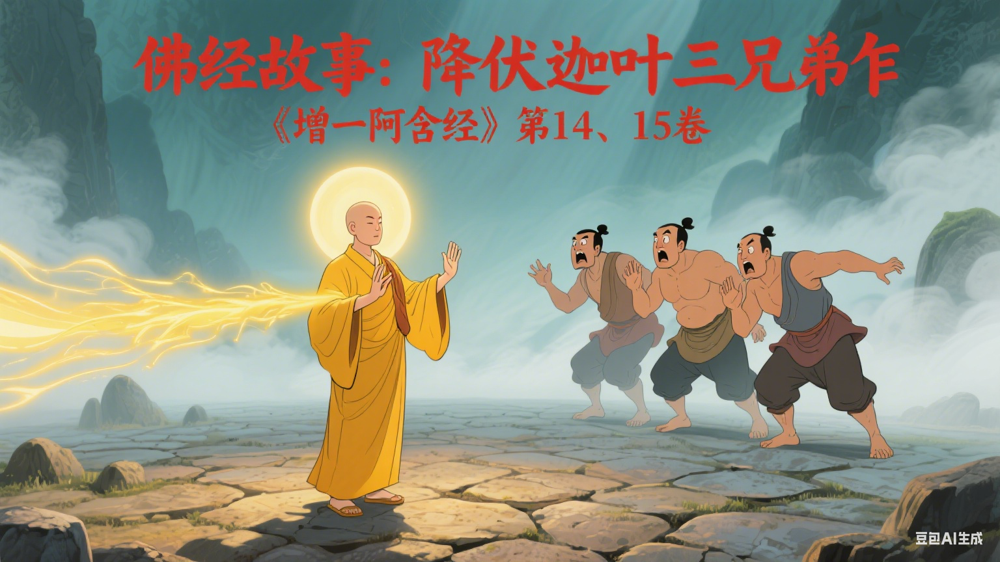

# 佛经故事：降伏迦叶三兄弟｜《增一阿含经》第14、15卷

这是选自《增一阿含经》第14、15卷中，佛陀成道后初转法轮度化五比丘后，再度化迦叶三兄弟的故事。

---

## 降伏石室毒龙

连若河畔，住着一位名为优楼频螺迦叶的大学者。他精通天文地理，备受尊崇，拥有五百名弟子。他对自己的道行深信不疑。

一日，世尊行至此地，欲向迦叶借石室一宿。迦叶提醒道：“那石室里有条凶猛的毒龙，恐怕会伤害你。”

世尊只道：“无妨，它伤不了我。”

夜里，迦叶起身观星，只见石室方向火光冲天。他心想：“可惜了，那位样貌端正的沙门，终究还是被毒龙害了。” 随即带弟子提水赶去救火。

然而，任凭他们如何泼洒，火光却丝毫未减。

次日清晨，世尊安然无恙地走出石室，手中钵盂里，那条曾凶悍无比的毒龙，此刻正温顺地蜷伏着。

迦叶与众弟子惊叹不已，深感这位沙门神通广大。但他心中转念一想，却生出一个念头：

“这位沙门确有大神通，能降伏毒龙。……虽如此，终究不如我的道行深真。”

## 神通与傲慢

迦叶虽心悦诚服于世尊的神通，却依然固守着“不如我道行深真”的骄傲。于是，一场无声的教化开始了。

每日饭时，迦叶前来邀请，世尊总说：“你先行，我随后便至。”

迦叶前脚刚走，世尊便以神足通，瞬间去往遥远的阎浮提、北俱卢洲等处，取来世间罕见的奇果与香米，然后先于迦叶回到住处。迦叶回来时总会惊奇地发现世尊已在等候，面前还放着他从未见过的食物。

一次，迦叶准备举行盛大的祭祀，弟子们举起斧头却无法劈柴，点燃祭火却无法使其燃烧，想要熄灭时又无法熄灭。每一次，都需世尊开口，才能恢复如常。

甚至，世尊能洞悉他心中所想。当迦叶暗自希望世尊不要出席第二天的祭祀大典时，第二天，世尊果然没有出现。待迦叶事后询问，世尊淡淡说出他昨日心中所念，并告知自己去了何处。

每一次神迹的展现，迦叶都震撼不已。但他心中那个固执的声音总会再次响起：

“此沙门神力莫测……虽如此，仍不如我得道为真。”

他的傲慢，如同一座坚固的堡垒。

## 水上的最后一课

连日暴雨，连若河水暴涨，浊浪滔天。迦叶心想：“沙门住处低洼，恐怕已被大水漂走了。” 他急忙带弟子乘船前去探看。

只见洪流之中，世尊非但安然无恙，更在汹涌的水面上经行，双足竟不沾湿。

迦叶见此景象，心中再次震撼，但他依旧对自己说：“我也能在水上行走，只是不能让脚不沾湿罢了。这位沙门虽神，还是不如我道行深真。”

这一次，世尊不再沉默。他直视迦叶，平静而威严地说道：
“迦叶，你并非阿罗汉，也不知阿罗汉之道，甚至不识阿罗汉之名，又怎能说自己得道？你如盲人一般，见了如此多的变化，心中仍固执己见。现在，你若能在水上行走，不妨一试。”

这番话如惊雷贯耳，瞬间击碎了迦叶最后的骄傲。他恍然大悟，自己所谓的“道行”，在真正的觉者面前，是何等浅薄。

他立刻俯身，向世尊顶礼忏悔：“我愚痴至深，冒犯了如来，恳请您接受我的悔过。”

见导师至诚归顺，他的五百弟子，以及闻讯赶来的两个弟弟（江迦叶与伽夷迦叶）和他们的五百弟子，共计一千人，尽皆放下原本的修行与傲慢，投入世尊座下，成为比丘。

那一天，他们将过去赖以为生的祭祀之器、咒术之具，尽数投入滚滚的河水之中，随波而去。

