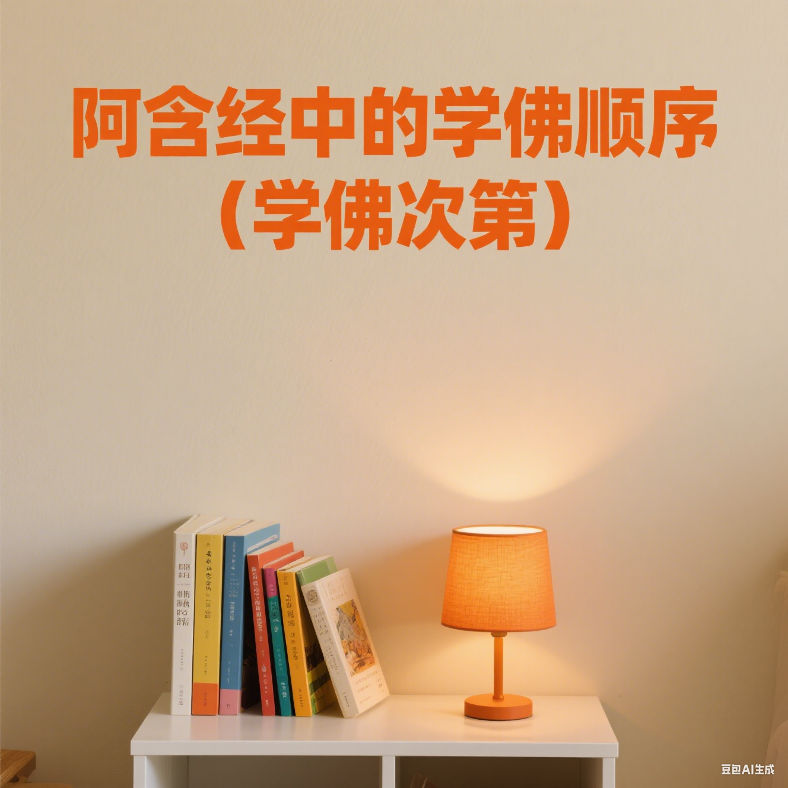

# 阿含經中的學佛順序（學佛次第）

很多人剛接觸佛教，都會面臨一個問題：佛法像一片大海，該從哪裡開始學？面對浩瀚的經論和眾多的宗派，很容易感到迷茫，不知道從何下手。

其實，學佛跟蓋房子一樣，得有個順序，先打地基，再一層層往上蓋。沒有順序，東學一點，西看一撇，很難系統地建立起正見，甚至可能走偏路。

說到學佛的順序，或者說“次第”，很多人會想到藏傳佛教的《菩提道次第廣論》（簡稱《廣論》）。《廣論》提供了一個非常清晰的修學地圖，從“道前基礎”開始，教我們認識人生的寶貴和無常，然後進入下士道、中士道、上士道，一步步引導我們生起出離心和菩提心，最終走向成佛。這是一個非常完整和殊勝的體系。

但很多人可能不知道，在最原始、最核心的《阿含經》裡，佛陀本人也反覆強調過一個非常重要的學佛順序。這個順序，可以說是佛陀為普通人量身定做的“教學大綱”。

我們來看一段經文：

> 《長阿含經》卷1：「佛漸為說法，示教利喜：施論、戒論、生天之論，欲惡不淨，上漏為患，讚歎出離為最微妙清淨第一。爾時，世尊見此二人心意柔輭，歡喜信樂，堪受正法，於是即為說苦聖諦，敷演開解，分佈宣釋苦集聖諦、苦滅聖諦、苦出要諦。」(CBETA 2025.R1, T01, no. 1, p. 9a6-12)

這段話直接點明瞭佛陀教化眾生的步驟。這個模式有多重要呢？我用CBETA的搜索引擎查了一下，“施論、戒論、生天之論”這組關鍵詞，光是在《阿含經》裡就出現了37次之多[1]。這絕非偶然，而是佛陀教學的核心方法論。

現在我們來拆解一下這個順序：

**第一步：打好人天善法的基礎（施論、戒論、生天之論）**

這是入門三件套，也是學佛的地基。

* **施論**：就是講佈施。不要把它想得太複雜，以為非要捐多少錢。佈施的核心是破除我們的吝嗇和自私。分享你的時間、知識、體力，或者給人一個微笑，一句安慰，都是佈施。這是培養慈悲心和利他心的第一步。
* **戒論**：就是講持戒。最基本的就是五戒（不殺生、不偷盜、不邪淫、不妄語、不飲酒）。戒律像什麼？像馬路上的護欄。有了護欄，你開車才安全，才不會掉下懸崖。持戒能讓我們的身心安定下來，為後續的修行提供一個穩定、清淨的環境。
* **生天之論**：這是前兩者的“階段性成果彙報”。佛陀告訴我們，認真地佈施、持戒，可以感召善果，最直接的就是能投生到更好的地方，比如天界，享受福報。這是一種非常樸素的因果觀，容易理解，也能給人最直接的信心和動力。

這三步，合起來就是“人天善法”，目標是讓你成為一個更好的人，過上更安穩、更有福報的生活。這是世間法的極致。

**第二步：認識世間法的侷限，生起出離心**

當地基打牢了，學生也嚐到了行善的甜頭，佛陀就要開始“潑冷水”了。他會接著說：

* **欲惡不淨，上漏為患**：意思是，慾望本質上是苦的、不乾淨的。就算你修得再好，能“生天”，天上的福報也有享盡的一天，福報沒了照樣會墮落。這種福報是有“漏洞”的（上漏為患），不是究竟的解脫。
* **讚歎出離為最微妙清淨第一**：點明真正的目標。佛陀說，比享受天人之樂更高級、更美妙的，是“出離”——徹底跳出這個輪迴的循環。

這一步是關鍵的轉折，是把學生的眼光從追求“世間福報”引向追求“出世間解脫”。

**第三步：宣說核心解脫之道（四聖諦）**

當佛陀觀察到聽法的人，心裡已經變得“柔輭”，能接受更深刻的道理了（堪受正法），他才會開始講真正的核心佛法：

* **苦、集、滅、道四聖諦**。

這是佛法的根本，是解決終極問題的藥方。但這個藥方，必須在病人願意承認自己有病（認識到輪迴是苦），並且相信醫生（對佛法生起信心）之後，才會開出來。如果一開始就直接講四聖諦，很多人是聽不進去的，就像你對一個沒覺得口渴的人拼命推銷水一樣。

### 總結

所以，《阿含經》裡的學佛順序非常清晰，就像上臺階：

1.  **基礎層**：先修好佈施、持戒，以獲得人天福報為目標，建立因果正見和學佛信心。
2.  **轉折層**：認識到人天福報依然不究竟、有侷限，從而生起追求徹底解脫的心。
3.  **核心層**：在心態準備好的前提下，學習四聖諦等核心教理，走向真正的解脫道。

這個次第，從世間法入手，再導入出世間法，循序漸進，非常符合人的認知規律。它告訴我們，學佛不能好高騖遠，想一步登天。老老實實地從佈施、持戒開始，先學做個好人，把地基打牢了，再去談空性、談解脫，那才是踏實、穩妥的正道。

參考：
1: https://cbetaonline.dila.edu.tw/search/?q=%E6%96%BD%E8%AB%96%E3%80%81%E6%88%92%E8%AB%96%E3%80%81%E7%94%9F%E5%A4%A9%E4%B9%8B%E8%AB%96&lang=zh
