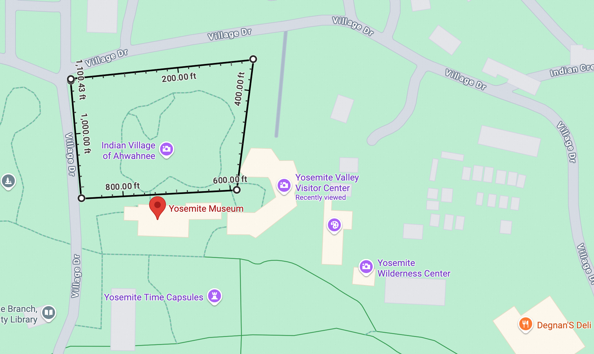
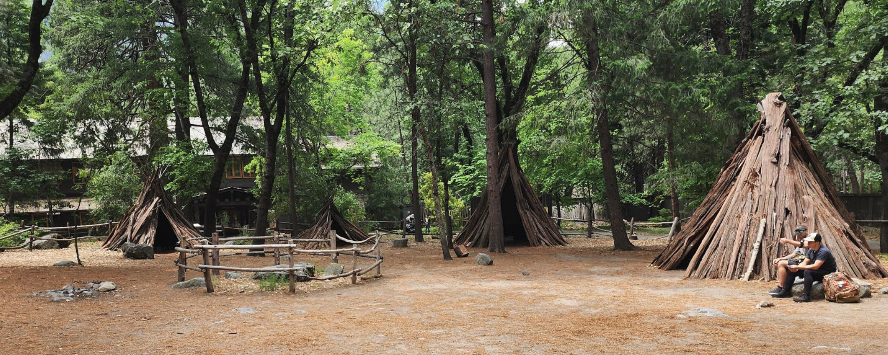
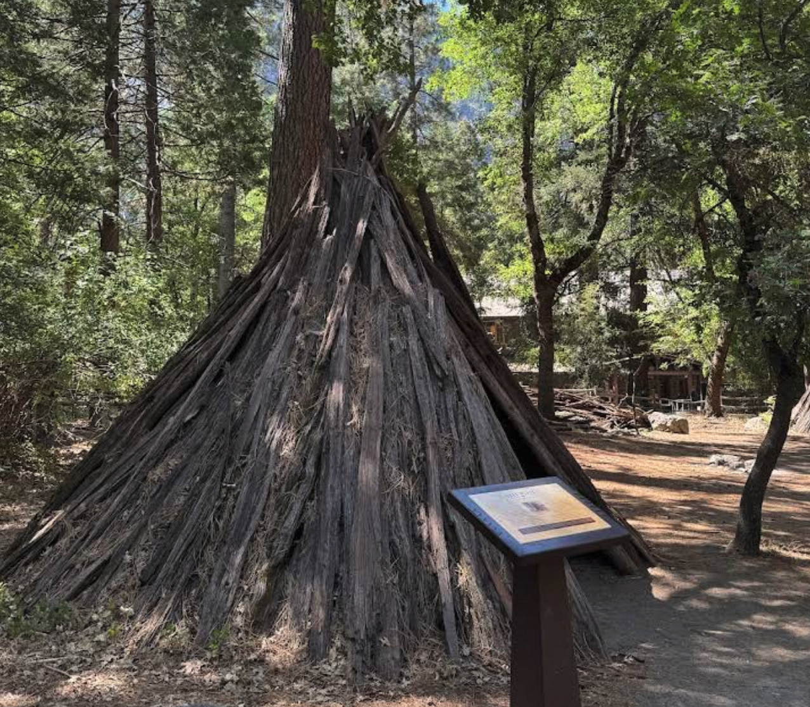
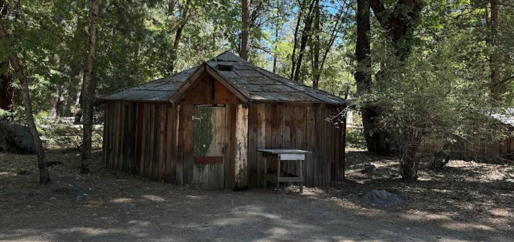
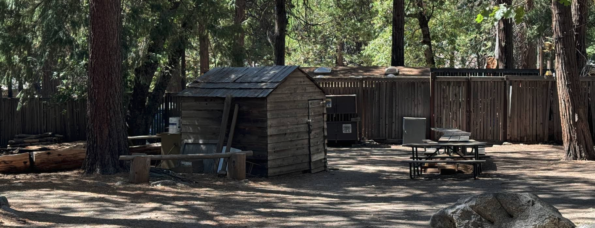
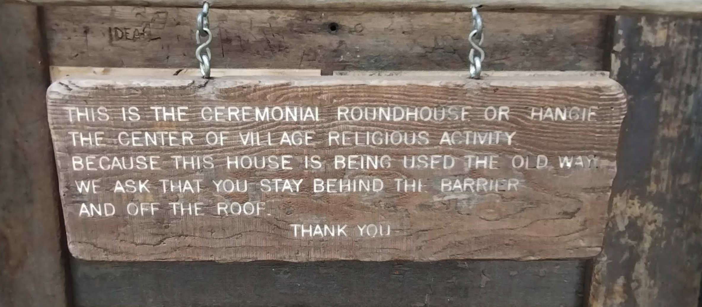
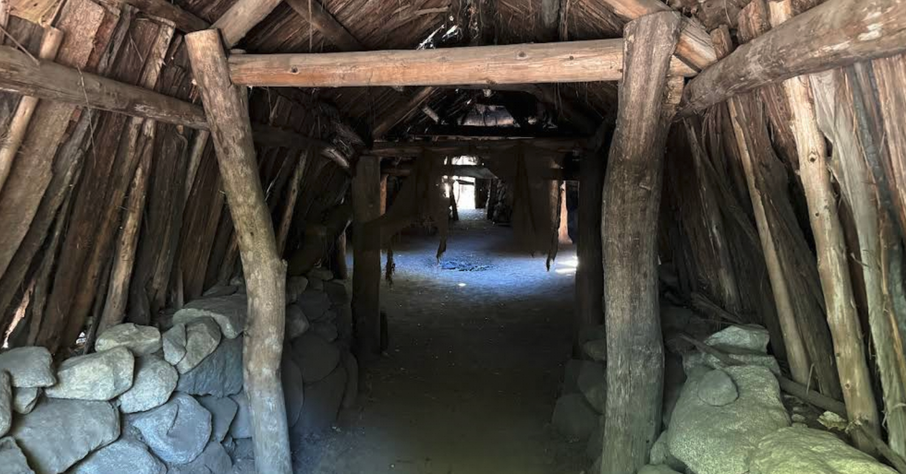

刚刚完成了今年暑假的 road trip（自驾游），目的地是加州的优胜美地国家公园。优胜美地果然非常棒，适合度假、露营、骑车、爬山……今年是我们第一次去，所以只去了几个主要景点，以及几条很短、很轻松的 trail，没有走太多路。下面就根据记忆，写一写其中有趣或者特别的经历。

# 最意外的经历，参加了印第安人Miwok的年度庆典

## 背景

土著印第安人 Miwok 人是最早生活在优胜美地的，已经有几千年历史。后来，欧洲白人将他们赶走，并禁止他们进入优胜美地。直到 xxx 年，他们才得以重新回到这里，但生活方式已经彻底改变。这段历史，在 Yosemite Valley Visitor Center 里有较为客观的记录。

## 地点

在优胜美地博物馆（Yosemite Museum）后面，有一块很小的地方，叫做 Indian Village of Ahwahanee。如下图，周长大约 1100 英尺（335 米）。

在这里，优胜美地象征性地建了几座土著印第安人的房子。

这些房子是用木头堆起来的三角形结构。

旁边还有几间小木屋，像这样：

这些小木屋看起来并不像土著人的房子。有意思的是，每个小木屋的门上都上了锁。如果只是供大家参观，通常都会打开房门，让人看到内部。比如，下面这个最特殊的房子 —— round house。

门口有一个告示牌，禁止进入。

告示牌内容是：THIS IS THE CEREMONIAL ROUNDROUSE OR HANGIE THE CENTER OF VILLAGE RELIGIOUS ACTIVITY, BECAUSE THIS HOUSE IS BEING USED THE HOLD WAY. WE ASK THAT YOU STAY BEHIND THE BARRIER AND OFF THE ROOF. THANK YOU. (翻译：这是举行仪式的圆屋或茅屋，是村庄宗教活动的中心。由于这座房屋一直按传统方式使用，我们请求您留在障碍物后面，不要登上屋顶。感谢您的配合。)

不过可以从外面看到里面的样子，如下图。

## 邀请和等待

我们参观土著村庄时，看到有几位看起来像印第安人的人在小木屋旁边做饭。其中一位年长的大姐（大约 50-60 岁），看到我后主动和我打招呼。她注意到我脖子上的观世音玉佩后，还告诉我，她有个好朋友是一位非常虔诚的佛教徒，每年都会花几个月时间去印度和东南亚佛教国家。她们彼此介绍各自的信仰，她也从佛教中学到了很多。

突然她话题一转，问我有没有看到他们唱歌、跳舞。我说没有，她们便说，晚上还会在 Round House 里跳一次舞。从明天起，还会连续跳几天，不只在这里，还会去其他地方表演。她们介绍说，这几天正是他们的年度盛典，类似我们的春节，Miwok 人都会聚集到这里，载歌载舞，庆祝一年，感谢大自然的馈赠（指优胜美地的动植物）。

我顿时来了兴趣，原因有两个：一是我对各种宗教都很感兴趣，有机会旁观其他宗教的仪式自然不想错过；二是能进入平时不对外开放的 Round House。两者叠加，让我格外期待。

她们一开始说大概下午 5 点多开始，结果我们等了很久。因为要等不同部落的人都到齐，还要精心装扮。快到晚上 7 点才真正开始。

## 仪式

人齐后，大家都精心装扮，一共三组人在门口列队。前面是几位男性，后面是来自两个不同部落的女性小组。

他们先把 Round House 的告示牌拿开，让亲朋好友们先进去，我们也趁机跟了进去。Round House 中间有一堆篝火，烧得正旺。等大家都坐好后，首领开始用英文讲话，大意是：这是他们第 50 次在这里举行年度庆典，举办这个庆典很不容易，感谢大家的付出，有人准备食物，有人维修 Round House，最后感谢大家的到来。

随后，另一位首领带头哼起节拍……外面列队、精心装扮的舞队踏着节奏进入 Round House，用 Miwok 语唱歌跳舞，围绕篝火。

他们告诉我，一共要唱 4 首歌，每首歌唱 4 遍，然后就结束。

根据我们的行程，当晚要离开优胜美地前往下一个目的地。所以在唱完第二首歌的第一遍、出现一个小停顿时，我们便离开了。

仪式期间不允许拍照和录像，所以进入 Round House 后我也没有拍照。唯一的一张照片，是征得对方同意后，拍下其中一个部落的女性小组。

对他们唱歌跳舞感兴趣的朋友，可以自行搜索“Miwok”，能找到不少资料和视频，例如 YouTube 上的：https://www.youtube.com/watch?v=Zwqu3k62HtY 

## 感想

### 特别的经历

从经历上说，这是一段非常特别、非常巧遇的体验。100 个人里，未必有 1 个人能遇到 —— 亲眼见到这片土地的原住民在这里庆祝他们的年度盛典。当然，也不是所有人都会对这样的事情感兴趣。

### 历史和现实

从历史记录来看，美国人并没有过度美化自己，对于印第安人的遭遇（主要体现在旁边的博物馆和访客中心），是有客观记录的 —— 承认把他们赶跑了等等。但在现实层面，并没有打算补偿或赔偿印第安人。

我特意问了 Miwok 人回来参加庆典是怎么来的、住哪里？—— 回答是，和普通游客一样，自己找 Camping 的地方住，没有任何特权。

优胜美地划给他们活动的地方非常小 —— 1000 英尺的范围，比一个篮球场稍大一点，还包括几座土著房子、几间木屋和 Round House。就算是这些地方，Miwok 人的权利也很有限，无法自主建设什么，只是有几个小木屋和 Round House 的使用权而已。从首领的讲话来看，连日常修缮工作都是 Miwok 人自己负责。可见，国家公园并没有给他们什么经费和空间。

### 思考

这段经历，以及参观其他印第安人博物馆，也启发了我们思考几个问题，记录在这里，欢迎大家一起讨论：

* 为什么印第安人如此“溃败”？没有像黑人一样被反思、被要求赔偿？
* 印第安人的文化是什么？有传承下来吗？有保留下来吗？
* 再过几百年，印第安人的文化是不是就完全消失了？

愚千一

