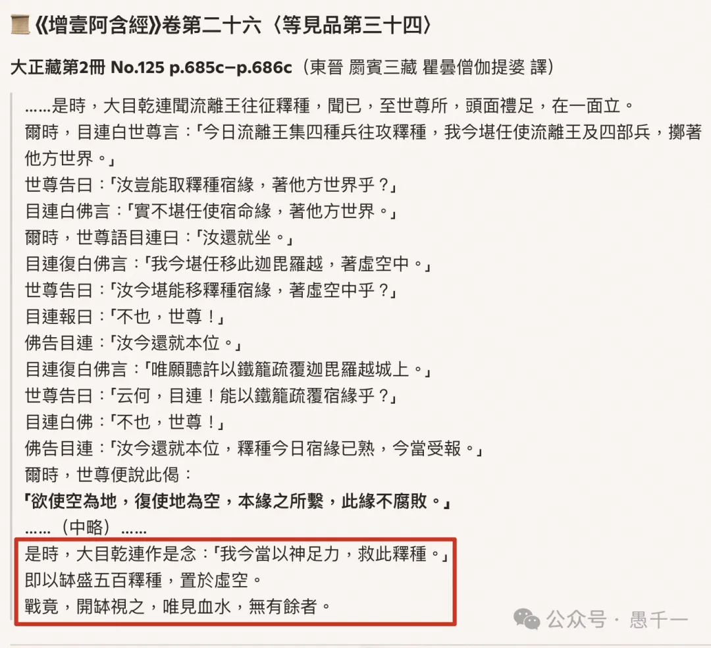

我在写上一篇文章的时候，[佛教释迦族的事情是如何被谬传的｜ 多读佛经原始的重要性 ｜《增壹阿含经》卷第26](https://mp.weixin.qq.com/s/rl5_Q-A6qR8l6tbPX2cM0w) ，里面提到

> 在《增壹阿含经》的这个版本里，有几个关键点值得注意：经文中没有提到“目犍连用钵救人，结果人化为血水”这个极具“不可思议”的桥段。当然，必须承认，其他佛经，比如不同部派传承的律藏或论藏里，确实有类似的情节。但至少在《增壹阿含》这部经的记载中是没有的。

这里为何要说“其他经典”里面有呢？因为我被AI误导了，我当时使用了Microsoft Edge里面自带的GPT-5来查证。

完整链接：https://copilot.microsoft.com/shares/nw9g9Drm1YLMhnotgVy3S

GPT说，虽然《增一阿含经》中有这个故事，但是没有“钵中血水”的记录。但是在另外三部经中有，而且还给出了准确的位置：

《雜寶藏經》卷10〈毗琉璃王緣〉（T203）

《根本說一切有部毘奈耶·破僧事》（T1451）

《佛本行集經》卷51（T190）

我进一步，让GPT-5给出佛经的原文，这个时候GPT-5居然也煞有其事地返回了原文。

这个时候，我就信以为真了。于是，就在昨天的文章中总结说，虽然《增一阿含经》中没有“钵中血水”的情节，但是其他佛经中有。因为《增一阿含经》我刚读过（参考我读《四阿含》的帖子：共读经典《杂阿含经》，乃至《四阿含》 ）。但是这里提到的其他3部经典，我还没有读过，我就信任了GPT-5的结果。

其实，我如果仔细一点，我还是可以发现疑点的。因为就在GPT-5返回《增一阿含经》中故事的时候，自己增加了一段。如下图：

因为《增一阿含经》卷26是我前段时间读的，也许有十几天了，虽然我读的时候特别记住了下没有“钵中血水”的情节，但是在GPT-5返回错误的结果的时候，我忽略了它。

就在我发表上面那篇文章后，我突然想要看看佛经中关于“钵中血水”的原始记录。这个时候，我又回去查了一下《增一阿含经》的卷26，的确没有“钵中血水”的情节，并不是我的记忆模糊了。

既然GPT-5返回的《增一阿含经》有错误，那么它说其他佛经中有此段落会不会也有错误呢？于是，我就继续问GPT-5，让它给出具体的位置，我好去验证下。结果GPT-5一本正经的胡说八道，还给出了详细的位置，有CBETA的具体引用位置：

然后我一一验证这些位置：

雜寶藏經卷第十 

https://cbetaonline.dila.edu.tw/zh/T04n0203_010

根本說一切有部毘奈耶破僧事卷第八 

https://cbetaonline.dila.edu.tw/zh/T24n1450_008

佛本行集經卷第五十一

https://cbetaonline.dila.edu.tw/zh/T03n0190_051

这里统统没有“唯見血水”的文字。甚至都不是这个琉璃王和释迦族故事。至此，我有点崩溃了。我告诉GPT-5这些位置都不对之后，GPT-5就说要逐一对比才能查证了。

CBETA上线了语义搜索的功能，于是我就想用它来验证下，我查询了几次，换了几次关键字，都没有找到佛经的原文。

我查证的关键字：“ 大目乾連 缽 血水”，以及“大目乾連 即以缽盛五百釋種”，“我今當以神足力，救此釋種”，都没有找到直接的佛经原文。

注意：祖师的注疏并不算佛经原文。

这次我换了不同的AI，再尝试下，结果ChatGPT（同样使用GPT-5）（官方网站），也没有找到佛经。Gemini 2.5 Pro也没有。

ChatGPT的小结：

至此！我可以比较肯定地说，佛经中关于“钵中血水”的情节，非常可能不是佛经原文。如果有人知道佛经有此原文，也请告知。重复下，是佛经原文，而不是其他论疏。

对于古人来说，没有现代化的科技，没有电子书，没有电脑，想要查证一个事情是否有佛经，这是非常困难的 —— 所以古代的论疏当中有错误是情有可原的（事实上有很多错误，当然了，瑕不掩瑜，不影响论疏的主题）。但是，对于现代人来说，想要查证却相当容易，可以通过搜索，也可以通过AI。虽然也可能有错误，但是机率要小得多。

最后，再次呼吁，回归佛经，正本清源！

阿弥陀佛

愚千一

