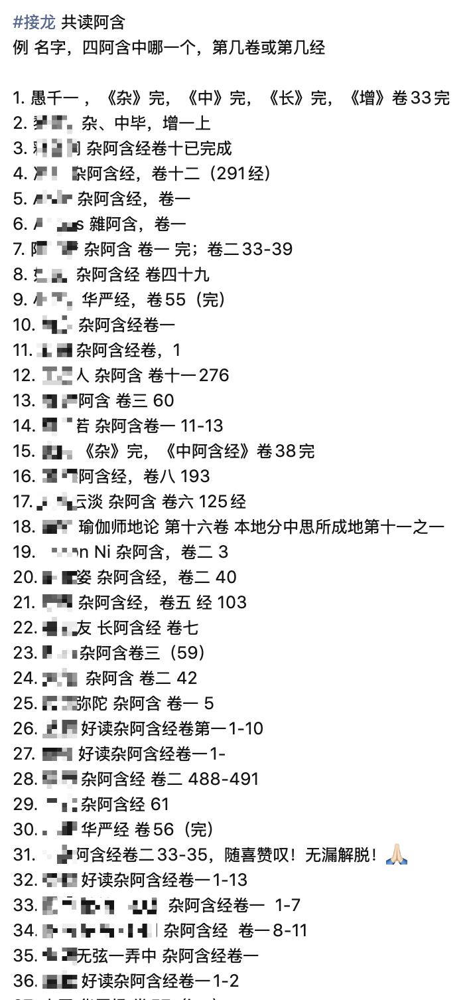

# 经典共读群形式的说明｜也改收费群了｜情况汇报

为了避免各式各样的骚扰，我把共读群也改成了收费群的了（目前是19元）。自从发了不再加人的文章（对不起，群里不再随便加人了，除非……）后，就几乎无人再加入。

一是，很少有人会去看“除非”后的要求。

二是，那个“除非”后面的要求也很高，那就是先给我私信打开N次后，我再看情况，也不承诺就加群。

## 共读群的共读形式

共读群是一种非常松散的自行读经、打卡、就所读的内容进行提问和分享的交流形式。

### 自行读经

自行读经的意思是说自己开始读就行，没有时间限制，你可以每天读，也可以每周读，可以白天读，可以晚上读，也可以中午读，可以在地铁上读，也可以在公交车上读，只要读就行。

读和听，还是不同的，现在有很多播客，网上也有很多读经的视频，但是只是听的话，很容易走神，很多都是一边做事情一边听的，这样的话，也很难有用，所以听的不算。

每次读多少也是自由的，可以读一部经，也可以读一卷，一品，一经都可以，甚至你以页数也来打卡，我也是鼓励的，总之，读就行。

### 打卡

利用微信里面接龙的格式，意外地发现这个打卡是可以持续打卡的，即每次打卡是修改，这样就不会让接龙无限制变长了，有几个人读经，就只有几个人打卡，偶尔有人打重复了，也可以删掉重复的。

打卡的格式是：人名 + 经典名 + 读了多少。

例如：千一，《杂阿含》，卷25完

最长的时候，有近70多人的打卡记录，包括个别重复的情况。

这些接龙中，也有很多人不再坚持打卡了。有20+多人停留在阿含经的卷一、二；有人主动退群了；也有人被踢出群了。

后来接龙的格式有问题，于是我们就重新开始接龙了。以下是新的接龙。群里有110多人，接龙的目前仅仅剩下7人。这也是我越来越严的入群要求的原因所在了。我希望想要入群的人，是真正想要一起读经的人。

很多人加群，其实不是为了共读经典，而是为了来聊天，说得好听是交流，说得不好听，就是想找个地方满足自己的表达欲而已。表达的动机远大于读经和打卡。

我不断地在群里劝诫大家，这个群的建立是为了鼓励大家多读经典，有些人好像被我“逼”着读了一些，打卡了一些，这也是为何有那么多人的人停留在卷一了。

### 群规

想要宽松的讨论环境，又想要大家遵守规则，这是非常困难的。我也做不到，只好改变规则，不断劝诫，不断严格群规，不断踢人了。

我还好心地把他们送走到了一个完全不限制讨论什么的群里面去了。

而我建立的群，都是专群专用，有特定的目的，希望达成一个目的，希望做成一件事情，而不是一个聊天的地方。不要再找我要这些群了，我自己也退出了这类聊天群了。有些没退的，也会慢慢退出。

群规本来也没有霸道不霸道一说的，规矩立了，大家遵守即可，不遵守规则，自己也可以主动退群。没必要留在群里，还不遵守规则。这才逼得我霸道起来了 —— 我来设规则，我来撵人。

### 打卡不包括：定课性质的读诵

很多朋友都有定课，例如读诵《xx经》一遍或多遍，或诵咒xx遍，念佛xx遍 —— 这些都很好，我也随喜你有定课，也随喜你的定课。不过这些不是我在这个群里鼓励的事情，所以，定课性质的不算共读。

### 固定学习一本经典的也算了吧

有很多朋友很喜欢某个经典，如《楞严经》，如果只是读诵一遍，来打卡一次，我也能接受。但是，如果你是类似定课性质的，或者周而复始地重复读诵这本经典，也没有必要了 —— 这类更适合去某个经典的专修群。

而我建立的共读群是鼓励大家多读佛经佛论，属于多闻的范畴，不是只看一本经的。

### 打卡的经典范围

总结下目前已有的打卡范围：

* 《华严经》
* 《阿含经》系列
* 《瑜伽师地论》
* 《法华经》

关注公众号的朋友或许知道，第一次组织经典共读的就是《华严经》，第二次是《四阿含》。因此，这两本经是第一、第二的位置，其他朋友愿意读其他经典，原则上我都是欢迎的，比如《瑜伽师地论》，《法华经》。

原则上，佛教三藏里面的经典都是可以的，但是为了避免出现特殊情况，还是希望朋友们在打卡一本没出现过的经典的时候，先和我打个招呼先。

当代人的各类佛教书，就没必要进来打卡了。更别说是抱有其他目的的情况了，比如想要来推广自己喜欢的某个“大师“，某个“道场”，那就更没有必要了。

我的宗旨是依法不依人，但是依法的前提是你要学法，懂法呀。如果只能依靠某人的解释，只信仰某人的解释，那我很难相信你的“依法”是能够独立于“人”的。

## 经典来源

限于国内严格的环境，我很难分享链接，我自己制作的各种链接也容易被屏蔽，就算是腾讯自己的平台，限制也很多。所以，我就只能提及名字，大家自己检索了。

### 阿含系列

建议从《增一阿含经》开始读，然后说《长阿含》《中阿含》，最后才是《杂阿含》。微信读书里面（需要会员）有恒强校注的版本，是我后来读的，还不错，也带有基本的解释。

### CBETA

我个人主要使用 CBETA 为主，不仅检索方便，还可以下载成电子书，导入到微信读书或其他读书APP中使用，是非常方便的。 CBETA 还有一个大陆版：https://cbetaonline.cn/zh/

### 鼓励用AI

AI虽然还有各种问题，但是，让AI来做佛学测试，及格是没有问题的。所以，如果我们还是初学，那么就可以大胆地用AI了，把看不懂的内容，复制到AI里面，让它帮你解释即可，不懂的地方，你还可以追问。

常见的佛经，常见的理论，可以说AI的回答不仅能够及格，甚至还可以达到70-85分（假设满分100的话）。

只要你保持开放的心态即可，就可以信AI的，但是当别人说的和AI不一样的时候，那你就要有能力去判断哪个更正确了。如果没有能力分辨，那就都先听听，不要着急判断。

阿弥陀佛。

愚千一

