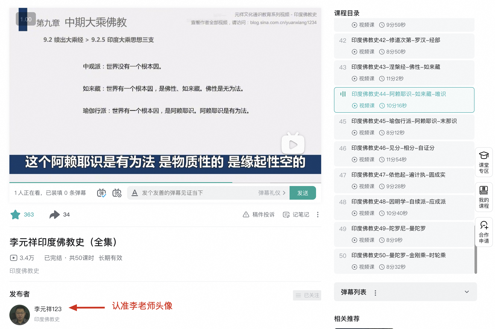

先说下我最近一次佛学知识付费经历。

最近付费的是一个视频课程，李元祥老师的《印度佛教史》，在 YouTube、B站和千聊上都有销售。YouTube 上比较贵，且按月订阅。千聊最便宜，但我没用过，不知道在美国播放卡不卡；B站用过，而且 B站的课程是永久有效的，千聊会过期。所以我最终选择在 B站购买。80 元，50 集，每集大约 10 分钟。

一般的佛教视频、文章我都不看。李元祥老师的视频之前也搜到过，但因为播放量比较低，所以就没去听。后来我向朋友请教佛教史有什么好视频推荐，这位朋友就推荐了他的视频。这个朋友阅读很多，知道什么是高质量内容。出于对他的信任，我就开始听了。

李元祥老师很大方，50 集的《印度佛教史》，前 30 集都是免费的，B站也能搜到前 30 集的内容，最后 20 集收费。我听完前 30 集就决定购买，这样就能听完剩下的 20 集。一共 50 集，你先听了 30 集，试用比例达到 60%，确实很实在。

最后说说我觉得他的视频好在哪，为什么推荐。

第一，不迷信，讲道理，讲逻辑。我的文章风格也如此，算是气味相投。如果你是我文章的读者，大概率也会喜欢他的风格。
第二，知识点足够多，虽然每集只有10分钟，但是每集都会有几个关键字，而这几个关键字，恰恰是佛学的精髓所在。
第三，从佛教史的角度，帮助我厘清了一些问题。如果没有李老师的总结，我自己可能也能找到，但很花时间，效果也未必更好。
第四，我的佛学基础也还可以，尤其是佛学体系、俱舍、唯识这些也略知一二。但在听李老师视频时，偶尔会听到一些新奇的角度，有些角度非常巧妙，有新意，所以我也愿意多听听。

当然，如果非要鸡蛋里挑骨头，视频个别地方的表达方式也有商榷空间，或者说可以更准确一些。这类情况整体很少，也许 5% 左右吧。总体而言，质量非常高，值得推荐。

李元祥老师的信息：
* 李元祥的个人网站：https://yuanxiang123.com/
* Youtube上的《印度佛教史》：https://www.youtube.com/playlist?list=PL3Trmi2OmXhJWujBWPhlDfqDrDeC3dZVG
* Youtube上的李元祥老师频道：https://www.youtube.com/@liyuanxiang
* B站上的《印度佛教史》：https://www.bilibili.com/cheese/play/ss23590
* B站上的主页：https://space.bilibili.com/61155184

PS1，我的视频观看进度（前面30集可以免费试看，31集后需要收费）：

PS2，请认准上图中李老师的头像，网上有很多搬运视频的，不一定是李老师本人。搬运的，视频可能不全，不建议看。

阿弥陀佛。

愚千一
