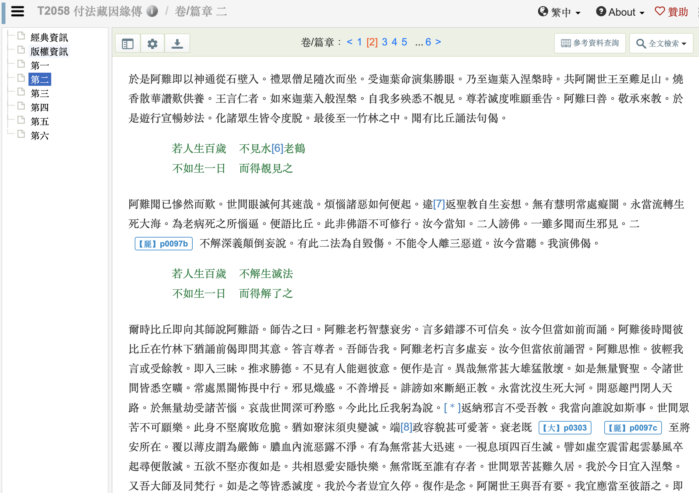

# 一個真理是如何被“迭代”成謬誤的？阿難的無力回天

阿難聽到比丘誦：

> 若人生百歲
> 不見水老鶴
> 不如生一日
> 而得睹見之

他立刻糾正：
“這不是佛語！
佛陀說的重點在於——
解生滅，見真理。”

於是他改誦：

> 若人生百歲
> 不解生滅法
> 不如生一日
> 而得解了之

——然而，事情沒這麼簡單。

比丘回去問師，
師卻說：
“阿難老了，言多虛妄，
不用理他。”

結果——
比丘依舊誦著錯偈。

阿難再度聽見，
滿心悲痛：
“連我也無法糾正，
聖教正被扭曲，
邪見正在取代真義。”

他歎：
“無常迅速，
正法易失，
眾生將沉沒苦海。”

最後，
阿難選擇儘早入涅槃。

# 原文

