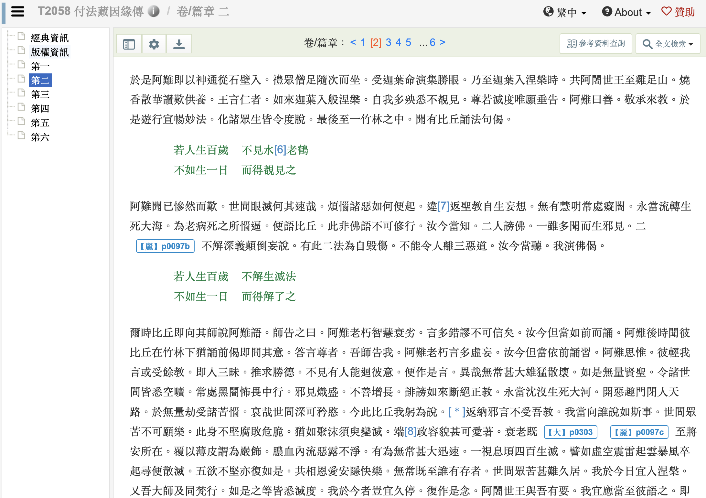

# 真理是如何被“迭代”成谬误的？阿难的无力回天 ｜《付法藏因緣傳》卷二

阿难听到比丘诵：

> 若人生百岁  
> 不见水老鹤  
> 不如生一日  
> 而得睹见之

他立刻纠正： 
这不是佛说的！ 
佛陀说的重点在于见真理。”

于是他诵出正确的版本：

> 若人生百岁  
> 不解生灭法  
> 不如生一日  
> 而得解了之  

然而，事情没这么简单。

比丘回去问他的师父， 
师父却说： 
“阿难老了，老糊涂了，不用理他。”  
结果，比丘依旧诵着错偈。

阿难再度听见， 
满心悲痛： 
“连我也无法纠正， 
圣教正被扭曲， 
邪见正在取代真义。”

他叹： 
“无常迅速， 
正法易失， 
众生将沉没苦海。”

最后，
阿难选择尽早入涅槃。

# 原文

