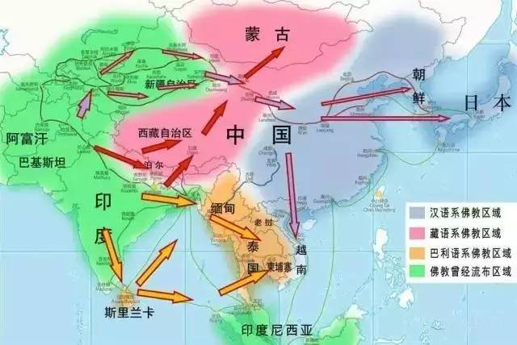

# 佛教分布：南传、汉传、藏传三大体系｜南传本来也有大乘佛法｜西藏本来也有汉传禅宗

佛教自公元前 5 世纪左右诞生于印度北部，历经数百年的传播与演变，逐渐形成了今天的三大区域性体系：**南传佛教、汉传佛教、藏传佛教**。这三大体系不仅代表了不同的地理分布，更反映了佛教在与不同的历史背景、文化传统和社会结构结合后，所呈现出的独特面貌。若要了解当今佛教的格局，首先必须从这三大体系的分布入手。

## 一、南传佛教

**分布地区**  
南传佛教主要分布在东南亚国家，包括斯里兰卡、缅甸、泰国、柬埔寨、老挝等，被称为“上座部佛教”或“巴利佛教”。其主要经典为**巴利三藏**，使用巴利语保存并传承。

**特色**  
南传佛教强调个人修行，注重持戒、禅修，重视“声闻解脱”的理想，即通过八正道修行以证得阿罗汉果。僧团制度严谨，僧人托钵乞食，成为民众供养的对象，民众则通过布施、守戒而积累功德。

**形成原因**  
南传佛教的定型与斯里兰卡密切相关。公元前 3 世纪，阿育王派遣其子摩哂陀与女儿僧伽蜜多将佛法传入斯里兰卡，并逐渐形成巴利语经典的传统。此后，佛教由斯里兰卡再传播至东南亚，形成稳定的南传体系。  
其独立性很大程度上源于地理隔离：当印度本土佛教逐渐衰落时，南亚岛屿与东南亚半岛的佛教依靠巴利语的口传与书写，成功保存了相对完整的上座部传统。

## 二、汉传佛教

**分布地区**  
汉传佛教主要流行于中国及其周边文化圈，包括中国大陆、台湾、韩国、日本、越南等地。其主要经典为**汉译大藏经**，使用汉文保存。

**特色**  
汉传佛教接受了大量的大乘经典，强调“菩萨道”与“普度众生”的理想，发展出天台、华严、净土、禅宗等多种宗派。尤其是禅宗与净土宗，对中国以至东亚文化影响深远。寺院不仅是修行中心，也成为教育、艺术、社会救济的重要机构。

**形成原因**  
佛教自公元前后经丝绸之路传入中国，最初以西域僧人翻译为主，逐渐形成庞大的汉译佛典体系。中国文化的高度发达，使佛教在此吸收了儒家、道家的思想因素，并在魏晋南北朝至隋唐时期走向鼎盛。中国成为佛教新发展的中心，从而形成独具特色的汉传体系。

## 三、藏传佛教

**分布地区**  
藏传佛教主要分布于西藏、蒙古、不丹及部分喜马拉雅地区。其经典既有梵文原典的译本，也有大量藏文译本，形成了独立的**藏文大藏经**。

**特色**  
藏传佛教以密宗修行著称，注重上师传承、灌顶仪轨和密续修法。同时，它也保留了印度晚期佛教的大乘与金刚乘传统，形成了格鲁、宁玛、萨迦、噶举等教派。其组织形式具有政教合一的特点，寺院常同时承担宗教与政治的双重职能。

**形成原因**  
公元 7 世纪松赞干布迎娶尼泊尔与唐朝的公主，佛教开始正式传入西藏。后经历赤松德赞、寂护、莲花生大师的弘扬，奠定了藏传佛教的根基。西藏地理环境封闭，使其保存了印度晚期佛教的许多特色，同时又因政治需要发展出独特的教派体系。

## 四、三大体系的格局：由传播路径所决定

从传播史看，今天佛教呈现“南传、汉传、藏传”三大体系，主要由**三条主干传播路线**与若干**区域枢纽**共同塑造；附图中的箭头走向正是这三条路线的空间投影。

### 1) 南传线（上座部为主）

* **源头与枢纽**：印度中北部—>斯里兰卡（关键中转站）。
* **通道**：孟加拉湾与印度洋的**海上丝绸之路**，以及缅甸—泰国—柬老的河谷走廊（伊洛瓦底、昭披耶、湄公河支流）。
* **扩散**：自公元前3世纪起由斯里兰卡北上/东传至缅甸、泰国、柬埔寨、老挝，后在13–14世纪完成区域性**上座部化定型**；中国西南的云南傣族地区亦与此线相连。
* **结果**：形成以巴利三藏、僧团戒律与禅修为核心的**南传佛教圈**。

### 2) 汉传线（大乘为主）

* **源头与枢纽**：印度—>中亚—>**河西走廊**—>长安/洛阳（翻译与弘化中心），并由此北东外溢。
* **通道**：**陆上丝绸之路**（塔里木盆地—河西—关中）与**海上丝绸之路**（南印/斯里兰卡—广州—福建/浙江）。
* **扩散**：公元1世纪后进入中土，6世纪起经朝鲜半岛至日本，同时南下影响越南北部；形成以汉译大藏为载体、禅/净/天台/华严等宗派并立的**汉传佛教圈**。
* **结果**：东亚文化圈内，寺院教育、译经事业与在家信仰（念佛、持斋）共同支撑体系稳定。

### 3) 藏传线（金刚乘为主）

* **源头与枢纽**：印度东北部、克什米尔与尼泊尔—>吐蕃**桑耶寺/拉萨**（制度化中心）。
* **通道**：**青藏高原南缘走廊**（经尼泊尔、不丹入藏）与昆仑—阿里—羌塘高地的内陆道；随后北传至**蒙古高原**，东缘联通川甘青。
* **扩散**：7–9世纪“前弘期”入藏，11世纪后“后弘期”系统化，继而辐射蒙古与喜马拉雅诸国；形成宁玛、噶举、萨迦、格鲁等教派格局。
* **结果**：以上师传承、灌顶与密续修法为核心的**藏传佛教圈**，并在部分时期与地方政权形成政教合一。

## 冷知识：南传本来也有大乘佛法  

南传佛教在今天的面貌中，往往被视为纯粹的“上座部”，以巴利三藏为正统。然而，历史的事实更为复杂。斯里兰卡早期佛教的发展过程中，确实存在过**大乘思想与上座部的互动乃至冲突**。  

最具代表性的事件，是**无畏山寺派（Abhayagiri）与大寺派（Mahāvihāra）**的斗争。无畏山寺建于公元前 1 世纪，其僧团思想开放，兼收并蓄，曾积极接受并弘扬大乘经典，成为南传世界中大乘思想的中心。相对地，大寺派主张坚守上座部的传统，强调巴利语经典的权威性。两派之间长期存在教义与政治上的对立，彼此互相攻讦，甚至争取王权支持。  

从历史结果来看，大寺派逐渐取得优势，尤其在阿努拉达普拉王朝后期，王室对无畏山寺多次采取压制政策。无畏山寺最终式微，大寺派独尊，确立了斯里兰卡乃至东南亚佛教“上座部化”的格局。  
然而，考古学和文献学证据显示，大乘佛法在南传世界并非边缘现象，而是在数百年间曾有过广泛影响。今日的南传佛教虽以小乘面貌自居，但其历史记忆中，仍留有大乘的痕迹。  

## 冷知识：西藏本来也有汉传禅宗  

西藏佛教以密宗著称，但在其形成初期，确曾与汉传禅宗发生过深刻的交流与冲突。唐代时，中国禅师摩诃衍（又称禅门大师）入藏，弘扬“顿悟”法门，主张一念即悟，顿超诸阶。与此同时，印度来的寂护与莲花生大师则强调“渐修”次第，结合密续的观行与灌顶，逐步成就佛果。  

这场论辩史称**“顿渐之争”**，又称“三年大辩论”，在西藏史籍《贤者喜宴论》等中均有记载。最终，西藏赞普与僧团裁定以“渐修”为正统，汉传禅宗在西藏的发展因此受挫。此后，西藏佛教的史观多以批判态度回顾这段经历，认为顿悟之说过于简略，不足以为根本。

这是藏传佛教单方面的记录。汉地史籍多只提及“僧人入藏”，并未记录所谓的“辩论”。

然而，后代学者的研究表明，这场论辩的叙事具有政治与宗派建构的成分。部分西方学者认为，西藏记录中的“汉地禅宗”形象，可能并未完全代表真实的中国禅宗，而是一个被对手建构出来的“假想敌”。在实际历史上，禅宗的影响可能比文献记载更为温和，并非单纯的失败者。今日学术界的主流观点是：藏传佛教与汉传禅宗的交流确实存在，但其冲突被西藏后世文献放大，用以强调密宗正统性的确立。  

## 总结

无论是南传佛教中无畏山寺派与大寺派的斗争，还是西藏佛教史上的“顿渐之争”，都显示出一个共同规律：宗派之间的兴衰并不仅仅取决于教义的深浅优劣，而更依赖于王权的态度与支持。

在斯里兰卡，无畏山寺派因弘扬大乘经典而一度兴盛，但随着王朝转而扶持大寺派，其势力迅速衰落。西藏的情况更为典型：在“顿渐之争”中，王权与僧团最终选择了印度密续的渐修体系，使得汉传禅宗在西藏被边缘化。此后，西藏佛教发展出政教合一的格局，宗派斗争与王权之争紧密结合。宁玛、噶举、萨迦、格鲁等教派，都曾经依靠不同的政治势力而兴起、衰落，直至格鲁派最终建立政教合一的统治。

由此可见：佛教史上的宗派斗争，往往不仅是学理的辩论，更是政治与宗教互动的结果。只要争取到王权支持，任何一方便可迅速确立正统地位；而失去王权的一方，则往往被边缘化甚至消亡。这一点在西藏佛教史中尤为明显，成为政教合一传统的重要注脚。

