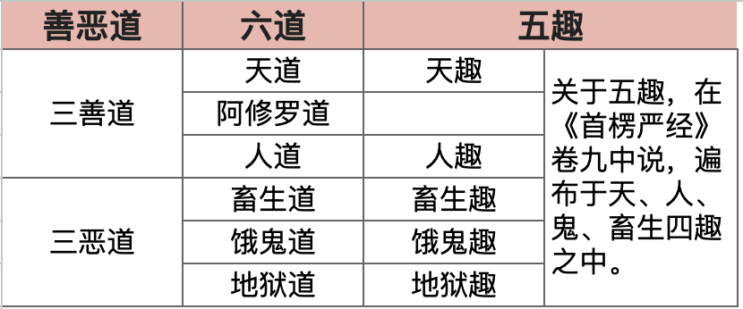

# 六道轮回：五趣或六道，两种解读

学佛的朋友可能会有个疑问，谈到轮回，有时候听到的是「五趣」，有时候又是「六道轮回」，到底有几个？是五个还是六个？是哪个说法错了吗？

其实都没错。这背后反映了佛教思想在不同时期的演变和整合。我们可以直接从佛经里寻找答案，理清它们的关系。

## 五趣

在比较早期的佛经，尤其是《阿含经》里，佛陀谈论众生流转的生命形态时，主要说的是「五趣」，也叫「五道」。

> 《杂阿含经》卷34：“如是众生转五趣轮，或堕地狱、畜生、饿鬼及人、天趣，常转不息。”

> 《增壹含经》卷27：「念佛无贪欲，度彼欲难陀，覩天现地狱，制意离五趣。」

> 《大乘本生心地观经》卷4：“由妄想缘起诸烦恼，因众烦恼造善恶业，依善恶业感五趣果，如是如是生死不断。”

> 《大般若波罗蜜多经》卷342：“若一切法皆无分别，云何而有地狱、傍生、鬼界、人、天五趣差别？”

从这些经文可以清楚看到，早期通行的说法是五种生命形态：
1.  **天趣**：享受福报、快乐、长寿的生命，如天神。
2.  **人趣**：苦乐参半，但有理性和意志，最适合修行。
3.  **饿鬼趣**：遭受无尽饥渴，欲望极强却无法满足的生命。
4.  **畜生趣**（或称傍生）：缺乏理性，凭本能行事，常被奴役或互相残杀的生命。
5.  **地狱趣**：承受极大痛苦与折磨的生命。

## 六道

到了后期，尤其是在大乘佛教的经典中，「六道」的说法变得越来越普遍，大家常说的「六道轮回」也由此而来。

> 《大乘本生心地观经》卷3：“有情轮回生六道，犹如车轮无始终，或为父母为男女，世世生生互有恩。”

> 《过去现在因果经》卷2：“诸天虽乐，福尽则穷，轮回六道，终为苦聚。”

> 《摩诃般若波罗蜜经》卷15：“须菩提！菩萨摩诃萨得阿耨多罗三藐三菩提时，拔出六道众生，着无畏岸涅槃处。”

那么，六道比五趣多出来的是哪一道呢？就是**阿修罗道**。

阿修罗是一种很特别的众生，他们有天人的福报，享受很好的物质生活，但内心充满了瞋恨、骄慢和猜疑，非常好勇斗狠。简单说，就是一群有福气但脾气极差，整天只想战斗的众生。

## 五趣和六道的对应关系

既然有两种说法，后来的祖师大德们自然会对其进行整理和解释，让理论体系更加完备。关于阿修罗到底算哪一类的众生，历史上有过不同的看法。

如《大毗婆沙论》卷一七二记载，有些部派把阿修罗（阿素洛）单独立为第六趣。

但也有经论，如《正法念处经》卷十八认为，阿修罗散居在鬼道和畜生道里，不算独立的一道。

《佛地经论》卷六则说阿修罗的种类不固定，有的属于天，有的属于鬼，有的属于傍生。

其中，《首楞严经》卷九对阿修罗的归属和出生方式，提供了一种非常详细的分类，正好印证了其种类不定的说法：

* 有修罗在鬼道中，因护持佛法而有神通，能进入虚空。这是卵生的阿修罗，摄于鬼趣。

* 有修罗是从天道中福报衰损而堕落的，居住地邻近日月。这是胎生的阿修罗，摄于人趣。

* 有阿修罗能执持世界，力量强大无所畏惧，能与梵王、帝释天、四天王争夺权力。这是化生的阿修罗，摄于天趣。

* 还有一类福报较差的下劣阿修罗，生在大海深处的水穴口。这是湿生的阿修罗，摄于畜生趣。

从这段经文可见，阿修罗并非一个单纯的群体，而是根据其业力、福报和出生方式，遍布于天、人、鬼、畜生四趣之中，这也解释了为何在谈五趣时，没有单独列出阿修罗。

## 分类：三善道和三恶道

不过，在汉传佛教中，影响更为深远的还是《大智度论》的观点。它将六道划分为「三善道」和「三恶道」，提供了一个更为简洁、清晰的框架。

《大智度论》卷三十说，六道有善恶之别。善道分上、中、下，分别是天、人、阿修罗；恶道也分上、中、下，分别是地狱、畜生、饿鬼。

按照《大智度论》的说法，我们可以整理出下面这个对应关系表：

* 三善道：天道、人道、阿修罗道
* 三恶道：饿鬼道、畜生道、地狱道

## 制作图表

## 两种解读

了解了五趣和六道的演变与关系后，更重要的是我们该如何理解轮回？这里有两种层次的解读，都很有意义。

#### 第一种：实有的轮回

这是最传统、最基础的解读。六道被视为客观存在的六种生命世界或状态。我们根据自己一生的善恶业力，在死后被牵引到相应的道去投生。

做了大善事，可能生到天道享福；守好做人的本分，能保住人身；若是贪婪吝啬，可能堕入饿鬼道；愚痴无明，堕入畜生道；瞋恨心极重，则可能堕入地狱道受苦。阿修罗道则是因善业带有慢、疑、瞋的结果。

这个解读方式强调的是因果不虚，提醒我们对自己的行为负责，为自己的未来负责。

#### 第二种：人间的心理状态

这是更贴近我们现实生活，更具「人间佛教」精神的解读。六道不仅是死后的世界，更是我们当下内心的不同状态。我们每一个人在一天之中，甚至一念之间，都在经历着「六道轮回」。

* 当我们内心平静、喜悦、充满爱与光明时，这就是**天道**的心境。
* 当我们嫉妒、好胜、与人争执不休、处处想占上风时，就落入了**阿修罗道**。
* 当我们理性、自省、能明辨是非、控制自己行为时，就保持在**人道**。
* 当我们被强烈的欲望控制，贪得无厌，无法满足时，就是**饿鬼道**的状态。
* 当我们浑浑噩噩，麻木不仁，只凭本能和情绪反应过日子，就是**畜生道**的状态。
* 当我们被愤怒、仇恨、绝望和痛苦淹没，感觉身心如在炼狱时，就是**地狱道**的状态。

这种解读方式不是要否定第一种，而是将佛法拉回到我们的内心，变成可以时时观照和实践的工具。修行的目的，就是练习觉察自己的念头，让自己尽量脱离三恶道的心境，多安住在人、天的善念中，并最终超越这一切分别，获得真正的解脱。

从五趣到六道，再到两种不同的解读，我们可以看到佛法既有其历史的演变，也有不同层次的智慧。对我们现代人而言，将六道轮回理解为当下的心理写照，或许更能体会到佛法的实用与深刻。

