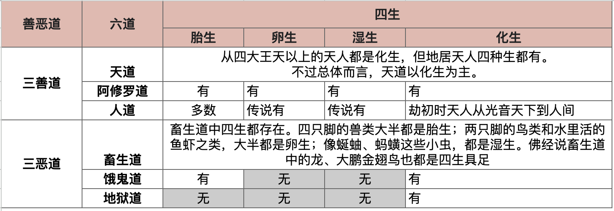

# 四生与六道的关系

这张图延续了《[佛学基础：三界、九地（九有）、六道、三有](https://mp.weixin.qq.com/s/7IAI5TzicGvcp6uo1XwrrQ)》的整理方式，在原有的三界、九地、六道框架上，再加上一层“出生模式”的信息。

## 四生的定义

“四生”出自《长阿含经·大本经》《增一阿含经·四生品》等经典，也在《阿毗达磨俱舍论》卷八作了系统说明。四种生法如下：

1. **卵生**：以卵为胎器，由外缘孵化而成，如鸟类、爬行类与部分水生众生。
2. **胎生**：在母体内孕育成形而出生，如人类、哺乳动物、部分天众与阿修罗。
3. **湿生**：依赖湿润、腐植的环境而生起，如微细昆虫、湿气滋养的生命体。
4. **化生**：无须母体与胎器，因业力感召而顿时现形，常见于天道、地狱、饿鬼等众生，也包含某些修行有成者的特殊再生。

如果按照现代科学来说，“湿生”是可以归类到卵生中去的。过去的时候，对于比较微细的生物，很难观察到卵，但是，现代科学很容易观察到。因此，对于这类来说，算为卵生也可以。

不过现代科学上的微生物繁殖，大多是无性繁殖，例如细菌，真菌，这类应该属于湿生的范畴了。

佛教的四生不是单纯的生物学分类，而是佛教在观察众生出生因缘时所提出的框架。把“出生方式”纳入轮回体系，可以进一步说明业力如何在不同界、不同道中成熟。

## 四生在六道中的分布

为了方便记忆，可以对照下表，结合上方图表来阅读：

| 六道 | 主要生法 | 说明 |
| --- | --- | --- |
| 天道 | 化生为主，欲界下两天兼有胎生 | 《俱舍论》指出，除四天王与忉利天部分众生外，其余天众多以化生现形；化生象征清净与迅速成就的福报。 |
| 阿修罗道 | 卵生、胎生、湿生、化生皆有 | 《首楞严经》卷九提到，阿修罗散布在天、人、鬼、畜生之间，不同类型对应不同生法。 |
| 人道 | 胎生为主，少数特殊因缘为化生 | 《杂阿含经》说“人从母胎生”，但经典亦记载莲华化生、刹土化生的人类圣众。 |
| 畜生道 | 卵生、胎生、湿生、化生并存 | 海陆空各类众生无所不包，四种生法都能找到例子。 |
| 饿鬼道 | 化生为主，兼有胎生、湿生 | 饿鬼多由贪爱心强烈的业力所致，经典描述他们“随念即现”，多以化生示现，也有投胎受生的鬼类。 |
| 地狱道 | 化生 | 地狱众生依业力顿时受报，《地藏经》《俱舍论》都以“化生”描述其出现。 |

若从三善道与三恶道的角度来看，善道（天、人、阿修罗）的生法相对多样，表示福报与烦恼并存的复杂性；恶道（地狱、饿鬼、畜生）则显示业力的强制力，众生几乎无法选择出生形态。

## 十二因缘：爱取有

《杂阿含经》卷十二说：“爱缘取，取缘有。” 四生正是“有”的具体表现。时常观照自己的爱取，就能在因上断除粗重的生死。

阿弥陀佛

千一合十

