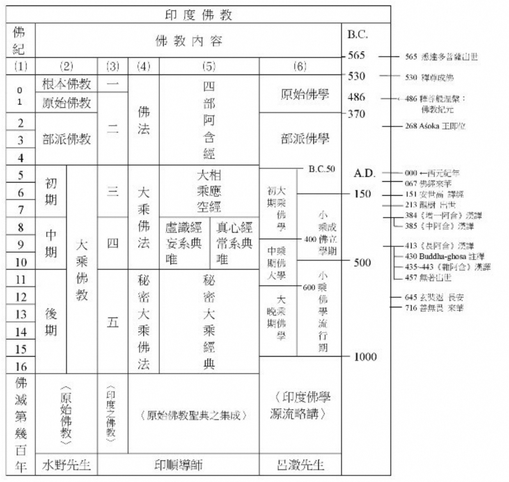

# 全体佛法

## 为什么要建立对全体佛法的认识？

因为大家接触到的寺院、道场所教导的佛法，绝大多数，都是从各自的宗派所出发的，这样背景下，所讲的佛法，如果仅仅是自宗的内容，那还好。如果涉及到评判其他宗派，那么就非常容易有偏颇。比如，小乘毁谤大乘非佛说，大乘批评小乘自了汉，中观经常批判唯识不了义，还有各种对密法的批判。

所以，对于现代教育下的我们，十分有必要先上一堂课，叫做“全体佛教”，“全体佛法”，对于佛教、佛法都要有一个全面的了解。这样可以避免片面和偏颇。

而且，从学习的角度，可以帮助学习到更加“纯正”的佛法。例如，在声闻教里面学习解脱法，就是最正宗的。在般若系中学习般若，是最纯正的。在唯识中学习唯识，是最清楚的。而不是，在一个批判声闻都是自了汉的所谓大乘教法中学习声闻法。不是在批判般若不究竟唯识也不究竟的如来藏中学习般若和唯识。

这就跟美食是一个道理的，去川菜馆才能吃到正宗的川菜，在湘菜馆才能吃到正宗的湘菜。而不是跑去火锅店里面点烤鸭，去烤鸭店里面点汉堡。

## 什么是全体佛法？

那就是全部的佛法，包括所有的佛法，包括南传、北传，包括小乘和大乘。甚至，包括小乘的各个宗派（含学说），也包括大乘的各种宗派（同样包括学说）。

再具体来说，就是所有的、不同体系下的三藏：南传的巴利三藏，汉传的大藏经（三藏），藏传的甘珠尔和丹珠尔。

## 如何认识全体佛教？

**一纵一横**

我推荐的思路是一纵一横。
一纵的意思是，从时间的角度、从历史的角度认识佛教和佛法。也就是佛教史和佛教思想史。
一横就是判教，也就是对全体佛法的分类和整理。

**佛教史**

介绍历史中的佛教，一般包括佛陀的生平，佛陀灭度后的教团的发展，这里有几个关键性的时间点，也就是教团的分裂。

**佛教思想史**

如果只看历史，会偏重于故事，因为只是历史事件的串联。而如果要再深入一点，那么就应该把佛教的思想也包括进来，综合起来，就是佛教思想史了。

**佛教分期**

把佛教历史和佛教思想的发展脉络综合起来，就是佛教分期了。

上图是杨郁文（杨白衣）在《阿含要略》的图表，整理得非常全面了。

图中的最后一行是参考书：
* 水野先生《原始佛教》
* 印顺导师《印度之佛教》《原始佛教圣典之集成》
* 吕溦《印度佛学源流略讲》

这里综合一下，把佛教分期可以精简如下：

**传统判教和弊端**

传统的判教有：

* 天台判教：藏、通、别、圆
* 华严判教：小、始、终、顿、圆
* 藏传判教：先显后密，推崇密法，密法里面又推崇无上瑜伽为最高最上的

这类判教有其历史背景，但也有其历史局限。说它有历史背景，是承认这类判教的价值，在汉传佛教内，天台判教依然是最为推崇的。但也有其局限性，是因为这类判教里面，实际上是分了高下，最后的就是最好的。

汉传佛教里面，就以圆教为最高的，最究竟的，于是，所有的汉传佛教（禅宗，净土，天台，华严等），无一不以圆教为最高的层次。既然有最高的层次，那么干嘛要去追求低级的层次呢，最终就导致学人好高骛远，眼高手低，不重视根本佛教，不重视次第了。最终导致了汉传佛教的败坏不堪，苟延残喘了。

藏传有同样的问题，因为推崇密法，导致显宗不被重视，这才有宗喀巴大师要重振戒律，重新强调显宗，要求先显后密作为次第。但是，依然有其局限性，不敢否定无上瑜伽，而仅仅是做了若干限制。而放眼藏传佛教的“大师”，无一例外都是密法的大成就者，至于是哪种密法，差别仅仅在于是否公开和宣传了。所以，藏传的局限性就是无法彻底规范密法，导致各种假仁波切骗财骗色，络绎不绝。如果没有国家法律的强制干预，早就乌烟瘴气了。

**为什么现代的判教更适合我们？**

因为我们都经过现代教育的洗礼，对于现代教育是非常熟悉的，而现代教育也是非常科学的。

具体来说，古代传统教育，就是读读经典，尤其是儒家经典，像《诗》《书》《礼》《易》《春秋》《论语》《孟子》《大学》《中庸》等。我们也在语文课本里面读过一些《论语》《孟子》，请问我们从中有学到哪些数学，地理等知识呢？要么没有，要么十分稀少。这就是传统教育的弊端。所以，在现代的学校里面，传统教育的形态被完全抛弃了。（注意，我这里说的是抛弃了以此为大纲的教育方式，不是要抛弃国学。）

取而代之的是现代教育，现代教育是分科目的，语文、数学、地理、物理、生物、化学、音乐、美术等等。分别按照各自的科目来教学，各个科目都有自己的教学大纲。

学习佛学也是这样的。现代佛学的分类就是四大体系，每个体系都有其特点，特色，并不能随便混为一谈。更不能胡子眉毛一把抓。按照四大体系的方式分别学习佛学，才能学到最纯正的佛法。

阿弥陀佛

千一合十

