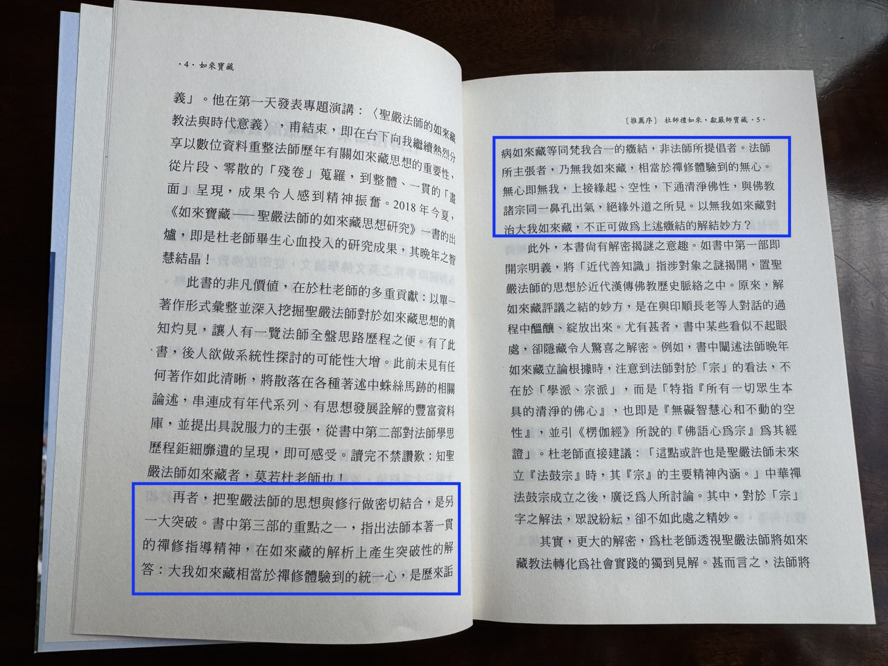
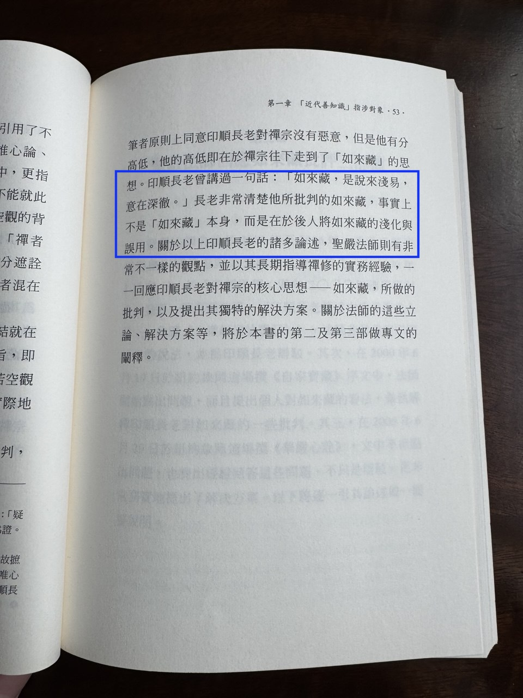
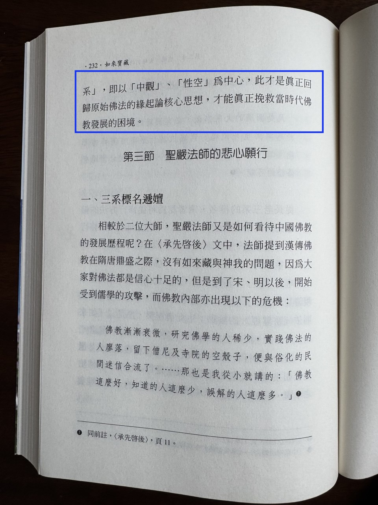
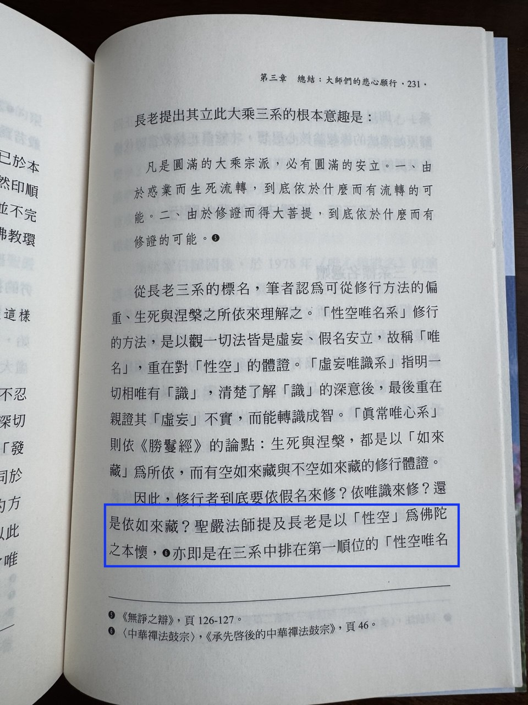

我之前写了一篇文章[《圣严法师的佛学中心思想是 —— 缘起性空，而非真常如来藏》](https://mp.weixin.qq.com/s/GyySsomspX4mV7F7FEMyzA)，并且发在了法鼓山的群组里面。很显然，这个标题本身就引起了一些佛友的强烈情绪。他们都未必读了文章内容，更未必读了内容中所引的，圣严法师亲自写的，几本书：《承先启后的中华禅法鼓宗》，《华严心诠──原人论考释》《自家宝藏──如来藏经语体译释》。如果他们读了这些书，就应该不难理解我的标题了。

有人在群组里面立即转发了《如来宝藏：圣严法师的如来藏思想研究》（下面简称《如来宝藏》）这本书，可能是想要做些反驳。于是我就问大家，谁有这本书可以借我读下？无论是电子版或纸质书都可以。结果，并未如愿，原因未知，不知道是不是自己转发书籍而自己没有读过呢？还是单纯地没有书可以借。

借助上次短暂停留台湾的机会，在法鼓山农禅寺浏览后，在书店里面发现了这本书，于是就买了回来。但没有立即开始读，中间读了其他的书，然后在昨天和今天才读了一下这本书。

如果熟悉上面的几本书，以及熟悉印顺法师的几本书，如《如来藏之研究》《空之探究》。《如来宝藏》这本书读起来还是非常快速的，从昨天到今天，总共花了不到三个小时而已。

读完以后，如果你问我，之前写的文章有什么修改的地方吗？—-- 我可以开玩笑地说，一个字都不用改。为什么？请参考下面的截图和引用。

**《如来宝藏》，推荐序，杜师礼如来，献严师宝藏 - 越建东，P4-5**

> 再者，把聖嚴法師的思想與修行做密切結合，是另一大突破。書中第三部的重點之一，指出法師本著一貫的禪修指導精神，在如來藏的解析上產生突酸性的解答：大我如來藏相當於禪修體驗到的統一心，是歷來詬病如來藏等同梵我合一的癥結，非法師所提倡者。法師所主張者，乃無我如來藏，相當於禪修體驗到的無心。無心即無我，上接緣起、空性，下通清淨佛性，與佛教諸宗同一鼻孔出氣，絕綠外道之所見。以無我如來藏對治大我如來藏，不正可做為上述癥結的解結妙方？

**《如来宝藏》，第一章，近代善知识指涉对象，P53**

> 印順長老會講過一句話：「如來藏，是說來淺易，意在深徹。」長老非常清楚他所批判的如來藏，事實上不是「如來藏」本身，而是在於後人將如來藏的淺化與誤用。

**《如来宝藏》，第三章，總結：大師們的悲心願行，P231**

> 聖嚴法師提及長老是以「性空」為佛陀之本馍，e亦即是在三系中排在第一順位的「性空唯名系」，即以「申觀」、「性空」為中心，此才是真正回歸原始佛法的絲超論核心思想，才能眞正挽救當時代佛教發展的困境。

但是，如果要考虑到照顾大家对如来藏的情感的话，那么，也不妨改个标题 —--《圣严法师推崇的是无我如来藏、空性如来藏》。这样的标题就不再犀利了，或许引起不了大家的思考。就好像，虽然圣严法师自己也写了《承先启后的中华禅法鼓宗》，《华严心诠──原人论考释》《自家宝藏──如来藏经语体译释》这些书，但是仔细读过的人，又有几个呢？

圣严法师对《六祖坛经》的总结说，《六祖坛经》是以般若为手段，以如来藏为目的的。

> 《禪與悟》：「於是《六祖壇經》雖讓人見到般若的思想，實際上是以如來藏為根本，這是非常明顯的事。」法鼓全集2020紀念版（第4輯第6冊，頁328）。

那么圣严法师本人，就是以如来藏为接引的手段，以根本佛教和般若的缘起性空为目的了。

阿弥陀佛  
千一合十

