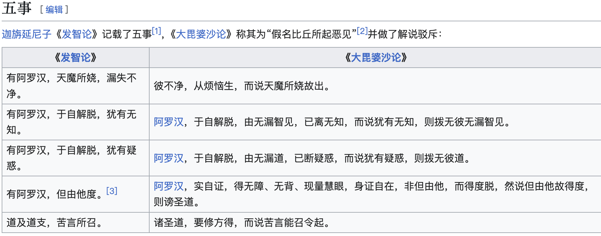

### 什么是形而上？

什么是形而上？尤其是指佛教中的形而上，那就是指总爱谈论佛教中最高、最大、最上层的理论。以佛教中的方式来说，就是第一中最第一，了义中最了义，究竟中最究竟，胜义中的胜义，密法中之最密（后面只简称为第一，究竟，了义，胜义，最密）。

并不是说，不该了解这些内容。而是说，不该过于讨论这些。原因是什么呢？

第一，因为各种说法，查询经典，都可以一定的依据。比如空宗说空是第一。

第二，容易引发争论。

有宗（如来藏）说有最究竟。那么到底是空宗的空是第一呢，还是有宗的有是第一呢？甚至还有人说，两个理论没有矛盾，没有对立 —— 这种说法，客气点说是“圆融”，不客气点说就是“和稀泥”了。空宗和有宗是佛教史上最大的两种思想，争论已有上千。根本原因，就在于第一点中所说的，各自依据的经典不同，相互争论时，也只是引用自己所推崇的经典，对方的经典，置若罔闻，即不敢批评佛经是错，更不敢批评佛陀是错。

说来说去无非是说，我宗所推崇的经典才是佛陀的本怀，佛陀的真实义。你宗的所说的经典，都是“方便说”，都是“不了义”。

第三，极难实证（除了佛和大菩萨们）。

如果很容易实证，或者历代高僧祖师们都可以实证的话，早就出来破斥另一种说法了。实际上，高僧大德们虽然很有修为，虽然有修有证，但也是无法实证到这些的。

我这样说，肯定有很多人要来骂我了。但是大家仔细想想，如果那么容易实证，佛教里面哪来的那么多纷争？

**大天五事**

熟悉佛教史的人或许知道，佛教团体第一次分裂的原因是什么？就是著名的“大天五事”。大天五事是什么？

* 是否有阿罗汉会受到天魔的干扰，因而会有梦遗（遗精）。 
* 是否有阿罗汉，对于自己是否完全解脱，不完全知情。
* 是否有阿罗汉，对于自己是否完全解脱，仍然有疑惑。 
* 是否有阿罗汉只能依靠他人才能解脱。无法自己解脱。
* 道和道支，是否要先听闻“苦”才能引发。

这些之所以会引起第一次佛教团队的分裂，根本原因，就在于当时的佛教团体无法对此达成一致。而无法达成一致的根本原因，不难猜测有这样几个：

* 两边都无阿罗汉，那就只能依赖佛经，看是否明确了，如果不明确，就只能靠推论了。
* 一方有阿罗汉，一方没有。有阿罗汉的一方自然会有判断，但是另一方肯定不服，才会导致分裂。
* 两边都有阿罗汉，但是依旧无法达成一致。要么所证阿罗汉的方式不同，要么所证阿罗汉后的见解依然不同。

根据佛教史记载，佛陀涅槃后的几百年都是有很多阿罗汉的，所以上面所说的第二，第三条可能性更大了。

**玄奘去取经的原因是什么？**

阿弥陀佛。

愚千一

