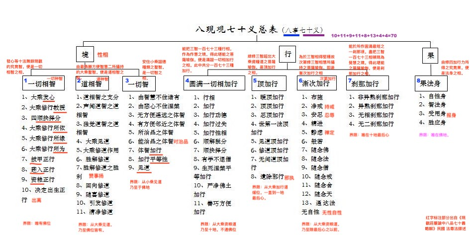

# 大图

# 八事七十义

## 第一事，一切相智（一切种智）

### 总颂

**謂法界自性。諸所緣所為。 
甲鎧趣入事。資糧及出離。**

### 十义

| 序号| 分类名称 | 解释 | 界限| 颂文|
|-|-|------|----|--|
|1| 发心 | 為利他故緣大菩提與自眷屬欲心所相應之大乘入門的最勝第六意識心王。是大乘發心之相。此分與欲相應所生之發心。乃至與法身相應所生之發心。共二十二種。| 從大乘資糧道。直通佛位。|「發心為利他」以下三頌|
|2| 教授 | 開示無錯謬能得發心所為事之方便的清淨語。便是大乘教授之相。此分正行等十種教授。| 從未入道前乃至佛位。|「正行及諸諦」等四頌|
|3|四決擇分|從自因大乘資糧道圓滿而生。勝解行地所攝之菩薩瑜伽。即大乘順決擇分相。此分煖等四位。|界限唯在加行道。|「所緣及行相」等十二頌|
|4|正行所依|既是自所依法菩薩心之法性。復是大乘正行所依之事。即是大乘正行所依自性住種之相。此分十三種|從大乘資糧道。乃至十地最後心。| 「通達有六法」等三頌|
|5|諸所緣|大乘正行遣除增益之所依。即是大乘正行所緣之相。此分十一類。||「所緣一切法」等兩頌即是廣釋。|
|6|所為事|菩薩為得何事而趣正行。其所得究竟。即是大乘正行所為事之相。分別有三。|唯在佛地|「思有情皆勝」等一頌|
|7|鎧甲|於一一波羅密多中。皆攝六六波羅密多。如是修持之慧所攝持之菩薩瑜伽。即是鎧甲正行之相。此分三十六種|從資糧道乃至十地最後心|「彼別別施等」一頌|
|8|趣入|大乘因果諸法如應加行。修所成為主之慧所攝持之菩薩瑜伽。即是趣入正行之相。此分九事|從大乘加行道乃至十地發心|「靜慮無色施」等二頌|
|9|資糧|由二種廣大資糧所攝持。勝出大乘加行道世第一法中品以下。能直生自果大菩提之菩薩瑜伽。即是資糧正行之相。此分十七種|從大乘加行道世第一法上品。乃至十地後心|「悲及施等六」等二十六頌|
|10| 出離|決定無疑出生一切相智之淨地瑜伽。即是出離正行之相。此分八種|唯在三清淨地。論中「所為及平等」二頌|

## 第二事，

### 总颂

**令其映蔽等。弟子麟喻道。 
此及他功德。大勝利見道。 
作用及勝解。讚事并稱揚。 
廻向與隨喜。無上作意等。 
引發最清淨。是名為修道。 
諸善巧菩薩。如是說道智。**

