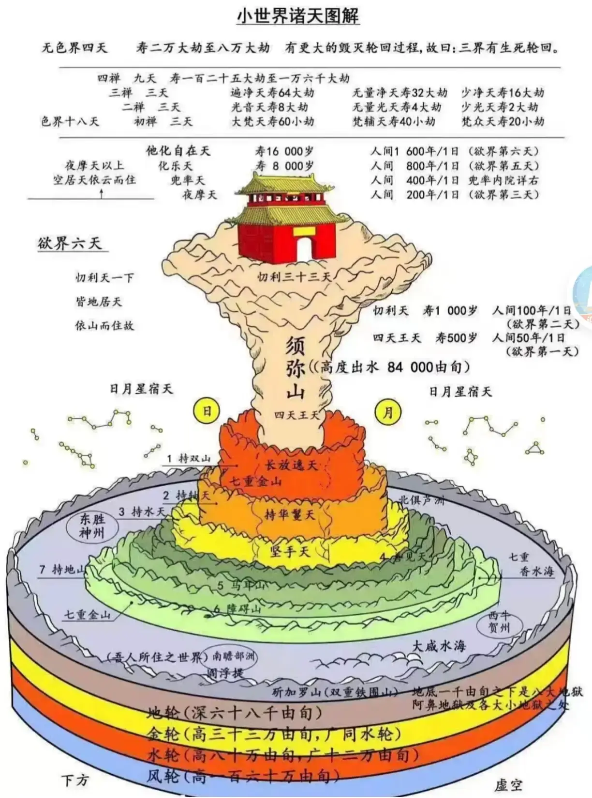
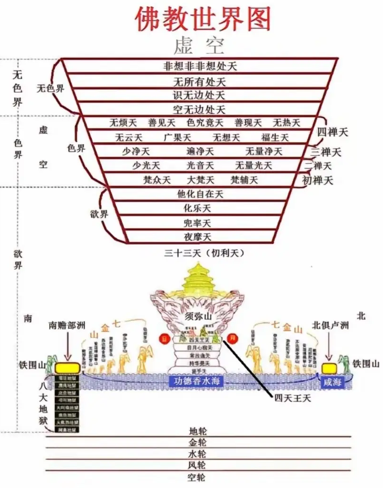
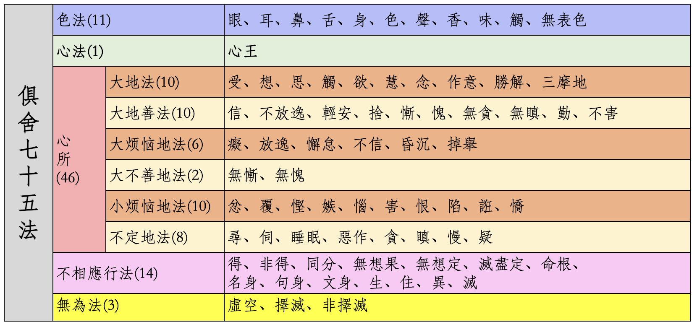
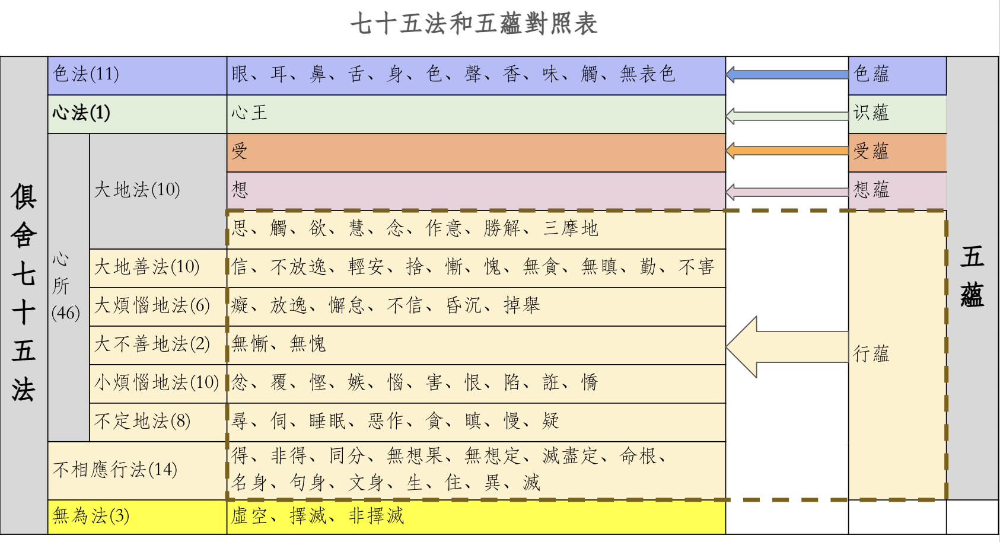
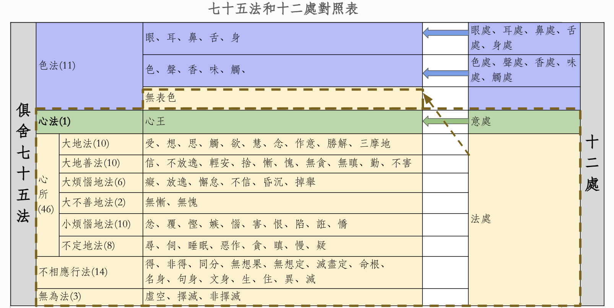
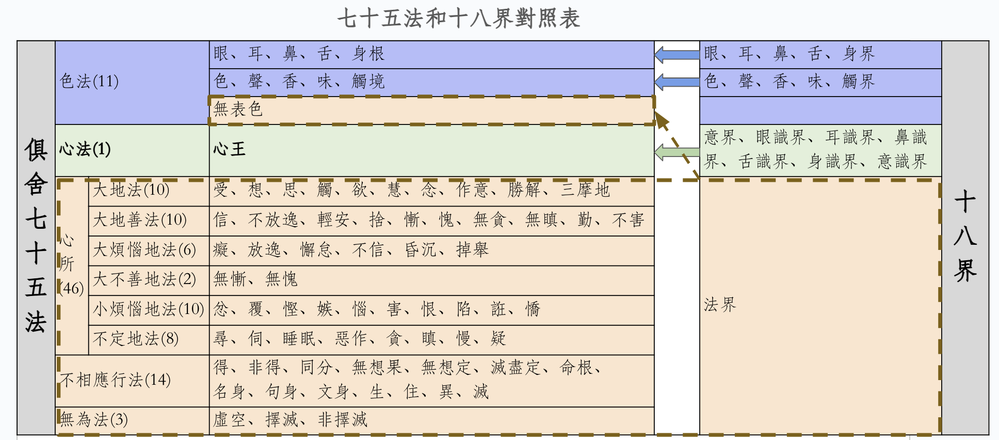

# 佛学基本

## 佛教世界

* **三界**：欲界、色界、无色界
* **三有**：欲有、色有、无色有 —— 和三界对应，也表示转生在那一界的有情众生。
* **六道**：天道、阿修罗道、人道、畜生道、饿鬼道、地狱道
* **五趣**：天道、人道、畜生道、饿鬼道、地狱道 —— 比六道少了阿修罗道，这是把阿修罗道分在了天、人、鬼、畜生四趣之中。

欲界包括了完整的六道。  
色界、无色界属于天道。  
因此，天道是六道中唯一一个在三界中都有的了。  

---

* **九地**：
  * 欲界：只有一地 —— 五趣杂居地。
  * 色界：有四地 —— 离生喜乐地、定生喜乐地、离喜妙乐地、舍念清净地。也叫初禅天、第二禅天、第三禅天、第四禅天。
  * 无色界：也有四地 —— 空无边处地、识无边处地、无所有处地、非想非非想处地。

* **九有**：和九地一样，把“地”换成“有”，也表示转生在那一地的有情众生。

---

### 天界

* 欲界有六天，从低到高分别是：
  * 四天王天
  * 忉利天。也叫三十三天，因为这里有三十三个地方，每个地方都是一个天，所以叫三十三天。
  * 夜摩天
  * 兜率陀天。这里有一个兜率内院，弥勒菩萨正在这里讲法，大约五亿七千万后，将会下生成佛，成为弥勒佛。
  * 化自在天
  * 他化自在天	
* 色界：
  * 初禅有三天：大梵天、梵辅天、梵众天
  * 二禅有三天：少光天、无量光天、光音天
  * 三禅有三天：少净天、无量净天、遍净天
  * 四禅有九天：无云天、福生天、广果天、无想天、无烦天、无热天、善见天、善现天、色究竟天
* 无色界有四天：空无边处天、识无边处天、无所有处天、非想非非想处天

其中四禅的后面五天（无烦天、无热天、善见天、善现天、色究竟天）也叫五净居天，是圣人不还果（声闻三果，阿那含）的居住地，没有凡夫。

天界一共有 28 天，记不住全部也没有关系，知道几个重点就可以。
* 九地对应九天
* 初禅三天可以记住下，因为经典里面较常出现，而且是一个类似古代帝王的组织，大梵天（国王），梵辅天（大臣）、梵众天（该天的众生）。

### 成劫、住劫、坏劫、空劫

* **四劫**: 成劫、住劫、坏劫、空劫

一个完整的世界系统并非永恒，而是循环经历四个阶段，称为“四劫”：

* **成劫**：世界从空无中逐渐形成，山河大地、日月星辰依次显现。
* **住劫**：世界安稳存在，有情众生出现，人类文明兴衰更替。此劫中有“增劫”与“减劫”交替，人寿随之增减。
* **坏劫**：世界开始毁坏，先由有情众生灭尽，再由自然灾害（火灾、水灾或风灾）摧毁物质世界。
* **空劫**：世界完全毁灭后，唯余虚空，无任何物质与生命，持续极长时间。

### 小劫、中劫、大劫

* 每一劫（成、住、坏、空劫），都有 20 中劫
* 1 中劫 = 20 小劫
* 1 小劫 = 人寿从最高（84000岁）每100百年递减1岁，直到最低（10岁），再同样的方式，每100年递增1岁，回升至最高（84000岁），这样一个完整周期。
* 四劫合计 = 80 中劫 = 1 大劫

劫，也有其他定义，但是不容易量化，只有这种定义可以量化。

### 小世界、中世界、大世界

佛教以须弥山为中心，构建层级分明的世界体系：

* 小世界，是基本单位，包括一个四洲界
  * 包括四大部洲（东、南、西、北）、须弥山、七金山、咸海等；
  * 上方包含六欲天。
* 小千世界：1000 个四洲界组成一个小千世界。
* 中千世界：1000 个小千世界组成一个中千世界。
* 大千世界（即“三千大千世界”）：1,000 个中千世界组成一个大千世界

因经过三次“千倍”叠加（千 × 千 × 千），故称“三千大千世界”，实为十亿个四洲界的整体。

* 初禅三天（梵众天、梵辅天、大梵天）依止一个小世界
* 二禅天的依止是一个小千世界
* 三禅天的依止是一个中千世界
* 四禅天的依止是一个大千世界	

### 火灾、水灾、风灾

| 灾难类型 | 毁坏范围          | 最高毁至       |
|---------|----------------|---------------|
| 火灾     | 毁尽欲界          | 初禅天（梵世） |
| 水灾     | 淹没初禅          | 二禅天       |
| 风灾     | 吹散二禅          | 三禅天       |

注意：四禅天及以上（包括无色界）不受三灾影响，不参与成坏循环。

### 地狱

八大地狱：等活、黑绳、众合、号叫、大叫、炎热、大热、无间。

八地狱皆属热地狱，另有八寒地狱，合称十六游增地狱；每一大地狱四周还有十六小地狱（游增地狱），罪人于主狱受苦后，复游历诸小狱，辗转增苦；地狱寿命极长，例如：等活地狱一日 = 人间900万年，无间地狱寿长一中劫。

### 四洲

四洲：南赡部、东胜身、西牛货、北俱卢。

| 部洲名称  | 主要特点 |
|---------|----------|
| 南赡部洲  | 苦乐参半，人寿不定，易修解脱（我们所在） |
| 东胜身洲  | 形如半月，人身殊胜，寿定250岁 |
| 西牛货洲  | 形如满月，多牛贸易，寿定500岁 |
| 北俱卢洲  | 方形大地，享乐自然，寿定1000岁，不闻佛法 |

### 图表

## 佛学的基本概念

### 六根、六尘、六识

* 六根：眼根、耳根、鼻根、舌根、身根、意根

前五根是产生视觉、听觉等感知的内在机能，佛教称为‘净色根’，不同于肉眼所见的器官。意根比较特殊，是以前一刹那的意识是下一刹那意识的意根。  

* 六尘：色尘、声尘、香尘、味尘、触尘、法尘

分别是六根所认识的对象。法尘比较特殊，法尘包括一切意识所缘的对象，如思想、情绪、概念、过去未来法、无为法等，范围极广。参考十二处的法处的说明或十八界的法界的说明。

* 六识：眼识、耳识、鼻识、舌识、身识、意识

六识是依各自根、缘各自尘而生起的了别作用。例如眼识依眼根缘色尘而生，仅能了别颜色形状，不能判断美丑 —— 后者属‘想’‘思’等心所的功能。

### 俱舍七十五法

请参考：[《五位七十五法（基础部分）》](https://mp.weixin.qq.com/s/chSlBrFIIE2vLnN1Q-FoGg)：一文介绍下俱舍五位七十五法的基础，包括五大分类（五位）和每个分类下具体包含的“法”和它们的基本含义。

学习了俱舍七十五法后，许多的基本概念都可以进行对照了。

### 三科

五蕴、十二处、十八界统称为三科。这里用俱舍七十五法对照说明。同样可以用大乘百法来对照，略过。

### 五蕴

五蕴是：

1. **色蕴**：对应俱舍七十五法中的 11 个色法。
2. **受蕴**：对应受心所。受可以分为三类或五类，三类是：乐受、苦受、不苦不乐受（也叫舍受），五类是乐受、喜受、苦受、优受、不苦不乐受。分成三类时，乐受包括喜受，苦受包括优受。分层五类时，身体和心理的感受分开了，乐受和苦受表示身体，喜受和优受表示心理。不苦不乐受不用分身体和心理，因为都是一样的。
3. **想蕴**：对应想心所。想心所，可以用拆字的方式记忆，心上取相，就是想。含义是：把“相”和概念进行映射。例如，看到苹果的外相后，给它和苹果这个概念链接起来，知道这个相就是苹果。
4. **行蕴**：色蕴、受蕴、想蕴、识蕴对应的法之外，俱舍七十五法中其他的 58 个法，都是行蕴。
5. **识蕴**：前五识和第六意识。对应俱舍中的心王。

下图就是七十五法和五蕴的对照。

### 十二处

十二处包括：
* 内六处（对应六根）：眼处、耳处、鼻处、舌处、身处、意处
* 外六处（对应六尘）：色处、声处、香处、味处、触处、法处

对照：
* 前五处（眼处、耳处、鼻处、舌处、身处）：对应七十五法中，色法中的五根。图中淡蓝色的第一行。
* 色处、声处、香处、味处、触处：对应七十五法中，色法中的五尘（五境）。图中淡蓝色的第二行。
* 意处：或叫意根。对应七十五法中的心法，或说心王。图中的淡绿色部分。
* 法处：包括的内容比较多，分别包括七十五法中的4个种类，共64个法。图中的淡橙色部分。
  * 色法中的无表色。
  * 全部的心所法，包括所有的46心所。
  * 全部的不相应行法，包括所有的14个法。
  * 全部的无为法，包括3个无为法。

下图就是七十五法和十二处的对照。

### 十八界

什么是十八界？分别是：
* 六根对应的：眼界、耳界、鼻界、舌界、身界、意界
* 六尘对应的：色界、声界、香界、味界、触界、法界
* 六识对应的：眼识界、耳识界、鼻识界、舌识界、身识界、意识界

对照：

* 前五界（眼界、耳界、鼻界、舌界、身界）：对应七十五法中，色法中的五根。图中淡蓝色的第一行。
* 色界、声界、香界、味界、触界：对应七十五法中，色法中的五尘（五境）。图中淡蓝色的第二行。
* 意界：或叫意根。对应七十五法中的心法，或说心王。图中的淡绿色部分。
* 六识界（眼识界、耳识界、鼻识界、舌识界、身识界、意识界）：也对应七十五法中的心法，或说心王。图中的淡绿色部分。
* 法界：包括的内容比较多，分别包括七十五法中的4个种类，共64个法。图中的淡橙色部分。
  * 色法中的无表色。
  * 全部的心所法，包括所有的46心所。
  * 全部的不相应行法，包括所有的14个法。
  * 全部的无为法，包括3个无为法。

下图就是七十五法和十八界的对照。

### 四生 

* **卵生**：从卵中孵化而出，如鸟类、蛇类、龟鳖等。其生命依卵壳（卵㲉）为依托，由外缘（如温度）助成出生，并非依赖母体胎藏。
* **胎生**：于母体胎藏中孕育成形而后出生，如人类、多数哺乳动物；某些阿修罗亦属胎生。
* **湿生**：依湿气、粪秽、腐肉等湿润污秽之缘，忽然生起可见的微细生命，如蚊蚋、蚤虱、蝇虫等。
* **化生**：无须父母、卵胎或湿润之缘，由业力直接感召，顿时显现身形。常见于天道、地狱、饿鬼道中有身（中阴）、色界与无色界众生，以及劫初初生之人等。

### 四食

1. **段食（团食）**：指以香、味、触三尘为体的粗重物质，能资益欲界有情的色身。不仅包括饮食，也涵盖香薰、沐浴、按摩等通过感官摄受而滋养身体的事物。 《俱舍论》卷1：“段食体事，唯香、味、触。”
2. **触食（触心所）**：指有漏的悦意触（如温暖、抚慰、安全感等），能维持诸根活力，令身心不坏。不仅胎儿依此，成人乃至临终者亦赖悦意触支持生命。 《俱舍论》卷10：“有漏触能摄益诸根，名为触食。”
3. **意思食（思心所）**：由“思心所”发起的希望、意愿之力，如“愿活下去”“愿得安乐”“愿修行成就”等志求，能执持命根，延续生命相续。其核心在于对未来的“希求”，而非泛指愉悦体验。 《俱舍论》卷10：“思愿力能持命根，名为意思食。”
4. **识食**：指心识对名色（即身心五蕴）的执取作用。由此执取，令结生相续，轮回不断。无色界众生无色身，唯依“识执取名（受想行识）”而住，故识食在此界最为显着。 《俱舍论》引经：“识食者，识执取名色故，能令当来生老死续。”

### 四有

* **生有**：指结生（受生）的那一刹那，即新一期五蕴初起之时。
* **本有**：指从生有之后，直至死有之前的所有生命阶段，涵盖一生中相续不断的身心活动。
* **死有**：指命终时的最后一刹那，此期五蕴即将解体。
* **中有**：指死有之后、下一期生有之前所现起的过渡性五蕴身（中有身），多见于欲界与色界众生；但造无间业、证圣果或生无色界者，可无中有，死有直接受生。

### 业

#### 业的性质：善业、恶业、无记业

* **善业**：带来安乐果报的行为，如布施、持戒、慈悲等。
* **恶业（不善业）**：带来痛苦果报的行为，如杀生、偷盗、邪淫、妄语等十不善业。
* **无记业**：非善非恶，不感召苦乐果报的行为，如日常走路、吃饭等中性动作。

注：只有善业与恶业能招感未来果报；无记业不感异熟果。

#### 十不善业（身三、口四、意三）

**身三**
* 杀生：故意断除有情生命（包括人、动物等），具足“有情、知是有情、起杀心、加行、命终”五缘成重业。
* 不与取（偷盗）：未经物主允许，以盗心取其财物，且物主未舍弃所有权。
* 欲邪行（邪淫）：违背社会或戒律规范的性行为，如侵犯他人妻妇、非时非处行淫等。《俱舍论》特别说明：在家众若与己妻于“非道、非处、非时”行淫，亦属邪行。

**口四**
* 虚诳语（妄语）：明知虚假而故意欺骗他人，尤以“大妄语”（如未证言证）为重。
* 离间语（两舌）：挑拨离间，破坏他人和睦关系。
* 粗恶语（恶口）：使用辱骂、讥讽、伤人言语，令他人心生恼恨。
* 杂秽语（绮语）：无意义、散乱、引生贪嗔的闲谈、戏论、邪命语等。

**意三**
* 贪欲：对他人财物、地位等强烈贪求，希望据为己有。
* 嗔恚：对他人怀恨、希望其受苦受损。
* 邪见：否定因果、业报、三宝、轮回等基本佛法真理，是最严重的意业。

#### 十善业（身三、口四、意三）

即上述十不善业的反面，是能招感乐果的清净行为：

**身三**
* 不杀生（要护生）	
* 不偷盗（要布施/尊重他人财物）	
* 不邪淫（要贞洁/节制）	

**语四**
* 不妄语（要说诚实语）
* 不两舌（要说和合语）
* 不恶口（要说柔软语）
* 不绮语（要说有意义语）

**意三**
* 不贪（少欲知足）
* 不嗔（慈悲）
* 正见（信因果、信三宝、四谛等）

#### 业的受报顺序

* **顺现法受业（现世报）**：今生造作，今生就感果。例如：极重善业（如证初果）或极重恶业（如五逆罪）。
* **顺次生受业（下一世报）**：今生造作，下一世必定感果。例如：临终时强烈执着某类行为，决定下一生形态。
* **顺后次受业（后世报）**：今生造作，第三世或更久以后才感果。大多数普通善恶业属此类。
* **顺不定受业（不定时报）**：虽已造作，但因缘未具足，可能感果，也可能被对治力（如忏悔、修善）消减乃至不感果。

注意：俗话中的受报、报应往往都是指不善业，但是佛学的受报是包括善业和不善业的。

#### 定业、不定业

* **定业**：必定会感果的业，通常指前三种（现、次、后受业）。
* **不定业**：不一定感果，可被转化或消除，对应“顺不定受业”。

也有观点说，不定业还可以分为“时不定”和“报不定”两种。

#### 思业、思已业

* **思业**：指内心的“意业”，即动机、意图。这是业的根本，《俱舍论》强调“业即是思”。
* **思已业**：由思（动机）推动而产生的身业（身体行为）和语业（言语行为）。

#### 引业、满业

* **引业（牵引总报之业）**：决定投生到哪一道（如人、天、畜生等）的总体生命形态。例如：持五戒得人身。
* **满业（圆满别报之业）**：在同一道中，决定个体的具体境遇差异，如美丑、贫富、健康与否等。

举例：两个人都生为人（引业相同），但一个富贵健康，一个贫病交加（满业不同）。

#### 共业、不共业

* **共业**：多人共同造作、共同感果（如共处同一国土、时代）。
* **不共业**：个人独自造作、独自感果（如个人容貌、性格）。

#### 五无间业

1. **害母**：杀害自己的亲生母亲。  
2. **害父**：杀害自己的亲生父亲。  
3. **害阿罗汉**：杀害已证阿罗汉果的圣者。  
4. **破和合僧**：以恶意制造分裂，破坏僧团的和合共住。  
5. **恶心出佛身血**：以伤害之心，令佛陀身体出血（特指佛在世时）。

此五业皆属“身业”或“语业”，但必须具足特定条件才构成“无间业”。佛虽然不住世，无法出佛身血，但是，如果恶心故意毁坏佛像等，属于近无间业或极大恶业。

**无间**

1. **趣果无间**：命终直堕无间地狱，不经中阴身，亦不生于他趣。
2. **受苦无间**：在地狱中昼夜受苦，无一念间歇。
3. **寿命无间**：地狱寿命极长（一大劫），中间不死。
4. **身形遍满**：一人亦遍满地狱，多人亦各满，无空间间隙。
5. **种类无间**：所受刑具、苦痛种类接连不断，无暂停。

### 烦恼

烦恼有很多别名，常见的有：睡眠、有漏、惑。

#### 六个根本睡眠（六个根本烦恼）

贪、瞋、慢、无明、见、疑

1. **贪**：于自己喜欢的人、事、境遇时（如财、色、名、食、睡等）产生执着，希望占有、受用。
2. **瞋**：对不喜欢的人、事、境遇时，内心生起愤怒、排斥、怨恨，甚至希望对方受损或受苦。
3. **慢**：觉得自己在某方面比别人强（如财富、地位、能力、美貌、年轻等），就轻视他人，内心高傲自大。
4. **无明**：不明白“四圣谛”、“十二因缘”、“八正道”等佛法核心道理。这是所有烦恼中最根本的一种。
5. **见（不正见）**：错误的推理、执着某种错误的见解为正确的见解。
     * 萨迦耶见（身见）：执五蕴为“我”或“我所”；
     * 边执见：执“我”死后常住（常见）或断灭（断见）；
     * 邪见：否定因果、三宝、轮回等（最重之见）；
     * 见取：执上述错误见解为“最胜、最上、能得清净”；
     * 戒禁取：执非因计因、非道计道（如持牛戒、狗戒以为能解脱）。
6. **疑**：对四谛、三宝、因果、业果等犹豫不决，不能信解。 

#### 十睡眠

把六根本烦恼中的不正见展开，就是十睡眠：

**十睡眠**：贪、瞋、慢、无明、有身见、边执见、邪见、见取、戒禁取、疑。

#### 俱舍七十五中的烦恼

* 大烦恼地法，有 6 个：痴、放逸、懈怠、不信、昏沉、掉举
* 大不善地法，有 2 个：无惭、无愧
* 小烦恼地法，有 10 个：忿、覆、悭、嫉、恼、害、恨、陷、诳、憍
* 不定地法，有 8 个：寻、伺、睡眠、恶作、贪、瞋、慢、疑

请参考前面的俱舍七十五法基本解释一文。

#### 九十八随眠

* 按照所断分：
  * 见所断：88 个
  * 修所断：10 个
* 按三界分：
  * 欲界：见所断：32，修所断：4，共 36 个
  * 色界：见所断：28，修所断：3，共 31 个
  * 无色界：见所断：28，修所断：3，共 31 个

**欲界**

| 见四谛         | 见所断随眠项目                     |
| ---------- | ---------------------------- |
| **苦谛**     | 贪、瞋、痴、慢、疑、身见、边见、邪见、见取、戒禁取（十） |
| **集谛**     | 贪、瞋、痴、慢、疑、邪见、见取（七） |
| **灭谛**     | 贪、瞋、痴、慢、疑、邪见、见取（七） |
| **道谛** | 贪、瞋、痴、慢、疑、邪见、见取、戒禁取（八） |

修所断：贪、瞋、痴、慢 (四)

**色界**

色界无“嗔”，所以每行都比欲界各少 1 个。

| 见四谛         | 见所断随眠项目                     |
| ---------- | ---------------------------- |
| **苦谛**     | 贪、痴、慢、疑、身见、边见、邪见、见取、戒禁取（九） |
| **集谛**     | 贪、痴、慢、疑、邪见、见取（六） |
| **灭谛**     | 贪、痴、慢、疑、邪见、见取（六） |
| **道谛** | 贪、痴、慢、疑、邪见、见取、戒禁取（七） |

修所断：贪、痴、慢 (三)

**无色界**

和色界完全一致，略。

## 声闻四果

### 初果：须陀洹（预流果）
- 核心定义：见道 + 断三结（身见、戒禁取、疑）
- 断除烦恼：  
  - 彻底断尽 98 随眠中的见所断（见惑）共 88 种（即四谛下所断的五见、疑、戒禁取等）；
  - 尚未断除“修惑”（贪、瞋、痴、慢）。
- 果德特点：
  - 永不堕地狱、饿鬼、畜生三恶道；
  - 最多在人天中往返七次（七返生死），必定证阿罗汉；
- 禅定：未到地定。

### 二果：斯陀含（一来果）  
- 核心定义：初果 + 断欲界修惑九品中的前六品。
- 断除烦恼：  
  - 在初果已断 88 种见惑基础上，进一步断除欲界九品修惑中的前六品；  
  - 尚余欲界后三品修惑（微细贪、瞋、慢）未断，“薄贪嗔痴”。  
- 果德特点：  
  - 命终后生于欲界天，仅再返回人间一次，便得究竟解脱；  
- 禅定：未到地定。

### 三果：阿那含（不还果）  
- 核心定义：二果 + 断五下分结。  
- 断除烦恼：  
  - 断尽欲界全部九品修惑；  
  - 彻底灭除五下分结：身见、戒禁取、疑、欲贪、瞋恚；  
  - 色界与无色界的修惑（五上分结）尚未断尽。  
- 果德特点：  
  - 死后不复生于欲界（包括人、天、三恶道）；  
  - 于色界或无色界直接般涅槃，有“五种不还”之别；  
- 禅定：必具**初禅**以上定力，多已成就四禅八定。

### 四果：阿罗汉（无学果）  
- 核心定义：一切烦恼尽断。  
- 修行位次：“无学位”，所作已办，无需更学。  
- 断除烦恼：  
  - 断尽三界98随眠（88见惑 + 10修惑）；  
  - 彻底灭除五上分结：色界贪、无色界贪、掉举、慢、无明；  
- 果德特点：  
  - 不受后有，永出轮回，究竟涅槃；  
  - 若曾修习，可具足三明六通（尤其漏尽通必具）；  
  - 堪为世间福田，称“应供”；  
  - “我生已尽，梵行已立，更不受有”。

### 有学、无学

* 有学：前三果
* 无学：四果阿罗汉

### 五种不还（三果细分）

* 中般：生于色界中阴即涅槃；
* 生般：生于色界不久即涅槃；
* 有行般：需加功用行才涅槃；
* 无行般：自然无功用行而涅槃；
* 上流般：从色界低层渐升至高层（甚至无色界）才涅槃。

---
---

参考：
* 王路老师的《俱舍万字》
* 通义千问，ChatGPT等

---
---

# 佛教的核心理论

* 十二因缘
* 四圣谛

# 修行的目标（圣者）：认识并建立正确的修行目标

* 三种菩提：声闻、缘觉、菩萨

## 解脱果（声闻果）
* 四向四果：须陀洹、斯陀含、阿那含、阿罗汉
* 见道：初步证悟
* 二种解脱：慧解脱、俱解脱
* 五分法身：

## 菩提果（菩萨和佛）
* 菩萨阶位
* 佛果
  * 佛三身

## 佛果的殊胜

* 佛十号：
* 十力：
* 四无畏：
* 十八不共法：

# 修行的过程（次第）

## 人天乘（居士修行，端正法）

* 三宝与归依：佛、法、僧；三皈依
* 五戒十善：在家修行的根本规范
* 四不坏净（信）
* 六随念：佛、法、僧、戒、施、天

* 修行五位：
* 修行总纲：戒定慧
* 八正道
* 三十七道品
  

* 六波罗密

# 历史版本
* 第一版，写于2025-09-19，发表在公众号上，[佛学概论大纲（第一期）：佛教简史和佛教基础（根本佛教）](https://mp.weixin.qq.com/s/hnqLaif4V-IB6_W7TcySuQ)
* 第二版，更新于2025-11-08

阿弥陀佛

千一合十

