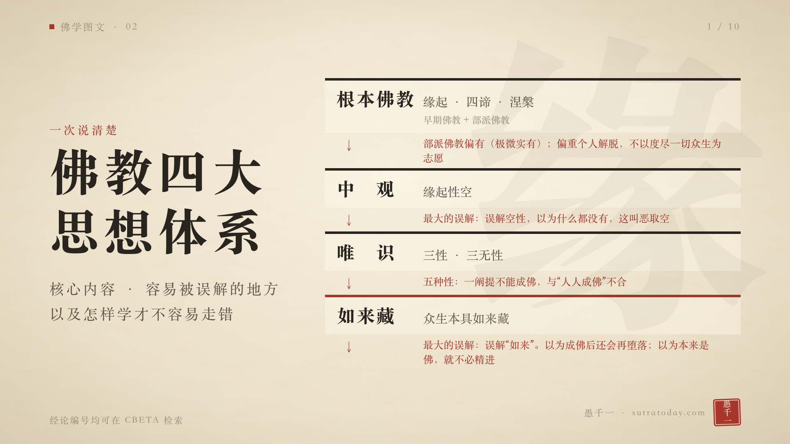
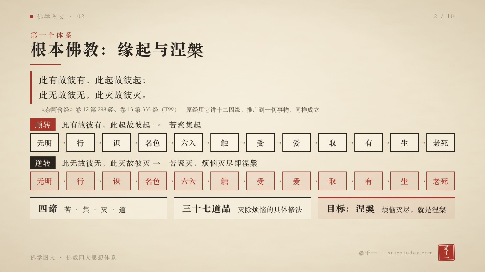
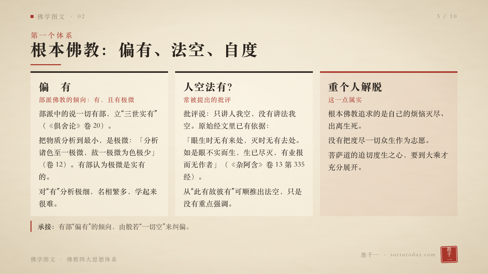
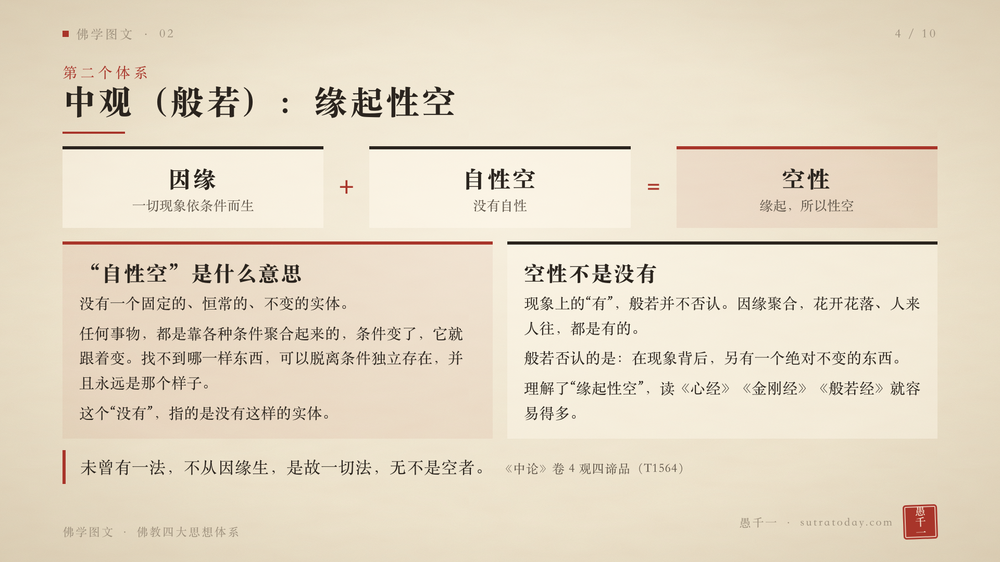
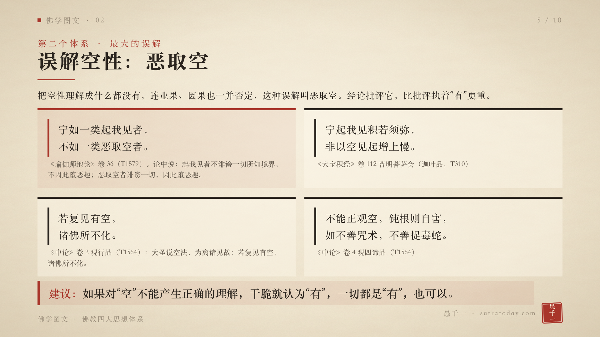
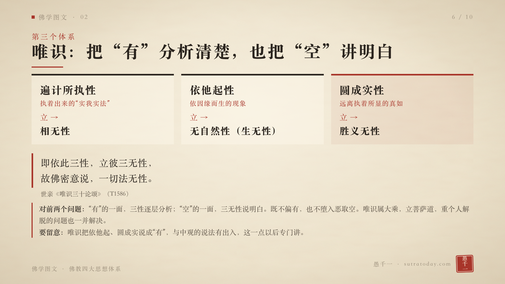
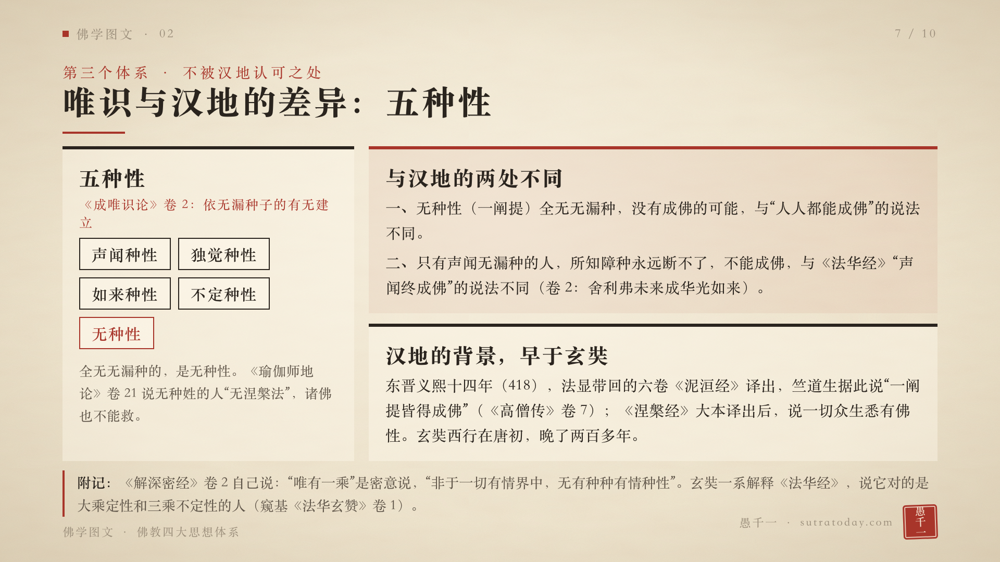
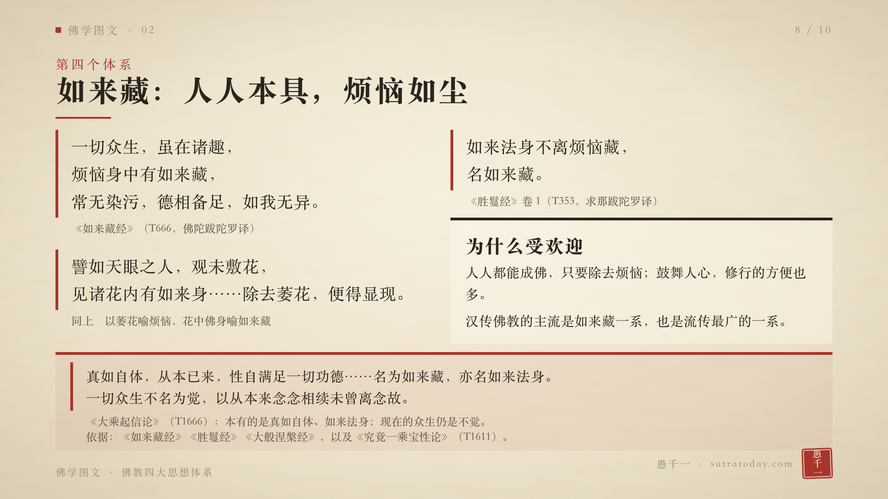
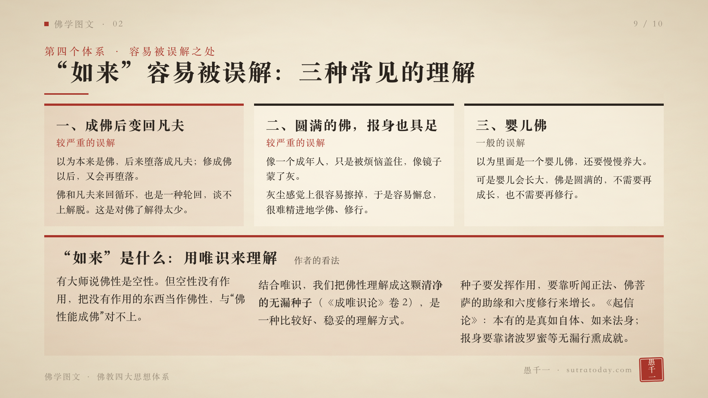
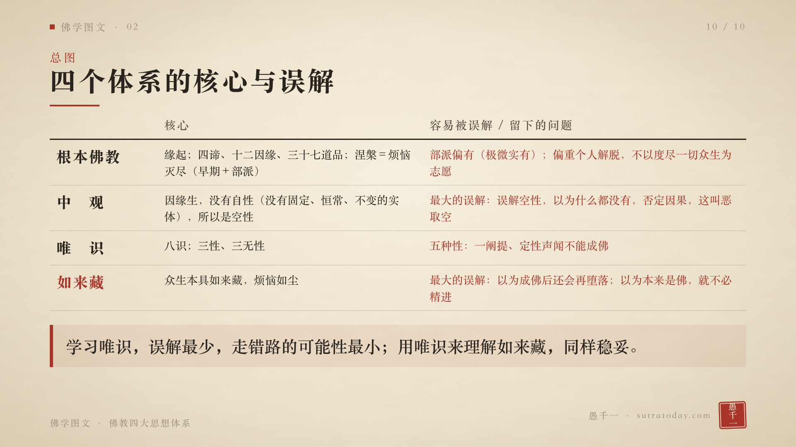

# 佛学图文 02 · 佛教四大思想体系 — 视频口播稿

> 由 notes/01.txt..10.txt 拼成，便于通读。改稿请改 notes/ 里的文件，每张卡片一个文件，与 out/card-N.png 一一对应。

## 读音提示（合成时加入 scripts/synth.py 的 PRONUNCIATION_FIXES）

| 词 | 读音 |
|---|---|
| 般若 | bō rě |
| 一阐提 | yī chǎn tí |
| 俱舍 | jù shè |
| 极微 | jí wēi |
| 种性 / 种姓 | zhǒng xìng |
| 如来藏 / 大藏经 | zàng |
| 解深密经 | jiě |
| 无漏种子 | wú lòu |
| 说一切有部 | shuō yī qiè yǒu bù |
| 圆成实性 | yuán chéng shí |
| 我是愚千一 | 替换为「我是 愚千一」 |
| 空 | kōng（平声），TTS 时统一换成「崆」 |
| 传（大师传、汉传、传到） | chuán；《高僧传》的传读 zhuàn，保持原字 |

## 第 1 张

这是「佛学图文」系列，今天讲佛教的四大思想体系。  
我是 愚千一。  
  
上一期讲佛教全景图的时候，我把佛教的思想分成了四大块：根本佛教、中观、唯识、如来藏。这一期，我们把这四块一块一块展开。  
每一块，先讲它的主要内容，再讲它容易被误解的地方。  
先说明一点：这四个体系，本身都没有问题。但是，每一个体系，都有容易被误解的地方。「被误解」，和「本身有错」，是两回事。这些地方，我们到后面一个一个讲。  
先看这张图。四个体系，按产生的先后排成一列：根本佛教，讲缘起、四谛和涅槃；中观，讲缘起性空；唯识，讲三性和三无性；如来藏，讲众生本具如来藏。  
讲完以后，我会说一说我自己的看法：学哪一个体系，走错路的可能性最小。  

## 第 2 张

先讲第一个体系，根本佛教。  
它包括早期佛教和部派佛教两个时期。主要教义是苦集灭道四谛，十二因缘，还有三十七道品。  
这里最主要的，是《杂阿含经》里反复出现的一句话：「此有故彼有，此起故彼起；此无故彼无，此灭故彼灭。」  
意思是：这个有，所以那个有；这个生起，所以那个生起；这个没有，所以那个没有；这个灭了，所以那个灭了。  
这句话，《杂阿含》卷十二第二九八经里，是佛在讲缘起法：「此有故彼有，此起故彼起，谓缘无明行，乃至纯大苦聚集」。卷十三第三三五经里，又接着说：「此无故彼无，此灭故彼灭，无明灭故行灭」。  
经里用它来讲人的生命。把范围放大，从生命放大到宇宙里的一切事物，这句话同样成立。《杂阿含》卷十二第二九六经说，这个缘起法，「若佛出世，若未出世，此法常住，法住法界」：不管佛有没有出世，这个道理都在那里。所以，根本佛教的主要教义，就是缘起法。  
再看图。上面一排，是十二因缘的顺转：无明、行、识、名色、六入、触、受、爱、取、有、生、老死。顺着走，就是苦聚集起。下面一排，是逆转：无明灭，行灭，一路灭到老死灭，苦聚灭。  
根本佛教的目标是涅槃。涅槃的定义，就是烦恼灭尽。《杂阿含》卷十八，舍利弗回答阎浮车时说：「涅槃者，贪欲永尽，瞋恚永尽，愚痴永尽，一切诸烦恼永尽，是名涅槃。」怎么灭烦恼？从十二因缘看，顺着烦恼走，是顺转；把烦恼灭掉，是逆转。具体的修法，是三十七道品。  

## 第 3 张

根本佛教，有三点常被提到。  
第一点，偏有。这里说的，是部派佛教。部派佛教里，有一个宗派叫说一切有部。他们立「三世实有」，过去、现在、未来，都是实有。《俱舍论》卷二十里说：「以说三世皆定实有故，许是说一切有宗」。  
他们还认为，把物质一直分析下去，最后分出来的是极微。《俱舍论》卷十二说：「分析诸色至一极微，故一极微为色极少」。有部认为，极微是实有的。  
学过《俱舍论》的人都知道，它对「有」分析得特别细，细节很多，学起来非常麻烦。因为过分看重「有」，就有了偏有的倾向。  
第二点，常有人批评说：他们讲了人我空，没有讲法我空。我的看法是，原始经文里，是可以推出法空的，只是没有重点强调。  
比如《杂阿含》卷十三第三三五经，说眼睛生起的时候，没有来处；灭的时候，没有去处。「如是眼不实而生，生已尽灭，有业报而无作者」。眼，是一个法。经里说它生了就灭，不是实在的。顺着「此有故彼有」推下去，法空是自然的结论。  
第三点，根本佛教确实以个人解脱为目标。它追求的，是自己烦恼灭尽，出离生死。对全人类、全部众生的解脱，没有特别去追求。这一点，是实情。  
般若可以纠正这种偏有。我们接着讲。  

## 第 4 张

第二个体系，中观，也叫般若。  
般若可以纠正偏有，它讲「一切无，一切空」。这个空，是自性空。意思是：没有一个固定的、恒常的、不变的实体。  
怎么理解？任何事物，都是靠各种条件聚合起来的。条件变了，它就跟着变。你找不到哪一样东西，可以脱离条件独立存在，并且永远是那个样子。这就是自性空。  
所以，般若的中心思想，合起来叫缘起性空。因缘生，所以有；没有自性，所以是空性。  
空性，不是没有。现象上的有，般若并不否认。花开花落，人来人往，都是有的。它否认的，是在现象背后，另外有一个绝对不变的东西。《心经》说：「色不异空，空不异色，色即是空，空即是色」，现象本身就是空，空也不离现象。  
《中论》卷四，青目的注释里说：「若法有性相，则不待众缘而有」。如果一样东西有自性，它就不需要依靠条件。可是任何东西都要依靠条件，所以「无有不空法」，没有哪一样东西不是空。  
龙树菩萨在《中论》卷四观四谛品里说：「未曾有一法，不从因缘生，是故一切法，无不是空者。」  
把缘起性空这四个字弄明白，般若的思想就理解到了。再去读《心经》《金刚经》《般若经》，就容易得多。  

## 第 5 张

中观最容易被误解的地方，是空性。  
有人把空性理解成什么都没有，连业果、因果这些原则，也一并否定。这种理解，叫恶取空。  
经论批评恶取空，批得很重。  
《瑜伽师地论》卷三十六说：「宁如一类起我见者，不如一类恶取空者。」论里解释：起我见的人，不诽谤一切所知境界，不会因此堕恶趣；恶取空的人，诽谤一切，因此堕恶趣。  
《大宝积经》卷一一二，普明菩萨会，佛对迦叶说：「宁起我见积若须弥，非以空见起增上慢。」  
《中论》卷二观行品：「大圣说空法，为离诸见故；若复见有空，诸佛所不化。」  
《中论》卷四观四谛品：「不能正观空，钝根则自害，如不善咒术，不善捉毒蛇。」  
《大智度论》卷十五也说：「若观诸法常毕竟空，取相心著，是为恶邪见」，把空抓成一个东西去执着，就是恶邪见。  
反过来，《中论》卷四说：「以有空义故，一切法得成；若无空义者，一切则不成」。有了空义，一切才能成立，因果也在其中。把空理解成什么都没有，正好和这句话相反。  
从这些原文看，执着有，还有办法化导；执着空，连诸佛也难化。  
所以我的建议是：如果对空，不能产生正确的理解，干脆就认为有，一切都是有，也可以。  

## 第 6 张

第三个体系，唯识。我这里讲的唯识，是玄奘大师传译的新唯识。  
前面讲了：根本佛教偏有，又偏重个人解脱；般若的空性，又容易被读成恶取空。有没有一个体系，既能把有讲清楚，又不偏有，还能把空讲明白？这就是唯识。  
唯识用三性，来分析有。  
第一，遍计所执性：我们执着出来的实我、实法。  
第二，依他起性：依因缘而生的现象。  
第三，圆成实性：远离执着以后，显出来的真如。  
针对三性，又立了三无性。遍计所执，立相无性；依他起，立无自然性，也叫生无性；圆成实，立胜义无性。  
世亲菩萨在《唯识三十论颂》里说：「即依此三性，立彼三无性，故佛密意说，一切法无性。」  
《成唯识论》卷九解释这首颂时，特别说了一句：「故佛密意说一切法皆无自性，非性全无」。意思是，说无性，不是说什么都没有。依他起、圆成实，体不是没有；没有的，是凡夫在它们上面执着出来的实我、实法。  
这样，有的一面，三性逐层分析清楚；空的一面，三无性讲明白。既不偏有，也不会落进恶取空。而且唯识属于大乘，立菩萨道，个人解脱的问题，也一并解决了。  
有一点要留意：唯识把依他起、圆成实说成有，和中观的说法有出入。这一点，以后再专门讲。  

## 第 7 张

唯识有一个地方，和汉地的想法不同：五种性。  
玄奘大师传的唯识，有五种性的说法。五种是：声闻种性、独觉种性、如来种性、不定种性，还有无种性。  
《成唯识论》卷二，按无漏种子的有无来讲：「若全无无漏种者，……即立彼为非涅槃法」，这是无种性；「若唯有二乘无漏种者」，是声闻种姓、独觉种姓；「若亦有佛无漏种者，……即立彼为如来种姓」。《瑜伽师地论》卷二十一说，无种姓的人，没有涅槃法，诸佛也不能救。  
这和汉地的想法，有两处不同。  
第一，无种性的人，就是一阐提，没有成佛的可能；而汉地讲的是，人人都能成佛。  
第二，只有声闻无漏种子的人，所知障的种子永远断不了，不能成佛；而《法华经》讲，声闻最终也会成佛。卷二里，舍利弗未来成佛，名叫华光如来。玄奘一系对《法华经》的解释，是说这部经对的是大乘定性和三乘不定性的人，见窥基大师《法华玄赞》卷一。  
汉地这种想法，在玄奘大师之前，已经相当普遍了。东晋义熙十四年，也就是公元四一八年，法显带回的六卷《泥洹经》译了出来。竺道生读了这部经，主张一阐提也都能成佛，《高僧传》卷七有记载。后来《涅槃经》大本传到南方，经里果然说，一切众生都有佛性。玄奘大师西行，是在唐朝初年，比这晚了两百多年。  
顺便补一句，《解深密经》卷二里说：「唯有一乘」是密意说。经里还说：「非于一切有情界中，无有种种有情种性」。就是说，这部经自己，是承认众生的种性有差别的。  
这就是唯识不容易被汉地接受的地方。而如来藏的思想，正好讲的是人人本具佛性，人人都能成佛。  

## 第 8 张

第四个体系，如来藏。  
它的主张是：每个众生本来就有如来藏，也就是佛性。烦恼像灰尘一样，盖在上面。去掉烦恼，就成佛。  
《如来藏经》里说：「一切众生，虽在诸趣，烦恼身中有如来藏，常无染污，德相备足，如我无异。」  
经里还有一个比喻：「譬如天眼之人，观未敷花，见诸花内有如来身……除去萎花，便得显现。」枯萎的花，比喻烦恼；花里的佛身，比喻如来藏。  
《胜鬘经》卷一说：「如来法身不离烦恼藏，名如来藏。」  
《大乘起信论》说，真如的自体，「从本已来，性自满足一切功德」，「名为如来藏，亦名如来法身」。但是论里同时说，现在的一切众生，「不名为觉」，因为他们「从本来念念相续，未曾离念」。  
如来藏的思想，鼓舞人心，修行的方便也多，所以很受欢迎。汉传佛教的主流，就是如来藏这一系。依据的经论，有《如来藏经》《胜鬘经》《大般涅槃经》，还有《究竟一乘宝性论》。  

## 第 9 张

如来藏最容易被误解的，是里面的「如来」。  
如来藏，说的是人人都是如来，人人都是佛。那么，这个「如来」，到底是什么样的佛？大家常有三种误解。前两种，比较严重；第三种，是一般的误解。  
第一种，以为成佛以后，还会变回凡夫。有人觉得，我们本来是佛，后来因为一些原因堕落，变成了凡夫；现在努力修，修成了佛；成了佛，又会堕落，再来修。佛和凡夫来回循环，岂不也是一种轮回？这样，还谈什么解脱？这种理解，是对佛了解得太少。  
第二种，以为凡夫里面，是一个圆满的佛，连报身也具足了，像一个成年人，只是被烦恼盖住了，像镜子蒙了灰。灰尘，感觉上很容易擦掉，因此就容易产生懈怠的心理，很难精进地学佛、修行。  
第三种，是一般的误解：以为是一个婴儿佛，还要慢慢养大。可是婴儿会长大，佛是圆满的，不需要再成长，也不需要再修行。所以婴儿佛的说法，说不通。  
那么，如来藏里的「如来」，应该怎么理解？这是我自己的看法：结合唯识来理解。  
有些大师说，佛性是空性。可是空性没有作用，把没有作用的东西当作佛性，和「佛性能成佛」，逻辑上对不上。  
结合唯识，我们把佛性，理解成清净的无漏种子，《成唯识论》卷二讲的就是无漏种子。  
要说明一点：玄奘大师传的唯识，认为无漏种子的有无，决定种姓的不同，无种性的人是全无无漏种的。所以这里借用的，是唯识对佛性的说明方式；人人是不是都有这颗种子，唯识和如来藏的看法不同。  
种子要发挥作用，要生根发芽。生根发芽，需要条件。《成唯识论》卷二说，听闻正法的时候，也会熏习本有的无漏种子，「令渐增盛，展转乃至生出世心」。菩萨修六度，是在积累福德和智慧的资粮，《成唯识论》卷九里讲得很详细。  
《大乘起信论》说的，是同一个道理。真如有一种自体相熏习，「从无始世来，具无漏法」，能让众生「自信己身有真如法，发心修行」。可是光有这个还不够，论里用木头里的火性作比喻：火性是火的正因，可是「若无人知，不假方便能自烧木，无有是处」；众生「虽有正因熏习之力，若不值遇诸佛菩萨善知识等以之为缘」，也不能自己断烦恼、入涅槃。所以还要靠佛菩萨这些外缘，要靠施、戒、忍、进、止观这些修行。  
《起信论》里，本有的，是真如自体，也叫如来藏、如来法身。至于报身，论里说它是「皆因诸波罗蜜等无漏行熏，及不思议熏之所成就」，是修六度这些无漏行，一点一点熏成的。  
我认为，这是一种比较好、稳妥的理解方式。  

## 第 10 张

最后，把四个体系，放在一张表里。  
根本佛教：主张是缘起，四谛、十二因缘、三十七道品，目标是涅槃，也就是烦恼灭尽。部派佛教偏有，还有偏重个人解脱，不以度尽一切众生为志愿。  
中观：因缘生，没有自性，所以是空性。空性容易被理解成什么都没有，否定因果，这叫恶取空。  
唯识：讲八识，讲三性、三无性。和汉地不同的地方，是五种性：一阐提、定性声闻，不能成佛。  
如来藏：众生本具如来藏，烦恼如尘。最容易被误解的，是「如来」：被理解成成佛后还会再堕落，被理解成本来是佛，就不必精进。  
四个体系讲完了，我自己的看法是：学习唯识，产生误解的可能最小，走错路的可能性也最小；用唯识来理解如来藏，同样稳妥。  
好，今天就讲到这里。  
我的微信公众号、视频号，都叫「愚千一」。  
最后——愿以此功德，普及于一切；我等与众生，皆共成佛道。  
